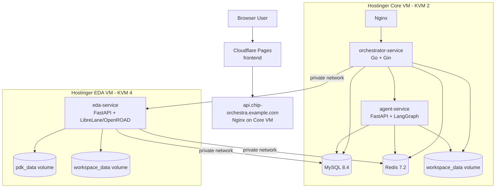
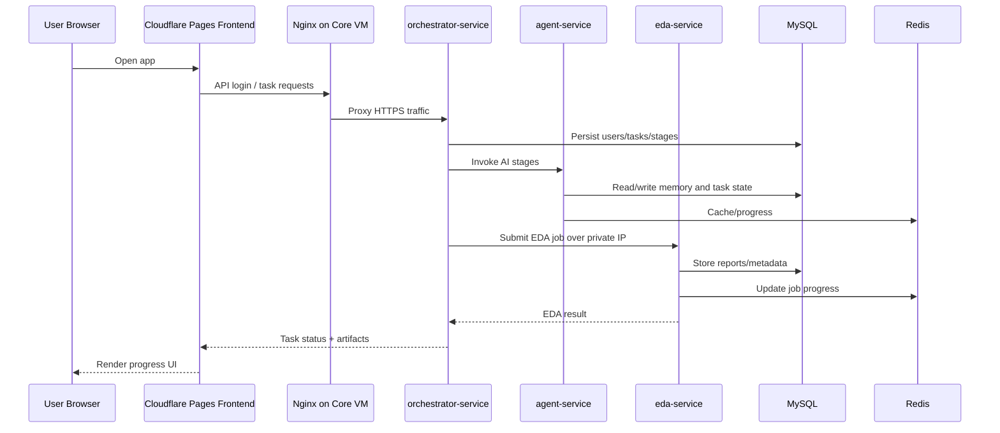

# Chip-Orchestra Production Deployment Blueprint

This document describes a low-cost but production-usable deployment plan for `radhian/Chip-Orchestra` on Hostinger VPS, with the frontend on Cloudflare Pages and the backend split across two x86 VMs. The plan is designed around the actual repository constraints: a six-service architecture, a heavy `eda-service` image, shared workspace expectations, and a `linux/amd64` EDA path.

## 1. Recommended topology

The recommended baseline is:

- Cloudflare Pages for the frontend
- Hostinger `KVM 2` for the core control plane
- Hostinger `KVM 4` for the EDA execution plane

This keeps the monthly cost low while isolating the disk-heavy and CPU-heavier EDA workload from the API and stateful services.

## 2. Architecture diagram



## 3. VM sizing

### Minimum viable

| Role | Hostinger plan | vCPU | RAM | Disk | Why |
|---|---|---:|---:|---:|---|
| Core VM | KVM 2 | 2 | 8 GB | 100 GB NVMe | Enough for Nginx, orchestrator, agent, MySQL, Redis when using cloud LLMs, with more RAM/disk than the minimum target |
| EDA VM | KVM 4 | 4 | 16 GB | 200 GB NVMe | Enough room for the EDA image, GF180MCU PDK, and single-user workspaces |

### More comfortable

| Role | Hostinger plan | vCPU | RAM | Disk | Why |
|---|---|---:|---:|---:|---|
| Core VM | KVM 4 | 4 | 16 GB | 200 GB NVMe | More headroom for Docker, DB growth, logs, and agent workload |
| EDA VM | KVM 8 | 8 | 32 GB | 400 GB NVMe | Better for repeated OpenROAD runs, larger retained workspace history, and future parallelism |

## 4. VM topology and naming

Use a simple private network layout.

| Host | Suggested private IP | Public role |
|---|---|---|
| `chip-core-01` | `10.0.0.10` | Public API endpoint via Nginx |
| `chip-eda-01` | `10.0.0.20` | No public app exposure; private EDA API only |

Suggested DNS:

- `chip.example.com` → Cloudflare Pages frontend
- `api.chip-orchestra.example.com` → Core VM public IP

If you prefer one product domain, use:

- `app.chip-orchestra.example.com` → frontend
- `api.chip-orchestra.example.com` → backend API

## 5. Deployment boundaries

The repo’s original `docker-compose.yml` runs everything together. For production on a budget, split it into two stacks:

- **core stack** on the core VM: `mysql`, `redis`, `agent-service`, `orchestrator-service`
- **eda stack** on the EDA VM: `eda-service`

This split is included in:

- `core/docker-compose.yml`
- `eda/docker-compose.yml`

## 6. Files included in this blueprint

The following deployment artifacts are included under `output/chip-orchestra-deploy/`:

- `DEPLOYMENT.md`
- `Makefile`
- `core/docker-compose.yml`
- `core/.env.example`
- `eda/docker-compose.yml`
- `eda/.env.example`
- `nginx/chip-orchestra.conf`
- `scripts/ufw-core.sh`
- `scripts/ufw-eda.sh`

## 7. Core stack config

The core stack runs the public API, the agent, and stateful services. It assumes:

- the EDA service is reachable at `http://10.0.0.20:8002`
- cloud LLMs are used instead of local Ollama on the VM
- a persistent Docker volume stores the shared workspace used by orchestrator and agent

Key production notes:

- do not expose MySQL or Redis to the public internet
- keep `JWT_SECRET`, DB passwords, and model API keys in `.env`
- use a private network between the core and EDA VMs

## 8. EDA stack config

The EDA stack only runs `eda-service`. It mounts:

- `workspace_data` for task artifacts and run outputs
- `pdk_data` for the GF180MCU PDK

The EDA service talks back to MySQL and Redis on the core VM over the private network. This preserves the repo’s expected control flow while keeping the large image isolated.

## 9. Nginx reverse proxy

Use Nginx on the core VM to expose the orchestrator publicly over HTTPS.

Responsibilities:

- terminate TLS
- forward `/api` and other HTTP traffic to `orchestrator-service`
- support WebSocket upgrades for realtime task events
- keep upload size high enough for workspace uploads and artifact transfers

The sample config is in `nginx/chip-orchestra.conf`.

Recommended host-level setup on the core VM:

```bash
sudo apt-get update
sudo apt-get install -y nginx certbot python3-certbot-nginx
sudo cp output/chip-orchestra-deploy/nginx/chip-orchestra.conf /etc/nginx/sites-available/chip-orchestra
sudo ln -s /etc/nginx/sites-available/chip-orchestra /etc/nginx/sites-enabled/chip-orchestra
sudo nginx -t
sudo systemctl reload nginx
sudo certbot --nginx -d api.chip-orchestra.example.com
```

## 10. Firewall rules

Use UFW on both VMs.

### Core VM firewall policy

Allow:

- `22/tcp` for SSH
- `80/tcp` for HTTP redirect / ACME
- `443/tcp` for public API traffic
- `3306/tcp` only from `10.0.0.20`
- `6379/tcp` only from `10.0.0.20`

Use `scripts/ufw-core.sh` as a starting point.

### EDA VM firewall policy

Allow:

- `22/tcp` for SSH
- `8002/tcp` only from `10.0.0.10`

Use `scripts/ufw-eda.sh` as a starting point.

### Important hardening note

If you attach a private network or equivalent provider-side internal networking, prefer binding inter-VM traffic to that network and keep the EDA VM without public app listeners beyond SSH. If private networking is unavailable for your VPS location or plan, use a firewall/VPN tunnel and only allow EDA, MySQL, and Redis traffic from the peer VM. If possible, further restrict SSH with your office or home IP CIDR.

## 11. DNS setup

### Frontend

Deploy the frontend separately to Cloudflare Pages.

Set environment variables in Cloudflare Pages:

```text
VITE_API_BASE_URL=https://api.chip-orchestra.example.com
VITE_USE_MOCKS=false
VITE_DEFAULT_USERNAME=admin
VITE_DEFAULT_PASSWORD=<your-admin-password>
```

DNS records:

- `chip.example.com` or `app.chip-orchestra.example.com` → Cloudflare Pages target
- `api.chip-orchestra.example.com` → A record to the core VM public IP

### Backend

After DNS resolves, issue the TLS certificate on the core VM with Certbot.

## 12. Step-by-step deployment guide

### 12.1 Provision infrastructure

Create:

- one Hostinger `KVM 2` VPS named `chip-core-01`
- one Hostinger `KVM 4` VPS named `chip-eda-01`
- one private network shared by both VMs

Attach both VMs to the same private network and note their private IPs.

### 12.2 Prepare both VMs

On both hosts:

```bash
sudo apt-get update
sudo apt-get install -y ca-certificates curl git make ufw
curl -fsSL https://get.docker.com | sh
sudo usermod -aG docker $USER
newgrp docker
```

Clone the repo on both machines:

```bash
git clone https://github.com/radhian/Chip-Orchestra.git
cd Chip-Orchestra
```

Copy the blueprint artifacts or sync `output/chip-orchestra-deploy/` to both VMs.

### 12.3 Deploy the core VM

On `chip-core-01`:

```bash
cd output/chip-orchestra-deploy/core
cp .env.example .env
```

Edit `.env` and set:

- `MYSQL_PASSWORD`
- `MYSQL_ROOT_PASSWORD`
- `JWT_SECRET`
- `DEFAULT_PASSWORD`
- `OPENAI_API_KEY` or your preferred cloud model credentials
- `EDA_SERVICE_URL=http://10.0.0.20:8002`

Then start the stack:

```bash
docker compose up -d --build
```

Verify:

```bash
docker compose ps
docker compose logs -f orchestrator-service agent-service
curl http://127.0.0.1:8080/health
```

### 12.4 Deploy the EDA VM

On `chip-eda-01`:

```bash
cd output/chip-orchestra-deploy/eda
cp .env.example .env
```

Edit `.env` and set:

- `MYSQL_HOST=10.0.0.10`
- `MYSQL_PASSWORD`
- `REDIS_HOST=10.0.0.10`
- `PDK_ROOT=/opt/pdk`

Then start the stack:

```bash
docker compose up -d --build
```

Verify:

```bash
docker compose ps
docker compose logs -f eda-service
curl http://127.0.0.1:8002/health
```

The first boot may take a while because the EDA image is large and the PDK may be installed on first run.

### 12.5 Configure Nginx and TLS on the core VM

Install Nginx and Certbot, copy `nginx/chip-orchestra.conf`, validate, then request the certificate.

After that, test:

```bash
curl https://api.chip-orchestra.example.com/health
```

### 12.6 Deploy the frontend

In Cloudflare Pages:

- connect the GitHub repository
- build from `frontend/`
- build command: `npm run build`
- output directory: `dist`

Then set the environment variables shown in the DNS section.

## 13. Suggested production adjustments

### 13.1 Use cloud LLMs, not local Ollama

For a low-cost Hostinger VPS deployment, do not run a large local model on the `KVM 2` core VM. The core VM is sized around cloud inference. Use one of:

- GLM-compatible endpoint
- Gemini
- OpenAI-compatible endpoint

### 13.2 Keep EDA jobs single-concurrency at first

The minimum viable EDA VM is fine for one user or a light team, but do not expect parallel heavy hardening jobs to feel fast. Start with one EDA worker and scale only if real usage demands it.

### 13.3 Watch disk growth

The EDA machine is the first place that can become painful if left unmanaged. Monitor:

- Docker image cache
- old task workspaces
- PDK volume size
- generated artifacts and exported bundles

### 13.4 Consider external object storage later

When usage grows, the first cost-effective improvement is usually moving large artifacts or exported bundles to object storage, while keeping the core DB and Redis local.

## 14. Operational checks

After deployment, validate these flows end-to-end:

1. Login through the frontend
2. Create a task
3. Confirm orchestrator can call agent-service
4. Confirm orchestrator can call EDA service over the private IP
5. Confirm task workspaces and artifacts are visible
6. Confirm an EDA stage can reach MySQL and Redis on the core VM
7. Confirm WebSocket task event streaming works through Nginx

## 15. Rollout order

The lowest-risk rollout order is:

1. Bring up core VM services locally and verify `/health`
2. Bring up EDA VM and verify `/health`
3. Confirm core → EDA connectivity using private IP
4. Add Nginx and TLS
5. Deploy frontend to Cloudflare Pages
6. Run one real end-to-end task

## 16. Diagram of runtime request flow



## 17. What this blueprint intentionally does not include

This document keeps the setup simple and budget-conscious. It does not add:

- Kubernetes
- managed MySQL
- managed Redis
- autoscaling workers
- centralized log stack
- S3/object storage wiring
- blue/green deployment automation

Those are reasonable later upgrades, but they are not necessary for a first functional production deployment.

## 18. Final recommendation

If you want the lowest-cost production-usable setup for this repo, start with:

- Cloudflare Pages frontend
- Hostinger `KVM 2` core VM
- Hostinger `KVM 4` EDA VM
- Nginx on the core VM
- private-network-only access from core to EDA, MySQL, and Redis

That setup matches the repository’s architecture, avoids forcing the heavy EDA service into a PaaS, and keeps your monthly cost close to the practical minimum.

## 19. Cost estimate

Pricing changes often, so treat this as a planning estimate based on the current public Hostinger VPS page checked on 2026-07-23. Hostinger lists `KVM 2` with 2 vCPU cores, 8 GB RAM, 100 GB NVMe disk, 8 TB bandwidth at $8.79/month promotional pricing and $14.99/month renewal pricing; `KVM 4` with 4 vCPU cores, 16 GB RAM, 200 GB NVMe disk, 16 TB bandwidth at $12.99/month promotional pricing and $28.99/month renewal pricing. The same page lists `KVM 8` with 8 vCPU cores, 32 GB RAM, 400 GB NVMe disk, 32 TB bandwidth at $25.99/month promotional pricing and $49.99/month renewal pricing, making it the best comfortable EDA fit for OpenROAD and retained workspaces::cite[1838].

| Tier | Core VM | EDA VM | Cloudflare Pages | Estimated monthly total, promo | Estimated monthly total, renewal | Notes |
|---|---|---|---|---:|---:|---|
| Minimum viable | Hostinger KVM 2 — 2 vCPU, 8 GB RAM, 100 GB NVMe, 8 TB bandwidth — $8.79/mo promo, $14.99/mo renewal | Hostinger KVM 4 — 4 vCPU, 16 GB RAM, 200 GB NVMe, 16 TB bandwidth — $12.99/mo promo, $28.99/mo renewal | Free tier: static asset requests are free and unlimited on both free and paid plans | $21.78/mo | $43.98/mo | Best first production setup: enough RAM/disk for core services and one EDA worker |
| Comfortable | Hostinger KVM 4 — 4 vCPU, 16 GB RAM, 200 GB NVMe, 16 TB bandwidth — $12.99/mo promo, $28.99/mo renewal | Hostinger KVM 8 — 8 vCPU, 32 GB RAM, 400 GB NVMe, 32 TB bandwidth — $25.99/mo promo, $49.99/mo renewal | Free tier: static asset requests are free and unlimited on both free and paid plans | $38.98/mo | $78.98/mo | More headroom for DB/log growth on core and CPU/disk-heavy EDA runs |

Cloudflare Pages can remain on the free tier for the frontend in this blueprint because static asset requests are free and unlimited on both free and paid plans. Pages Functions, Workers, R2, D1, and other Cloudflare products may bill separately if added later::cite[1826].

Relevant network and traffic cost notes:

- Hostinger VPS pricing includes a monthly bandwidth allowance per plan, so the normal two-VM setup should stay inside the bundled traffic allowance unless artifacts or user downloads become large::cite[1838].
- If Hostinger private networking is available for the selected VPS location/account, use it for core-to-EDA traffic. If not, use a firewall-restricted WireGuard/Tailscale-style private tunnel between the two VMs. The practical cost impact is usually not the tunnel itself, but any public bandwidth counted against the VPS bandwidth allowance.
- Cloudflare Pages frontend hosting should not add monthly cost for the static frontend under the free tier; costs can appear if the app later adds paid Cloudflare developer-platform features.

Cost drivers to watch:

- **EDA disk growth:** Docker layers, PDK data, OpenROAD run directories, generated reports, and retained workspaces are the most likely reason to move the EDA VM up a tier.
- **Traffic:** downloadable artifacts, repeated CI-style runs, or large workspace exports can consume VPS bandwidth faster than normal app/API traffic.
- **Object storage later:** if artifacts should be retained long-term, move them to object storage later; that adds storage/request costs but can keep VPS disks smaller and backups simpler.
- **Backups/snapshots:** provider backups, snapshots, or extra volumes may add separate monthly charges if enabled.
