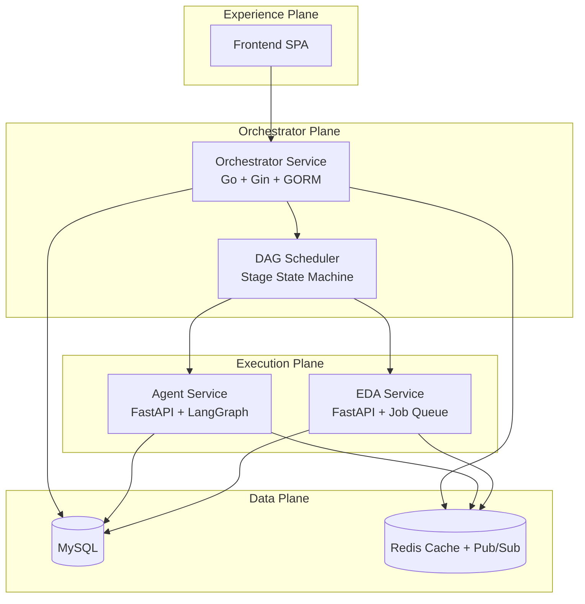
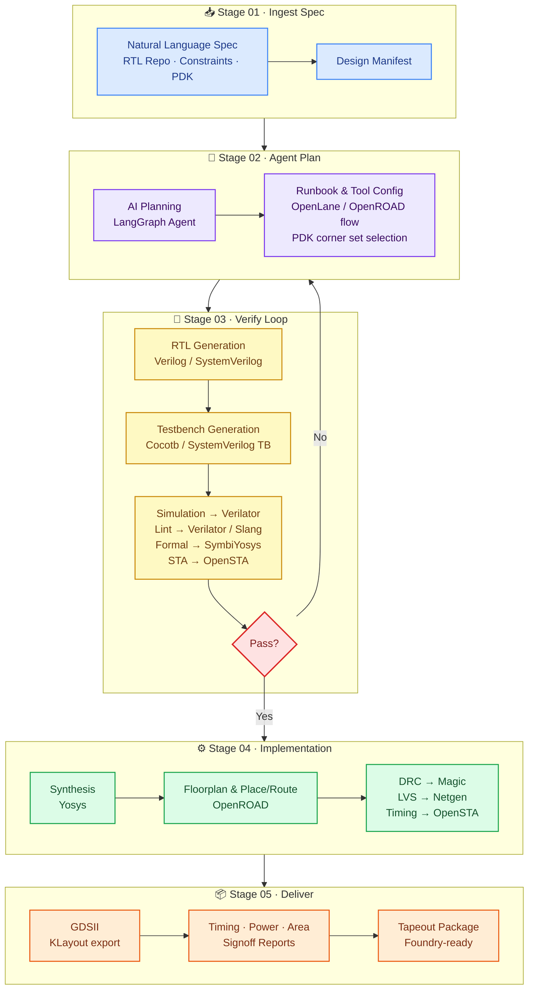

# Chip Orchestra

> **AI-native digital IC orchestration platform** that transforms natural language specifications into verified RTL and manufacturable GDSII through observable, browser-native workflows.

Chip Orchestra is an end-to-end platform for digital IC and SoC development that combines AI agents, EDA automation, and modern web technologies into a unified task-centric workflow.

Rather than treating RTL generation, verification, synthesis, and physical implementation as disconnected tools, Chip Orchestra orchestrates the complete RTL-to-GDSII lifecycle as a transparent, inspectable execution graph.

The platform enables engineers to:

- Generate RTL and produce tapeout-ready deliverables from natural-language specifications
- Automatically verify and repair generated designs
- Execute synthesis, place-and-route, and signoff
- Track every artifact, decision, and execution stage
- Review AI reasoning before accepting changes

---

## Why Chip Orchestra?

Modern digital chip development often relies on disconnected tools, scripts, and manual workflows. While AI has significantly improved RTL generation, there is still no unified execution platform that manages the complete digital chip design lifecycle.

Chip Orchestra introduces a **task-centric orchestration platform** where every design is executed as an observable workflow instead of a collection of scripts.

Instead of asking:

> **Can AI generate Verilog?**

Chip Orchestra asks:

> **Can AI orchestrate the entire RTL-to-GDSII journey while keeping engineers in control?**

The platform combines AI planning, verification, EDA execution, artifact management, and human review into a single browser-native experience.

---

## Features

- AI-assisted RTL-to-GDSII design flow
- Multi-agent orchestration
- Automated verification and repair
- Browser-native task management
- Artifact and execution tracking
- Human-in-the-loop review
- Self-hosted LLM support
- Modular microservice architectur

---

## Architecture



---

## Repository Layout

```text
chip-orchestra/
├── orchestrator-service/
├── agent-service/
├── eda-service/
├── frontend/
├── docs/
│   ├── architecture.md
│   ├── development.md
│   ├── roadmap.md
│   ├── vision.md
│   ├── test-plan.md
│   └── api/
├── scripts/
├── docker-compose.yml
├── docker-compose.dev.yml
└── .env.example
```

---

## RTL-to-GDSII Workflow




```text
Natural Language Specification
                │
                ▼
        Create Design Task
                │
                ▼
          AI Planning
                │
                ▼
 Repository Context + RAG
                │
                ▼
         RTL Generation
                │
                ▼
    Testbench Generation
                │
                ▼
     Simulation & Linting
                │
                ▼
      AI Self-Repair Loop
                │
                ▼
          Synthesis
                │
                ▼
       Place & Route
                │
                ▼
     STA / DRC / LVS
                │
                ▼
           Signoff
                │
                ▼
      Tapeout Package
```

Every stage is fully observable with:

- AI reasoning
- Execution logs
- Generated artifacts
- Retry history
- Reports and metrics
- Human approval checkpoints


---

## Design Principles

### Task-first orchestration

Digital chip development is managed as structured tasks instead of disconnected scripts. Every task owns its inputs, execution graph, artifacts, reports, approvals, and outputs.

### Transparent AI collaboration

AI should never behave like a black box. Every prompt, retrieved context, generated patch, retry, and reasoning step remains visible to engineers.

### Unified EDA execution

Simulation, linting, synthesis, place-and-route, and signoff execute within one orchestrated pipeline with complete artifact lineage.

### Human-in-the-loop

Critical engineering decisions—including RTL modifications, implementation, and tapeout—remain gated by explicit human approval.

---

## Current Capabilities

- AI-assisted RTL generation
- AI-assisted testbench generation
- Verification and self-repair loops
- Browser-native design task management
- RTL-to-GDSII automation
- Execution trace visualization
- Artifact management
- Self-hosted LLM inference via Ollama
- Modular service-oriented architecture

---

## Technology Stack

| Layer | Technology |
|--------|------------|
| Frontend | React |
| Orchestrator | Go, Gin, GORM |
| Agent | Python, FastAPI, LangGraph |
| EDA | Python, FastAPI |
| Database | MySQL |
| Cache & Messaging | Redis |
| AI Models | Ollama (Qwen, GLM, Mistral, etc.) |
| EDA Toolchain | Icarus Verilog, OpenLane, OpenROAD |

---

## Monorepo Services

### Orchestrator Service (Go)

The control plane responsible for:

- Task lifecycle management
- Workflow orchestration
- DAG scheduling
- Authentication
- Metadata management
- API gateway

### Agent Service (Python)

Responsible for:

- AI planning
- Retrieval-Augmented Generation (RAG)
- RTL generation
- Testbench generation
- Verification
- Self-repair
- Reasoning trace generation

### EDA Service (Python)

Responsible for:

- Simulation
- Lint
- Synthesis
- Place & Route
- Signoff
- Report generation
- Artifact management

---

## Quick Start

### 1. Clone the repository

```bash
git clone https://github.com/<your-org>/chip-orchestra.git
cd chip-orchestra
```

### 2. Copy environment variables

```bash
cp .env.example .env
```

### 3. Run the setup

```bash
bash scripts/setup.sh
```

### 4. Start the platform

```bash
bash scripts/start.sh
```

---

## Local Services

| Service | URL |
|----------|-----|
| Frontend | http://localhost:4173 |
| Orchestrator Service | http://localhost:8080 |
| Agent Service | http://localhost:8001 |
| EDA Service | http://localhost:8002 |

---

## Default Credentials

```text
Username: admin
Password: chip-orchestra
```

---

## Documentation

| Document | Description |
|----------|-------------|
| `docs/architecture.md` | Overall platform architecture |
| `docs/development.md` | Local development workflow |
| `docs/roadmap.md` | Product roadmap |
| `docs/vision.md` | Product vision and design principles |
| `docs/test-plan.md` | Testing strategy |
| `docs/api/orchestrator-service.md` | Orchestrator API |
| `docs/api/agent-service.md` | Agent API |
| `docs/api/eda-service.md` | EDA API |

---

## Roadmap

The long-term vision extends beyond RTL generation toward a complete AI-native digital engineering platform.

Planned capabilities include:

- Multi-agent collaboration
- Distributed execution across cloud and local workers
- Repository-aware engineering assistants
- Incremental compilation
- Design knowledge retrieval
- Multi-user collaboration
- Tapeout management
- Physical design optimization
- Analog and mixed-signal extensions
- FPGA implementation flows

---

## Success Metrics

Chip Orchestra is designed to improve engineering productivity by reducing:

- Time from specification to first working RTL
- Manual debugging iterations
- Verification turnaround time
- Engineering effort spent coordinating multiple EDA tools

while increasing:

- Workflow observability
- Artifact traceability
- AI transparency
- Signoff readiness
- Engineering confidence in AI-generated designs

---

## Vision

Chip Orchestra aims to make digital chip development as seamless as modern AI-assisted software engineering by combining autonomous AI agents with reproducible EDA workflows and browser-native collaboration.

The long-term goal is to reduce reliance on proprietary APIs through a flexible orchestration layer that supports self-hosted foundation models while maintaining production-grade observability, reproducibility, and human oversight throughout the RTL-to-GDSII lifecycle.

Rather than replacing hardware engineers, Chip Orchestra augments them by making complex digital design workflows transparent, reproducible, and significantly more efficient.
