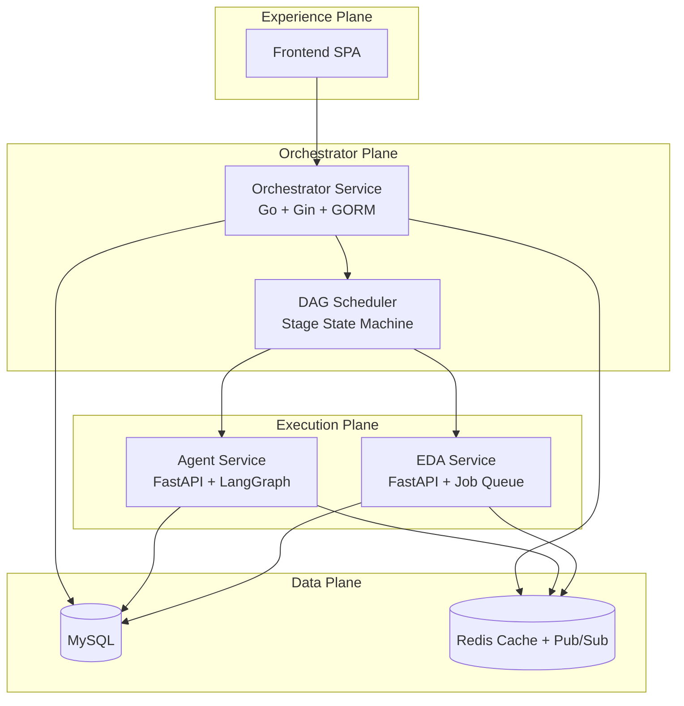

# Chip Orchestra

Chip Orchestra is a refactored monorepo for browser-native digital IC orchestration. This repository reorganizes the earlier prototype into a new service layout with a Go-based Orchestrator Service, Python Agent and EDA services, React frontend, MySQL metadata storage, and Redis-backed artifact caching plus pub/sub.

## Monorepo layout
```text
chip-orchestra/
├── orchestrator-service/
├── agent-service/
├── eda-service/
├── frontend/
├── docs/
├── scripts/
├── docker-compose.yml
├── docker-compose.dev.yml
└── .env.example
```

## Architecture at a glance


## Quick start
1. Copy environment defaults:
   ```bash
   cp .env.example .env
   ```
2. Run first-time setup:
   ```bash
   bash scripts/setup.sh
   ```
3. Start the full stack:
   ```bash
   bash scripts/start.sh
   ```
4. Open:
   - Frontend: `http://localhost:4173`
   - Orchestrator Service: `http://localhost:8080`
   - Agent Service: `http://localhost:8001`
   - EDA Service: `http://localhost:8002`

## Default local credentials
- Username: `radhian.armansyah`
- Password: `chip-orchestra`

## Core decisions applied in this refactor
- **Orchestrator naming applied consistently** across services, docs, and runtime concepts
- **Orchestrator Service in Go** with Gin, GORM, go-redis, and JWT middleware
- **Agent Service in Python** with a LangGraph-style deep-agent workflow
- **EDA Service in Python** with Redis queueing and MySQL persistence
- **MySQL everywhere** for relational state
- **Redis for artifact cache, transient state, and pub/sub**

## Service APIs
- Orchestrator Service docs: `docs/api/orchestrator-service.md`
- Agent Service docs: `docs/api/agent-service.md`
- EDA Service docs: `docs/api/eda-service.md`

## Development notes
- `docs/architecture.md` contains the adapted architecture source of truth.
- `docs/development.md` explains local workflows.
- `docs/test-plan.md` covers unit, integration, WebSocket, and E2E scenarios.
