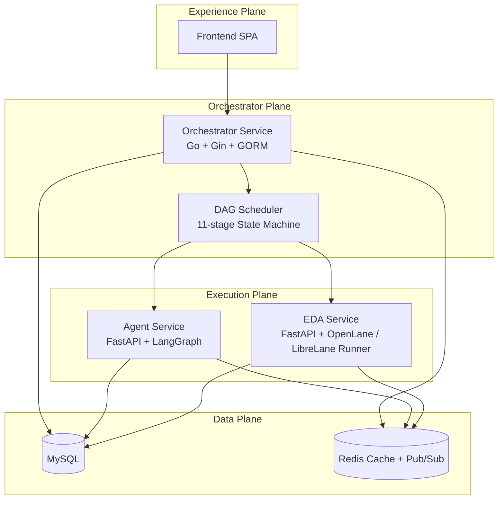
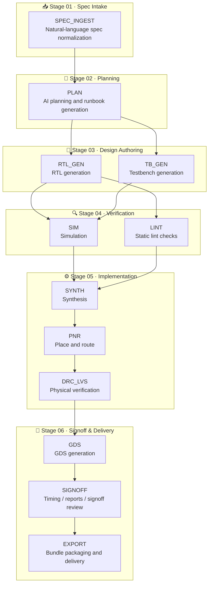

# Chip Orchestra

> **AI-native digital IC orchestration platform** that transforms natural language specifications into verified RTL and manufacturable GDSII through observable, browser-native workflows.

Chip Orchestra is an end-to-end platform for digital IC and SoC development that combines AI agents, EDA automation, and modern web technologies into a unified task-centric workflow.

Rather than treating RTL generation, verification, synthesis, and physical implementation as disconnected tools, Chip Orchestra orchestrates the complete RTL-to-GDSII lifecycle as a transparent, inspectable execution graph.

The platform enables engineers to:

- Generate RTL and produce tapeout-ready deliverables from natural-language specifications
- Automatically verify and repair generated designs
- Execute simulation, lint, hardening, GDS generation, and signoff
- Track every artifact, decision, and execution stage
- Download generated RTL, reports, and workspace files directly from the browser
- Review AI reasoning before accepting changes

---

## Why Chip Orchestra?

Modern digital chip development often relies on disconnected tools, scripts, and manual workflows. While AI has significantly improved RTL generation, there is still no unified execution platform that manages the complete digital chip design lifecycle.

Chip Orchestra introduces a **task-centric orchestration platform** where every design is executed as an observable workflow instead of a collection of scripts.

Instead of asking:

> **Can AI generate Verilog?**

Chip Orchestra asks:

> **Can AI orchestrate the entire RTL-to-GDSII journey while keeping engineers in control?**

The platform combines AI planning, verification, EDA execution, artifact management, and human review into a single browser-native experience.

---

## Features

- AI-assisted RTL-to-GDSII design flow
- Full 11-stage orchestration pipeline from spec ingest to export
- Multi-agent orchestration
- **Golden-first verification**: the Python golden model defines the desired output; the RTL must match it value-for-value before the flow proceeds
- Automated verification and repair (budgeted SIM and hardening auto-repair loops)
- **Complete bundled EDA toolchain** — iverilog, Verilator, yosys+pyosys, OpenROAD, KLayout, Magic, netgen — with the GF180MCU PDK auto-installed via Volare
- Browser-native task management with live per-stage activity (agent transcripts + raw EDA tool logs)
- Runbook artifact downloads for generated `.sv`, `.json`, and `.md` outputs
- RTL Workspace per-file downloads, in-browser PDF report viewing, and one-click **Export .zip** of the whole workspace
- Human-in-the-loop review
- Self-hosted LLM support
- Modular microservice architecture

---

## Architecture



Chip Orchestra now runs with **6 containers in Docker Compose**:

- Frontend
- Orchestrator Service
- Agent Service
- EDA Service
- MySQL
- Redis

The **EDA Service** is the newest application service in the stack. It runs on port `8002` and is responsible for OpenLane / LibreLane execution, GDS generation, and signoff-oriented outputs.

---

## Repository Layout

```text
chip-orchestra/
├── orchestrator-service/
├── agent-service/
├── eda-service/
├── frontend/
├── docs/
│   ├── architecture.md
│   ├── development.md
│   ├── roadmap.md
│   ├── vision.md
│   ├── test-plan.md
│   └── api/
├── scripts/
├── docker-compose.yml
├── docker-compose.dev.yml
└── .env.example
```

---

## RTL-to-GDSII Workflow



```text
SPEC_INGEST
    │
    ▼
PLAN
    │
    ├──► RTL_GEN
    │        │
    │        ├──► SIM ──┐
    │        └──► LINT ─┴──► SYNTH
    │
    └──► TB_GEN ───────────► SIM
                              │
                              ▼
                             PNR
                              │
                              ▼
                           DRC_LVS
                              │
                              ▼
                              GDS
                              │
                              ▼
                           SIGNOFF
                              │
                              ▼
                            EXPORT
```

The default pipeline now covers **11 orchestrated stages**:

1. `SPEC_INGEST`
2. `PLAN`
3. `RTL_GEN`
4. `TB_GEN`
5. `SIM`
6. `LINT`
7. `SYNTH`
8. `PNR`
9. `DRC_LVS`
10. `SIGNOFF`
11. `EXPORT`

Every stage is fully observable with:

- AI reasoning
- Execution logs
- Generated artifacts
- Retry history
- Reports and metrics
- Human approval checkpoints

---

## Golden-First Verification & Self-Repair

The chip is only considered correct when **input → RTL output equals input → Python output**, checked by code, not by an LLM:

1. **Canonical input** — an uploaded image (e.g. a maze) is decoded into `context/chip_input_grid.json` + `rtl/*.mem` stimulus and rendered to `waves/chip_input.png`.
2. **Desired output (Python first)** — the golden model implements *the algorithm the design brief specifies* (same weights, same fixed-point math as the RTL), runs on the canonical input, and writes `waves/golden_output.mem`. For data-driven designs (e.g. a DDPG RL accelerator) the NN weights are trained/derived in Python and baked into `rtl/*.mem` — the weights are part of the chip.
3. **Chip output** — the testbench dumps the DUT's computed result (`$writememh`) to `waves/chip_output.mem` in the identical format. The testbench may **never** write the golden file (enforced at write time and again in SIM).
4. **Deterministic comparison** — the SIM stage compares the two files value-by-value; any mismatch fails the stage with the exact differing cells, and both grids are rendered side-by-side in the UI (white free / black wall / red start / green goal / blue path).

When a stage fails, the orchestrator dispatches the repair deep-agent with the evidence and re-runs automatically:

| Loop | Trigger | Budget (env) |
|---|---|---|
| SIM auto-repair | testbench fails / golden mismatch | `SIM_AUTO_REPAIR_ROUNDS` (default 10) |
| Hardening auto-repair | LibreLane produces no GDS | `HARDEN_AUTO_REPAIR_ROUNDS` (default 3) |

A manual stage Retry re-arms the budgets. The repair agent may fix RTL, testbench, weights, or the golden model — but contracts forbid weakening the testbench, redefining the desired output, or swapping the algorithm.

## Bundled EDA Toolchain

The `eda-service` image is self-contained — no host tools needed:

| Tool | Source | Used for |
|---|---|---|
| Icarus Verilog, Verilator | Debian packages | simulation, lint |
| yosys + pyosys wheel | Debian + PyPI (`yosys -y` shim) | synthesis, LibreLane pyosys steps |
| OpenROAD (LibreLane build) | bundled from `hpretl/iic-osic-tools` | floorplan, place, CTS, route, STA |
| Magic, netgen | bundled from `hpretl/iic-osic-tools` | GDS stream-out, DRC, LVS |
| KLayout | Debian package | GDS render/checks |
| GF180MCU PDK (gf180mcuD) | auto-installed by Volare on first boot (`PDK`, `PDK_ROOT`) | all hardening stages |

Timing closes on the **3.3V corner set** by default (`GF180_VOLTAGE=3v3` → tt_025C_3v30 / ss_125C_3v00 / ff_n40C_3v60); set `GF180_VOLTAGE=5v0` for LibreLane's stock 5V corners.

The Ubuntu-built tools run through a bundled dynamic loader with their own shared libraries, Tcl runtime, and Python stdlib, so they work inside the Debian-based image regardless of host distro.

## Browser Experience

### Runbook artifact downloads

The **Runbook** tab now exposes working download actions for generated artifacts, including common outputs such as:

- `.sv`
- `.json`
- `.md`

This makes it easier to inspect generated deliverables outside the UI or attach them to downstream review workflows.

### RTL Workspace downloads

The **RTL Workspace** tab now supports per-file download actions, so engineers can export individual workspace files directly from the browser instead of copying content manually.

### Direct browser downloads with JWT

Chip Orchestra supports browser-friendly authenticated downloads by accepting a JWT in the query string:

```text
?token=<jwt>
```

This is useful when opening a direct download URL in a new tab or triggering a browser-native file download flow.

---

## Design Principles

### Task-first orchestration

Digital chip development is managed as structured tasks instead of disconnected scripts. Every task owns its inputs, execution graph, artifacts, reports, approvals, and outputs.

### Transparent AI collaboration

AI should never behave like a black box. Every prompt, retrieved context, generated patch, retry, and reasoning step remains visible to engineers.

### Unified EDA execution

Simulation, linting, synthesis, physical implementation, GDS generation, and signoff execute within one orchestrated pipeline with complete artifact lineage.

### Human-in-the-loop

Critical engineering decisions—including RTL modifications, implementation, and tapeout—remain gated by explicit human approval.

---

## Current Capabilities

- AI-assisted RTL generation
- AI-assisted testbench generation
- Verification and self-repair loops
- Browser-native design task management
- RTL-to-GDSII automation
- OpenLane / LibreLane-backed hardening flow through the EDA Service
- Execution trace visualization
- Artifact management and direct download flows
- Self-hosted LLM inference via Ollama
- Modular service-oriented architecture

---

## Technology Stack

| Layer | Technology |
|--------|------------|
| Frontend | React, Vite |
| Orchestrator | Go, Gin, GORM |
| Agent | Python, FastAPI, LangGraph |
| EDA | Python, FastAPI |
| Database | MySQL |
| Cache & Messaging | Redis |
| AI Models | Ollama (default: `glm-5.2:cloud`; also Qwen, Mistral, etc.), ZhipuAI GLM API, Google Gemini |
| EDA Toolchain | Icarus Verilog, OpenLane, LibreLane, OpenROAD |

---

## Monorepo Services

### Orchestrator Service (Go)

The control plane responsible for:

- Task lifecycle management
- Workflow orchestration
- DAG scheduling
- Authentication
- Metadata management
- API gateway
- Workspace and artifact download endpoints

### Agent Service (Python)

Responsible for:

- AI planning
- Retrieval-Augmented Generation (RAG)
- RTL generation
- Testbench generation
- Verification
- Self-repair
- Reasoning trace generation

Every LLM stage (PLAN / RTL_GEN / RTL_REPAIR / TB_GEN) runs a **RLM deep agent**
(GarudaChip architecture): the agent treats large inputs as an environment on
disk — it peeks at file slices, greps across the design, delegates focused
sub-tasks to fresh `llm_query` calls, computes data in a Python sandbox, and
writes RTL with a **compile-check-on-write** feedback loop. Each agent can also:

- **find information online** — `search_web` (design-topic knowledge digests and
  error-fix hints via SearXNG/DuckDuckGo/GitHub), `fetch_reference` (pull real
  HDL or paper text on demand), plus a PLAN-stage reference hunt that anchors
  the build on the closest open-source design (`context/anchor/`);
- **see attached images** — uploads (block diagrams, schematics, datasheet
  figures, PDFs) are read by a local vision model into a structural spec
  (`context/uploads_digest.md`) that drives generation;
- **remember fixes** — every broken→clean compile transition is stored as an
  error→fix lesson and recalled in later runs (`recall_memory`);
- **install what they need** — `pip_install` targets a persistent directory on
  the shared workspace volume (`.pydeps/`), so packages survive container
  restarts and are shared across tasks (`AGENT_PYDEPS_DIR` to relocate).

**Verification is the contract.** Testbenches must check every output against a
Python golden model (never "output changed"); chip-input images are sampled
deterministically once and pinned as `context/chip_input_grid.json`; the
testbench dumps the RTL's computed result to `waves/chip_output.mem` (rendered
to an image for the Simulation tab). The orchestrator enforces honesty gates:
a SIM run with no printed verdict or no chip-output dump FAILS (and triggers a
bounded auto-repair loop — deep agent debugs against the golden model, SIM
re-runs, max 2 rounds per manual retry); PNR/DRC_LVS fail unless a real GDS
exists (the PDK is auto-installed at LibreLane's pinned version on first boot).

Set `AGENT_DEEP_AGENTS=0` to fall back to one-shot templated generation.

### EDA Service (Python)

Responsible for:

- Simulation
- Lint
- Synthesis
- Place & route
- GDS generation
- Signoff
- Report generation
- Artifact management

---

## Quick Start

Everything installs and starts with **one script** — it checks/installs Docker and Ollama, pulls the LLM, writes `.env`, builds the 6 containers, and waits until every service is healthy:

```bash
git clone https://github.com/radhian/Chip-Orchestra.git
cd Chip-Orchestra
./scripts/install.sh
```

Then open the frontend and sign in:

```text
http://localhost:4173
Username: admin
Password: chip-orchestra
```

Day-to-day (run.sh only starts/stops the already-installed stack — it never
reinstalls, never asks for sudo, and never touches your `.env`):

```bash
./scripts/run.sh          # start the stack and print the web link
./scripts/run.sh stop     # stop the stack
./scripts/run.sh --build  # start + rebuild images after a code change
```

### Prerequisites

- Linux or macOS with `curl` and `git`
- **~45 GB free disk** — the EDA image builds on top of `hpretl/iic-osic-tools`
  (~25 GB one-time pull; it donates OpenROAD, Magic and netgen), plus the
  service images and the GF180MCU PDK
- Internet access on first run (Docker Hub, Ollama, and Volare which
  auto-installs the PDK into the persistent `pdk_data` volume on first boot)
- Patience on the first build: pulling the toolbox image and building the EDA
  service takes 10–30 minutes depending on bandwidth. Subsequent
  `docker compose up -d --build` runs are fast (cached layers), and the PDK and
  task workspaces persist in named volumes across rebuilds.

Docker and Ollama are installed automatically on Linux if missing (you may be asked for `sudo`). On macOS install [Docker Desktop](https://docs.docker.com/get-docker/) first.

### Choosing the LLM

The default model is **`glm-5.2:cloud`** — an [Ollama cloud model](https://ollama.com/cloud):
inference runs on Ollama's servers, so no GPU is needed, but you must sign in once:

```bash
ollama signin
./scripts/install.sh                          # uses glm-5.2:cloud
```

To run fully local instead (needs a capable GPU), pick any model from the
[Ollama library](https://ollama.com/library):

```bash
./scripts/install.sh --model qwen3.5:9b
```

Image uploads work with either choice: glm-5.2:cloud cannot read images itself,
so the vision digest automatically routes to the first installed **local**
vision model (e.g. `qwen3.5:9b`) — keep one pulled for image support, or set
`GARUDA_VISION_MODEL` explicitly.

Re-running `install.sh` never overwrites the model already chosen in `.env`
unless you pass `--model` explicitly.

The model can be changed later by editing `OLLAMA_MODEL` in `.env` and running `docker compose up -d agent-service`. Other providers (ZhipuAI GLM API, Google Gemini, or a deterministic `mock` for CI) are configured via `LLM_PROVIDER` in `.env` — see the comments in [.env.example](.env.example).

### Frontend hot-reload mode (optional, for development)

```bash
./scripts/install.sh --dev
cd frontend
npm run dev        # http://localhost:5173, proxies to the real backend on :8080
```

> Note: the frontend installs with plain `npm` from the public registry. If `npm install` ever fails with a 404 on `@rdservices/aime-code-inspector` or EACCES permission errors, make sure you are on the current master (the internal-registry dependency was removed) and that `frontend/node_modules` isn't owned by root from an earlier sudo install (`sudo rm -rf frontend/node_modules`, then re-run `./scripts/install.sh --dev` without sudo).

---

## Local Services

| Service | URL |
|----------|-----|
| Frontend (Docker / mock mode) | http://localhost:4173 |
| Frontend (local dev / real backend) | http://localhost:5173 |
| Orchestrator Service | http://localhost:8080 |
| Agent Service | http://localhost:8001 |
| EDA Service | http://localhost:8002 |
| MySQL | localhost:3306 |
| Redis | localhost:6379 |

---

## Default Credentials

```text
Username: admin
Password: chip-orchestra
```

---

## API Highlights

### Authentication

- `POST /api/v1/auth/login`
- `GET /api/v1/auth/me`

### Task and workspace APIs

- `GET /api/v1/tasks/:id/attempts/latest/events`
- `GET /api/v1/tasks/:id/attempts/latest/artifacts`
- `GET /api/v1/tasks/:id/workspace/files`
- `GET /api/v1/tasks/:id/workspace/file?path=<file>`
- `GET /api/v1/tasks/:id/workspace/download?path=<file>`

The download endpoint streams workspace files as attachments, which powers the browser download actions in the Runbook and RTL Workspace views.

---

## Documentation

| Document | Description |
|----------|-------------|
| `docs/ARCHITECTURE.md` | Overall platform architecture |
| `docs/architecture_v2.md` | Microservice architecture (current) |
| `docs/development.md` | Local development workflow |
| `docs/test-plan.md` | Testing strategy |
| `docs/api/operator-service.md` | Orchestrator API |
| `docs/api/agent-service.md` | Agent API |
| `docs/api/eda-service.md` | EDA API |

---

## Roadmap

The long-term vision extends beyond RTL generation toward a complete AI-native digital engineering platform.

Planned capabilities include:

- Multi-agent collaboration
- Distributed execution across cloud and local workers
- Repository-aware engineering assistants
- Incremental compilation
- Design knowledge retrieval
- Multi-user collaboration
- Tapeout management
- Physical design optimization
- Analog and mixed-signal extensions
- FPGA implementation flows

---

## Success Metrics

Chip Orchestra is designed to improve engineering productivity by reducing:

- Time from specification to first working RTL
- Manual debugging iterations
- Verification turnaround time
- Engineering effort spent coordinating multiple EDA tools

while increasing:

- Workflow observability
- Artifact traceability
- AI transparency
- Signoff readiness
- Engineering confidence in AI-generated designs

---

## Vision

Chip Orchestra aims to make digital chip development as seamless as modern AI-assisted software engineering by combining autonomous AI agents with reproducible EDA workflows and browser-native collaboration.

The long-term goal is to reduce reliance on proprietary APIs through a flexible orchestration layer that supports self-hosted foundation models while maintaining production-grade observability, reproducibility, and human oversight throughout the RTL-to-GDSII lifecycle.

Rather than replacing hardware engineers, Chip Orchestra augments them by making complex digital design workflows transparent, reproducible, and significantly more efficient.
