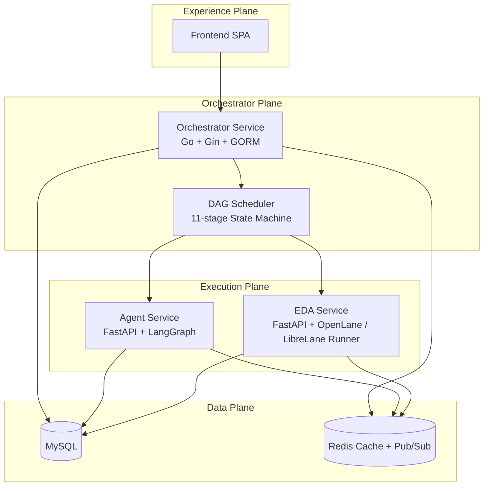
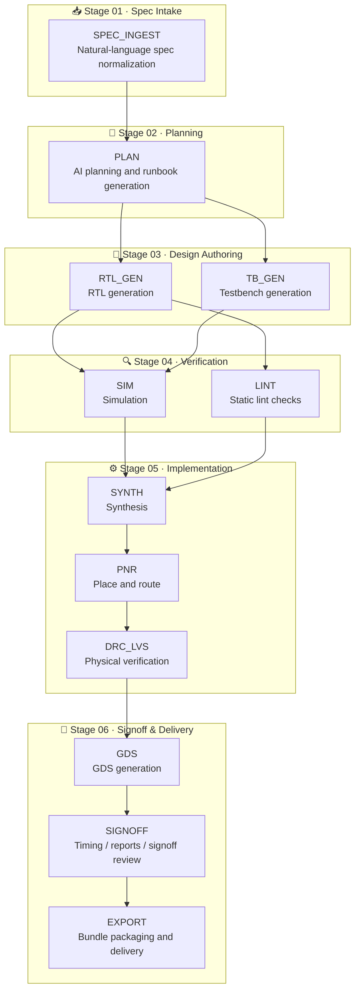

# Chip Orchestra

> **AI-native digital IC orchestration platform** that transforms natural language specifications into verified RTL and manufacturable GDSII through observable, browser-native workflows.

Chip Orchestra is an end-to-end platform for digital IC and SoC development that combines AI agents, EDA automation, and modern web technologies into a unified task-centric workflow.

Rather than treating RTL generation, verification, synthesis, and physical implementation as disconnected tools, Chip Orchestra orchestrates the complete RTL-to-GDSII lifecycle as a transparent, inspectable execution graph.

The platform enables engineers to:

- Generate RTL and produce tapeout-ready deliverables from natural-language specifications
- Automatically verify and repair generated designs
- Execute simulation, lint, hardening, GDS generation, and signoff
- Track every artifact, decision, and execution stage
- Download generated RTL, reports, and workspace files directly from the browser
- Review AI reasoning before accepting changes

---

## Why Chip Orchestra?

Modern digital chip development often relies on disconnected tools, scripts, and manual workflows. While AI has significantly improved RTL generation, there is still no unified execution platform that manages the complete digital chip design lifecycle.

Chip Orchestra introduces a **task-centric orchestration platform** where every design is executed as an observable workflow instead of a collection of scripts.

Instead of asking:

> **Can AI generate Verilog?**

Chip Orchestra asks:

> **Can AI orchestrate the entire RTL-to-GDSII journey while keeping engineers in control?**

The platform combines AI planning, verification, EDA execution, artifact management, and human review into a single browser-native experience.

---

## Features

- AI-assisted RTL-to-GDSII design flow
- Full 11-stage orchestration pipeline from spec ingest to export
- Multi-agent orchestration
- Automated verification and repair
- Browser-native task management
- Runbook artifact downloads for generated `.sv`, `.json`, and `.md` outputs
- RTL Workspace per-file downloads
- Human-in-the-loop review
- Self-hosted LLM support
- Modular microservice architecture

---

## Architecture



Chip Orchestra now runs with **6 containers in Docker Compose**:

- Frontend
- Orchestrator Service
- Agent Service
- EDA Service
- MySQL
- Redis

The **EDA Service** is the newest application service in the stack. It runs on port `8002` and is responsible for OpenLane / LibreLane execution, GDS generation, and signoff-oriented outputs.

---

## Repository Layout

```text
chip-orchestra/
├── orchestrator-service/
├── agent-service/
├── eda-service/
├── frontend/
├── docs/
│   ├── architecture.md
│   ├── development.md
│   ├── roadmap.md
│   ├── vision.md
│   ├── test-plan.md
│   └── api/
├── scripts/
├── docker-compose.yml
├── docker-compose.dev.yml
└── .env.example
```

---

## RTL-to-GDSII Workflow



```text
SPEC_INGEST
    │
    ▼
PLAN
    │
    ├──► RTL_GEN
    │        │
    │        ├──► SIM ──┐
    │        └──► LINT ─┴──► SYNTH
    │
    └──► TB_GEN ───────────► SIM
                              │
                              ▼
                             PNR
                              │
                              ▼
                           DRC_LVS
                              │
                              ▼
                              GDS
                              │
                              ▼
                           SIGNOFF
                              │
                              ▼
                            EXPORT
```

The default pipeline now covers **11 orchestrated stages**:

1. `SPEC_INGEST`
2. `PLAN`
3. `RTL_GEN`
4. `TB_GEN`
5. `SIM`
6. `LINT`
7. `SYNTH`
8. `PNR`
9. `DRC_LVS`
10. `SIGNOFF`
11. `EXPORT`

Every stage is fully observable with:

- AI reasoning
- Execution logs
- Generated artifacts
- Retry history
- Reports and metrics
- Human approval checkpoints

---

## Browser Experience

### Runbook artifact downloads

The **Runbook** tab now exposes working download actions for generated artifacts, including common outputs such as:

- `.sv`
- `.json`
- `.md`

This makes it easier to inspect generated deliverables outside the UI or attach them to downstream review workflows.

### RTL Workspace downloads

The **RTL Workspace** tab now supports per-file download actions, so engineers can export individual workspace files directly from the browser instead of copying content manually.

### Direct browser downloads with JWT

Chip Orchestra supports browser-friendly authenticated downloads by accepting a JWT in the query string:

```text
?token=<jwt>
```

This is useful when opening a direct download URL in a new tab or triggering a browser-native file download flow.

---

## Design Principles

### Task-first orchestration

Digital chip development is managed as structured tasks instead of disconnected scripts. Every task owns its inputs, execution graph, artifacts, reports, approvals, and outputs.

### Transparent AI collaboration

AI should never behave like a black box. Every prompt, retrieved context, generated patch, retry, and reasoning step remains visible to engineers.

### Unified EDA execution

Simulation, linting, synthesis, physical implementation, GDS generation, and signoff execute within one orchestrated pipeline with complete artifact lineage.

### Human-in-the-loop

Critical engineering decisions—including RTL modifications, implementation, and tapeout—remain gated by explicit human approval.

---

## Current Capabilities

- AI-assisted RTL generation
- AI-assisted testbench generation
- Verification and self-repair loops
- Browser-native design task management
- RTL-to-GDSII automation
- OpenLane / LibreLane-backed hardening flow through the EDA Service
- Execution trace visualization
- Artifact management and direct download flows
- Self-hosted LLM inference via Ollama
- Modular service-oriented architecture

---

## Technology Stack

| Layer | Technology |
|--------|------------|
| Frontend | React, Vite |
| Orchestrator | Go, Gin, GORM |
| Agent | Python, FastAPI, LangGraph |
| EDA | Python, FastAPI |
| Database | MySQL |
| Cache & Messaging | Redis |
| AI Models | Ollama (Qwen, GLM, Mistral, etc.) |
| EDA Toolchain | Icarus Verilog, OpenLane, LibreLane, OpenROAD |

---

## Monorepo Services

### Orchestrator Service (Go)

The control plane responsible for:

- Task lifecycle management
- Workflow orchestration
- DAG scheduling
- Authentication
- Metadata management
- API gateway
- Workspace and artifact download endpoints

### Agent Service (Python)

Responsible for:

- AI planning
- Retrieval-Augmented Generation (RAG)
- RTL generation
- Testbench generation
- Verification
- Self-repair
- Reasoning trace generation

### EDA Service (Python)

Responsible for:

- Simulation
- Lint
- Synthesis
- Place & route
- GDS generation
- Signoff
- Report generation
- Artifact management

---

## Quick Start

### 1. Start the full stack with Docker Compose

```bash
unzip chip_orchestra_feat_eda.zip
cd chip_orchestra_feat_eda
cp .env.example .env
docker compose up --build
```

Frontend:

```text
http://localhost:4173
```

> The Dockerized frontend runs with `VITE_USE_MOCKS=true` by default. This is useful for UI walkthroughs, but it is not the recommended mode for validating the live backend flow.

### 2. Test against the real backend

```bash
cd frontend
cp .env.example .env
npm install
npm run dev
```

Frontend:

```text
http://localhost:5173
```

Use this mode when you want to exercise the real Orchestrator, Agent, and EDA services instead of the default mock-mode frontend container.

### 3. Sign in

```text
Username: admin
Password: chip-orchestra
```

---

## Local Services

| Service | URL |
|----------|-----|
| Frontend (Docker / mock mode) | http://localhost:4173 |
| Frontend (local dev / real backend) | http://localhost:5173 |
| Orchestrator Service | http://localhost:8080 |
| Agent Service | http://localhost:8001 |
| EDA Service | http://localhost:8002 |
| MySQL | localhost:3306 |
| Redis | localhost:6379 |

---

## Default Credentials

```text
Username: admin
Password: chip-orchestra
```

---

## API Highlights

### Authentication

- `POST /api/v1/auth/login`
- `GET /api/v1/auth/me`

### Task and workspace APIs

- `GET /api/v1/tasks/:id/attempts/latest/events`
- `GET /api/v1/tasks/:id/attempts/latest/artifacts`
- `GET /api/v1/tasks/:id/workspace/files`
- `GET /api/v1/tasks/:id/workspace/file?path=<file>`
- `GET /api/v1/tasks/:id/workspace/download?path=<file>`

The download endpoint streams workspace files as attachments, which powers the browser download actions in the Runbook and RTL Workspace views.

---

## Documentation

| Document | Description |
|----------|-------------|
| `docs/architecture.md` | Overall platform architecture |
| `docs/development.md` | Local development workflow |
| `docs/roadmap.md` | Product roadmap |
| `docs/vision.md` | Product vision and design principles |
| `docs/test-plan.md` | Testing strategy |
| `docs/api/orchestrator-service.md` | Orchestrator API |
| `docs/api/agent-service.md` | Agent API |
| `docs/api/eda-service.md` | EDA API |

---

## Roadmap

The long-term vision extends beyond RTL generation toward a complete AI-native digital engineering platform.

Planned capabilities include:

- Multi-agent collaboration
- Distributed execution across cloud and local workers
- Repository-aware engineering assistants
- Incremental compilation
- Design knowledge retrieval
- Multi-user collaboration
- Tapeout management
- Physical design optimization
- Analog and mixed-signal extensions
- FPGA implementation flows

---

## Success Metrics

Chip Orchestra is designed to improve engineering productivity by reducing:

- Time from specification to first working RTL
- Manual debugging iterations
- Verification turnaround time
- Engineering effort spent coordinating multiple EDA tools

while increasing:

- Workflow observability
- Artifact traceability
- AI transparency
- Signoff readiness
- Engineering confidence in AI-generated designs

---

## Vision

Chip Orchestra aims to make digital chip development as seamless as modern AI-assisted software engineering by combining autonomous AI agents with reproducible EDA workflows and browser-native collaboration.

The long-term goal is to reduce reliance on proprietary APIs through a flexible orchestration layer that supports self-hosted foundation models while maintaining production-grade observability, reproducibility, and human oversight throughout the RTL-to-GDSII lifecycle.

Rather than replacing hardware engineers, Chip Orchestra augments them by making complex digital design workflows transparent, reproducible, and significantly more efficient.
