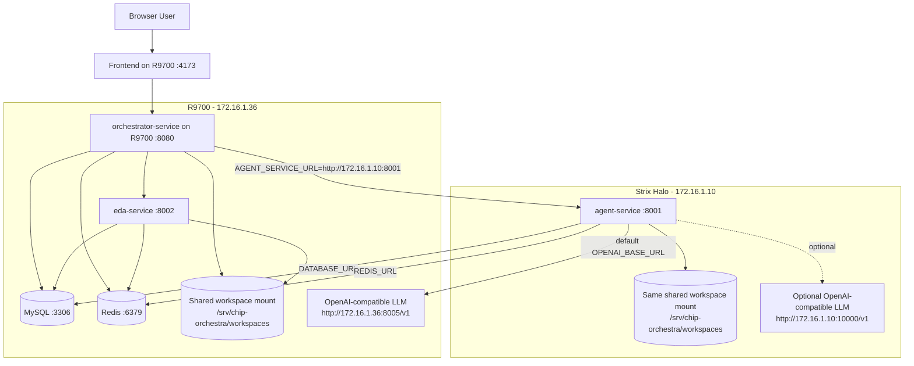
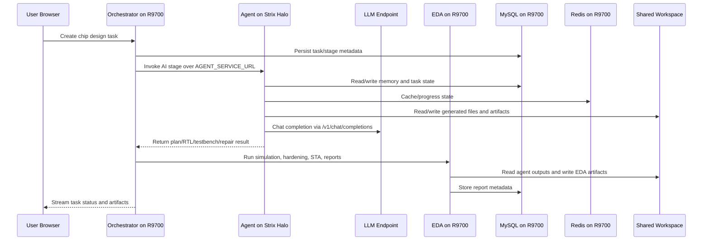

# Distributed AMD Architecture: Strix Halo Agent + R9700 Core

This document describes the proposed AMD deployment split for Chip Orchestra. It follows the same separation principle as the Hostinger deployment blueprint, but maps the roles to the available AMD infrastructure.

## 1. Goal

Run `agent-service` on Strix Halo and keep the rest of Chip Orchestra on R9700. This isolates the Python/LangGraph agent runtime from the stateful control plane and EDA execution path, while still allowing the agent to call either the R9700 LLM endpoint or the Strix Halo LLM endpoint through the OpenAI-compatible `/v1` API.

## 2. Node responsibilities

| Node | IP | Services | Why |
|---|---|---|---|
| R9700 | `172.16.1.36` | MySQL, Redis, `orchestrator-service`, `eda-service`, frontend, optional primary LLM endpoint on `:8005` | Keeps state, task orchestration, EDA execution, and public app entry together. Good default host for heavy inference. |
| Strix Halo | `172.16.1.10` | `agent-service`, optional secondary LLM endpoint on `:10000` | Isolates agent runtime and enables future local/fallback model experiments. |

## 3. Runtime topology



## 4. Request flow



## 5. Shared workspace requirement

The split only works if both nodes see the same workspace path. The recommended first implementation is a network filesystem mounted at the same host path on both machines:

```text
/srv/chip-orchestra/workspaces
```

Both compose files mount this host path into containers as:

```text
/srv/chip-orchestra/workspaces
```

Recommended options are NFS for the quickest setup, or a future object-storage/artifact-service refactor if multi-node concurrency grows. Without a shared workspace, `agent-service` may generate files that `eda-service` cannot see.

## 6. Compose files

The implementation lives in `deploy/selfhosted-llm-rocm/`:

| File | Runs on | Purpose |
|---|---|---|
| `docker-compose.r9700-core.yml` | R9700 | MySQL, Redis, orchestrator, EDA, frontend |
| `r9700-core.env.example` | R9700 | Environment defaults for the R9700 stack |
| `docker-compose.strix-agent.yml` | Strix Halo | Remote `agent-service` only |
| `strix-agent.env.example` | Strix Halo | Environment defaults for the Strix agent stack |
| `scripts/check_amd_infra_models.sh` | Any host with network access | Validates `/v1/models` and chat completions on R9700 and Strix Halo |

## 7. Deployment sequence

### 7.1 Validate LLM endpoints

Run from either host with access to both endpoints:

```bash
cd deploy/selfhosted-llm-rocm
bash scripts/check_amd_infra_models.sh
```

If `/v1/models` returns model ids like `GLM-5.2-FP8`, set `OPENAI_MODEL` to that exact value. The placeholders `R9700` and `Strix-Halo` are only safe if the serving layer registered them as model aliases.

### 7.2 Prepare shared workspace on both nodes

Mount the same network storage at:

```bash
sudo mkdir -p /srv/chip-orchestra/workspaces
```

For the first deployment, verify both nodes can create and read the same file in that path before starting containers.

### 7.3 Start R9700 core

On R9700:

```bash
cd Chip-Orchestra/deploy/selfhosted-llm-rocm
cp r9700-core.env.example r9700-core.env
# edit passwords, JWT_SECRET, DEFAULT_PASSWORD, and model ids as needed

docker compose --env-file r9700-core.env -f docker-compose.r9700-core.yml up -d --build
curl -fsS http://172.16.1.36:8080/health
curl -fsS http://172.16.1.36:8002/health
```

### 7.4 Start Strix Halo agent

On Strix Halo:

```bash
cd Chip-Orchestra/deploy/selfhosted-llm-rocm
cp strix-agent.env.example strix-agent.env
# edit MYSQL_PASSWORD and OPENAI_MODEL as needed

docker compose --env-file strix-agent.env -f docker-compose.strix-agent.yml up -d --build
curl -fsS http://172.16.1.10:8001/health
curl -fsS http://172.16.1.10:8001/agent/models
```

### 7.5 Validate cross-node flow

From R9700:

```bash
curl -fsS http://172.16.1.10:8001/health
curl -fsS http://172.16.1.10:8001/agent/models
```

Then open the frontend or call the orchestrator and run one small task. Start with a simple UART FIFO, ALU, or NanoCGRA-lite smoke task before attempting a larger design.

## 8. Network policy

Recommended private-network allowances:

| Source | Destination | Port | Purpose |
|---|---|---:|---|
| Strix Halo | R9700 | 3306 | Agent reads/writes MySQL |
| Strix Halo | R9700 | 6379 | Agent uses Redis |
| R9700 | Strix Halo | 8001 | Orchestrator invokes agent-service |
| Strix Halo | R9700 | 8005 | Agent calls R9700 LLM endpoint by default |
| R9700 or operator host | Strix Halo | 10000 | Optional Strix LLM validation |
| User/operator | R9700 | 8080 / 4173 | Orchestrator/frontend access |

Do not expose MySQL or Redis publicly. Bind them to the private interface and restrict source IPs with host firewall rules.

## 9. Why this split is preferred

This architecture is better than putting everything on one node when Strix Halo is stable because it separates the long-running Python agent process from the EDA/control-plane host. R9700 remains the state and execution anchor, while Strix Halo can be restarted, tuned, or pointed to different model endpoints without disturbing MySQL, Redis, EDA, or the frontend.

The tradeoff is operational complexity: shared storage and private network connectivity are now mandatory. If shared storage is not ready, use the single-node R9700 mode first.

## 10. Future improvements

Useful next steps after the first deployment are an OpenAI-compatible model router in front of `172.16.1.36:8005` and `172.16.1.10:10000`, automatic failover in `agent-service`, object storage for durable artifacts, and a small health dashboard that checks orchestrator, agent, EDA, Redis, MySQL, workspace read/write, and both `/v1/models` endpoints.
