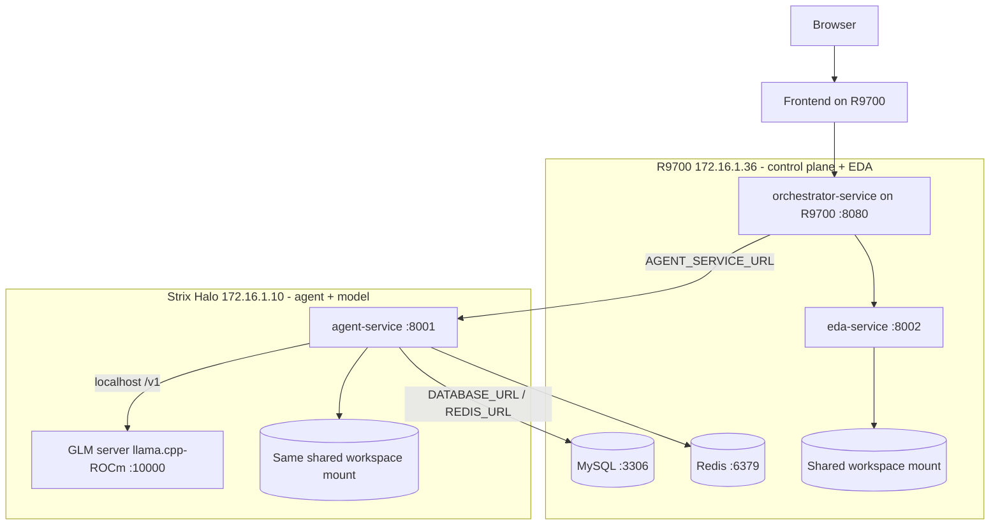

# Self-Hosting GLM-5.2 on AMD R9700 + Strix Halo

This document is the honest, hardware-accurate plan for self-hosting GLM for Chip Orchestra on the available AMD nodes. It replaces the assumption baked into the older `serve_vllm.sh` / `docker-compose.vllm-rocm.yml`, which target 8×MI300X/MI355X datacenter GPUs — not the hardware here.

## 1. What the hardware actually is

| Node | Class | GPU / arch | Memory | Practical engine |
|---|---|---|---|---|
| R9700 (`172.16.1.36`) | Workstation card | Radeon AI PRO R9700, Navi 48 / RDNA4, gfx120x | 32 GB GDDR6 | llama.cpp-ROCm (RDNA4 native in ROCm 7); vLLM-ROCm RDNA support is limited |
| Strix Halo (`172.16.1.10`) | APU / mini-PC | Ryzen AI Max+ 395, Radeon 8060S iGPU, RDNA3.5, gfx1151 | up to 128 GB unified (LPDDR5X) | llama.cpp-ROCm / Ollama; gfx1151 is ROCm "Preview" and needs `HSA_OVERRIDE_GFX_VERSION=11.5.1` |

Neither is an Instinct GPU. There is no 8-GPU tensor-parallel node and no 750 GB of HBM.

## 2. The blunt feasibility truth

Full flagship GLM-5.2 (~750B DSA MoE) needs roughly 750 GB (FP8) or ~375 GB (MXFP4) just for weights. That does not fit:

- R9700 32 GB — no.
- Strix Halo 128 GB — no (even the ~375 GB MXFP4 is far larger than 128 GB).
- R9700 + Strix Halo combined (~160 GB) — still no for the full flagship.

So "self-hosted GLM-5.2" on these two boxes means one of three realistic things:

1. Run a smaller GLM that fits (recommended to get running now), served under the alias `GLM-5.2` so nothing in the app changes.
2. Build a multi-node Strix Halo cluster with llama.cpp RPC to pool memory for a much larger quant. AMD documents running a trillion-parameter MoE this way across a Ryzen AI Max+ cluster.
3. Move the flagship to real Instinct hardware and keep these boxes for lighter models. That path is the existing `serve_vllm.sh`.

This deployment implements option 1 as the default and documents option 2.

## 3. Recommended topology: GLM co-located with agent-service on Strix Halo

Per the decision to host GLM wherever `agent-service` runs, the model server and the agent are co-located on Strix Halo. This is the right call for two reasons: Strix Halo's 128 GB unified memory is the better model host, and the chattiest traffic (agent ↔ model token streaming) stays on-node instead of crossing the network.



Why this is the scalable/reliable pattern: the agent+model pair is a single deployable unit you can restart, upgrade, or replicate without touching the R9700 control plane, and there is no cross-host hop on every model token. If you later add more Strix Halo boxes, each can run its own agent+GLM unit behind the orchestrator.

## 4. Container tool: Podman primary for the AMD path

For this AMD deployment, Podman is the primary tool; Docker remains a documented alternative. See `PODMAN_DEPLOYMENT.md` for install, SELinux `:z` volume flags, rootful vs rootless, and systemd auto-start. The rest of the Chip Orchestra repo keeps Docker.

## 5. Files

| File | Runs on | Purpose |
|---|---|---|
| `docker-compose.strix-full.yml` | Strix Halo | GLM server + agent-service, co-located, health-gated |
| `strix-agent.env.example` | Strix Halo | Env for the co-located full stack (and agent-only mode) |
| `scripts/serve_strixhalo_glm.sh` | Strix Halo | Standalone `docker/podman run` for the GLM server (gfx1151) |
| `docker-compose.r9700-core.yml` | R9700 | MySQL, Redis, orchestrator, EDA, frontend |
| `r9700-core.env.example` | R9700 | Env for the R9700 control plane |
| `docker-compose.r9700-full.yml` | R9700 | Optional: GLM server + core app on R9700 (second inference node) |
| `scripts/serve_r9700_glm.sh` | R9700 | Standalone GLM server for R9700 (gfx120x, 32 GB) |
| `scripts/healthcheck.sh` | any | Verify one endpoint's `/v1/models` + chat completion |
| `scripts/check_amd_infra_models.sh` | any | Verify both endpoints' `/v1/models` |

## 6. Model sizing cheatsheet

Approximate memory for weights only (add ~10-30% for KV cache at long context):

| Model class | Q4_K_M (~4.5 bpw) | Fits R9700 32GB? | Fits Strix Halo 128GB? |
|---|---|---|---|
| ~9B dense | ~6 GB | yes | yes |
| ~32B dense (e.g. GLM-4-32B) | ~20 GB | yes (tight KV) | yes |
| ~106B MoE (e.g. GLM-4.5-Air) | ~65 GB | no | yes |
| ~355B MoE | ~200 GB | no | no (needs cluster) |
| ~750B MoE (GLM-5.2 flagship) | ~400 GB | no | no (needs cluster) |

Default in this deployment: `GLM-4.5-Air` Q4_K_M on Strix Halo, aliased as `GLM-5.2`. It is the largest GLM that comfortably fits one 128 GB node and behaves like a capable agent model. Change `GLM_MODEL_REPO` / `GLM_MODEL_FILE` to whatever GLM build you standardize on.

## 7. Deploy — Strix Halo (agent + GLM), Podman primary

```bash
cd Chip-Orchestra/deploy/selfhosted-llm-rocm
cp strix-agent.env.example strix-agent.env
# edit MYSQL_PASSWORD, GLM_MODEL_REPO/FILE, and (SELinux) WORKSPACE_MOUNT_FLAG=:z

sudo podman-compose --env-file strix-agent.env -f docker-compose.strix-full.yml up -d
# Docker alternative:
# docker compose --env-file strix-agent.env -f docker-compose.strix-full.yml up -d --build

# First boot downloads the GGUF; watch the model server come up:
podman logs -f glm-strixhalo
BASE=http://172.16.1.10:10000 OPENAI_MODEL=GLM-5.2 bash scripts/healthcheck.sh
curl -fsS http://172.16.1.10:8001/health
curl -fsS http://172.16.1.10:8001/agent/models
```

## 8. Deploy — R9700 (control plane + EDA)

```bash
cd Chip-Orchestra/deploy/selfhosted-llm-rocm
cp r9700-core.env.example r9700-core.env
# AGENT_SERVICE_URL already points to http://172.16.1.10:8001

sudo podman-compose --env-file r9700-core.env -f docker-compose.r9700-core.yml up -d
# Docker alternative:
# docker compose --env-file r9700-core.env -f docker-compose.r9700-core.yml up -d --build

curl -fsS http://172.16.1.36:8080/health
curl -fsS http://172.16.1.36:8002/health
```

## 9. Option 2 — scale to bigger GLM with a Strix Halo cluster

To host a much larger GLM (up to the flagship), pool memory across multiple Strix Halo nodes using llama.cpp RPC: run `rpc-server` on each worker node, then start one `llama-server` with `--rpc host1:port,host2:port,...` and enough combined memory for the chosen quant. Keep `--alias GLM-5.2` so the app is unchanged, and point `agent-service` `OPENAI_BASE_URL` at the head node. This is the same mechanism AMD documents for running a trillion-parameter MoE locally on a Ryzen AI Max+ cluster.

## 10. Gotchas

The most common issues here are: choosing a GGUF larger than the node's memory (start smaller, confirm, then scale up); forgetting `HSA_OVERRIDE_GFX_VERSION=11.5.1` on Strix Halo so the iGPU is not used; forgetting SELinux `:z` on the workspace mount under Podman; and leaving `OPENAI_MODEL` as a placeholder that does not match the server `--alias`. Always confirm with `/v1/models` before running a real chip task.

## Sources

- AMD Radeon AI PRO R9700 (32 GB, RDNA4): https://www.amd.com/en/products/graphics/workstations/radeon-ai-pro.html
- Trillion-parameter LLM on a Ryzen AI Max+ (Strix Halo) cluster, llama.cpp + ROCm 7: https://www.amd.com/en/developer/resources/technical-articles/2026/how-to-run-a-one-trillion-parameter-llm-locally-an-amd.html
- Strix Halo LLM performance / gfx1151 notes: https://community.frame.work/t/amd-strix-halo-ryzen-ai-max-395-gpu-llm-performance-tests/72521
