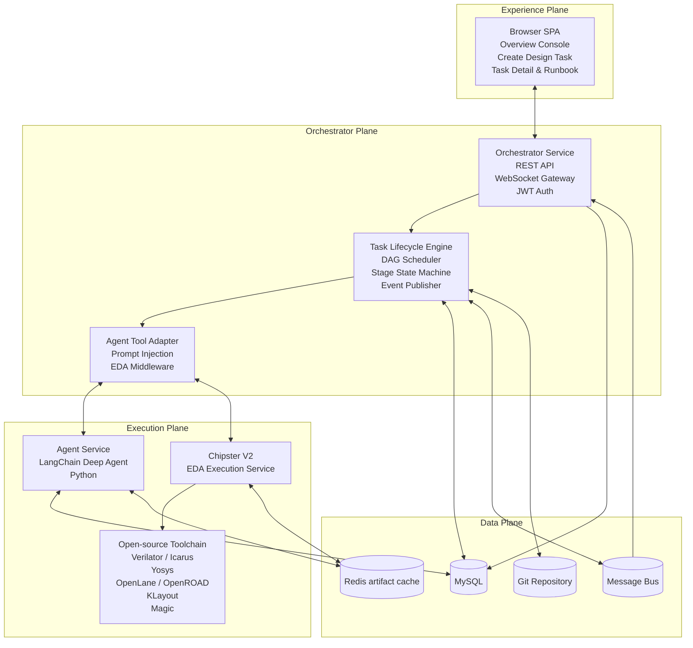
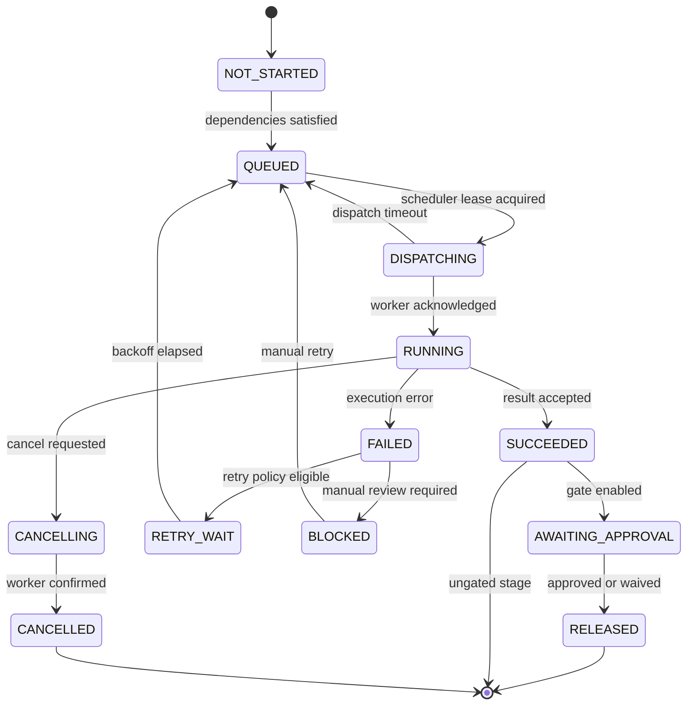
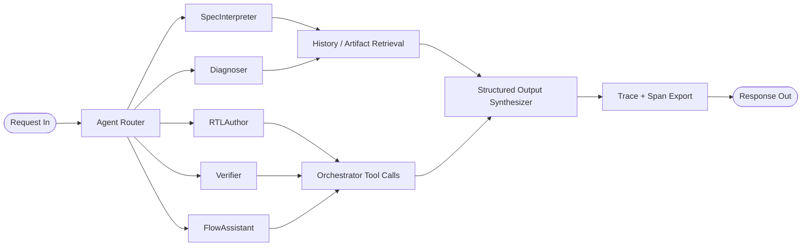
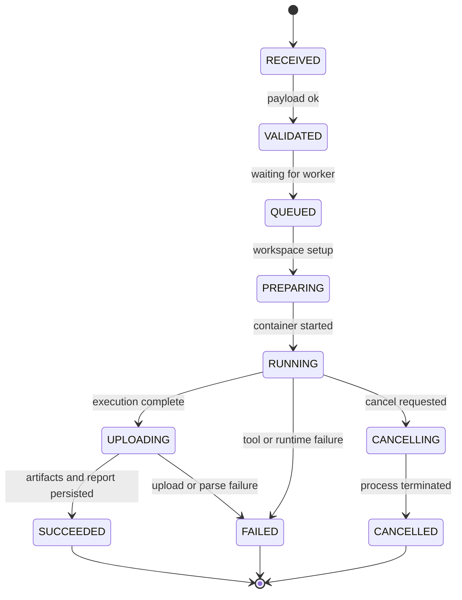
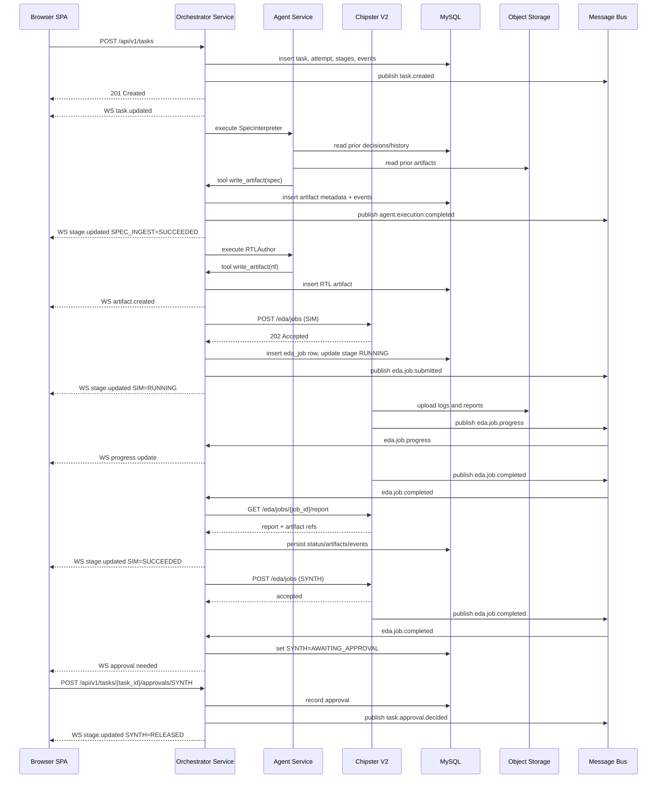

# Chip Orchestra Technical Architecture Design

**System name:** Chip Orchestra  
**Tagline:** Browser-based digital IC design automation — 100% open source

> Repository implementation notes: Orchestrator Service is the control-plane runtime, MySQL is the relational store, Redis is used for artifact caching and transient job state, and the Orchestrator Service implementation target is Golang.

## 1. Architecture Overview

Chip Orchestra is a browser-native digital IC design automation platform that manages the path from design intent to implementation artifacts through a unified orchestration model. The architecture is organized into four planes so that user interaction, control logic, compute execution, and persistent data remain clearly separated but tightly integrated.

### 1.1 Architectural goals

- Provide a browser-first task experience for digital IC design flows.
- Keep all orchestration logic explicit, observable, and recoverable.
- Centralize user control, process control, and service mediation in one backend service.
- Use agent-driven planning and diagnosis without allowing agents to directly control execution infrastructure.
- Standardize execution behind a clean EDA service contract.
- Preserve all important metadata, artifacts, logs, and agent traces for audit, retry, and self-improvement.
- Remain deployable from a small docker-compose setup up to Kubernetes without redesigning service boundaries.

### 1.2 Four-plane model

| Plane | Purpose | Primary components | Key outputs |
|---|---|---|---|
| Experience Plane | User interaction and live visibility | Browser SPA, WebSocket client, task console, runbook, file viewers | Commands, subscriptions, UI state |
| Orchestrator Plane | Unified control, API entry, orchestration, state ownership | Orchestrator Service, auth, scheduler, task lifecycle engine, event publisher | Task state, stage transitions, agent calls, EDA dispatch |
| Execution Plane | AI reasoning and EDA execution | Agent Service, Chipster V2, worker pools, container runtime | Plans, patches, diagnostics, reports, tool results |
| Data Plane | Durable metadata and artifact storage | MySQL, Redis cache, Git repository, event log | Metadata, artifacts, traces, reusable context |

### 1.3 New architecture diagram



### 1.4 Core architectural decisions

1. **Orchestrator Service is the only control-plane entry point.** It combines API gateway, backend-for-frontend, orchestration engine, state ownership, and middleware responsibilities.
2. **Agent Service is isolated from infrastructure details.** It receives structured prompts and tool contracts from Orchestrator rather than directly coordinating queues, databases, or EDA runtimes.
3. **Chipster V2 is the only execution-plane system that drives EDA jobs.** It exposes stable control and query APIs and is never called directly by the browser or Agent Service.
4. **Persistent feedback is part of the architecture, not an afterthought.** Agent traces, past decisions, reports, and artifacts feed future agent reasoning through controlled retrieval from MySQL and Redis cache.
5. **Async messaging complements synchronous APIs.** Command submission is mostly synchronous; progress, state transitions, and fan-out notifications are event-driven.
6. **JWT auth is sufficient for MVP.** No SSO is included in the first version to keep the product path focused and implementation cost low.

---

## 2. Module-by-Module Detailed Design

## 2A. Orchestrator Service

### 2A.1 Responsibility and scope

The Orchestrator Service is the unified system-of-record and runtime coordinator for Chip Orchestra. It combines the responsibilities that would otherwise be split across an API gateway, BFF, orchestration engine, and service mediator.

**In scope**
- REST API for browser and service clients.
- WebSocket fan-out for live task and stage updates.
- JWT-based authentication and RBAC enforcement.
- Task, stage, and attempt lifecycle ownership.
- DAG scheduling, dependency evaluation, retry, and checkpointing.
- Prompt packaging and tool exposure for Agent Service.
- EDA middleware calls to Chipster V2.
- Event publishing and event consumption.
- Database transaction coordination and idempotency.
- Repository integration and artifact metadata indexing.

**Out of scope**
- Running LLM chains itself.
- Executing EDA tools itself.
- Direct artifact transformation beyond metadata and storage pointers.
- SSO or enterprise identity federation for MVP.

### 2A.2 Internal subcomponents

| Subcomponent | Purpose |
|---|---|
| API Layer | REST endpoints, request validation, auth, rate limit, response shaping |
| WebSocket Gateway | Task-room subscription, live status push, heartbeat, replay cursor support |
| Auth Module | JWT issue/verify, password-based login for MVP, role extraction |
| Task Lifecycle Engine | Creates tasks, stages, attempts, transitions task-level aggregate state |
| DAG Scheduler | Resolves stage dependency graph and schedules runnable nodes |
| Agent Bridge | Builds prompt envelope, tool manifest, and invocation request to Agent Service |
| EDA Bridge | Translates stage execution request into Chipster V2 job request |
| Event Publisher / Consumer | Emits domain events to message bus and consumes execution progress |
| Repository Adapter | Pull, clone, branch, commit metadata, template materialization |
| Persistence Layer | MySQL transactions, optimistic locking, audit logging |

### 2A.3 Canonical task model

A **task** is the top-level design workflow instance. A task contains one or more **attempts**. Each attempt materializes a stage graph. Each **stage** can have one or more **stage attempts** when retried independently. Task status is an aggregate projection of stage states.

Recommended default stage graph:
- `SPEC_INGEST`
- `PLAN`
- `RTL_GEN`
- `TB_GEN`
- `SIM`
- `LINT`
- `SYNTH`
- `PNR`
- `DRC_LVS`
- `SIGNOFF`
- `EXPORT`

### 2A.4 REST API surface

All endpoints are rooted at `/api/v1`. All authenticated endpoints require `Authorization: Bearer <jwt>`.

#### Authentication APIs

##### `POST /api/v1/auth/login`
Issue an MVP JWT using username or email and password.

**Request**
```json
{
  "username": "radhian.armansyah",
  "password": "********"
}
```

**200 Response**
```json
{
  "access_token": "jwt-token",
  "token_type": "Bearer",
  "expires_in": 3600,
  "user": {
    "id": "usr_123",
    "username": "radhian.armansyah",
    "full_name": "Radhian Ferel Armansyah",
    "roles": ["designer", "admin"]
  }
}
```

**Status codes**
- `200` success
- `400` malformed request
- `401` invalid credentials
- `429` rate limited

##### `POST /api/v1/auth/refresh`
Rotate access token.

##### `GET /api/v1/auth/me`
Return current principal and permission summary.

#### Task APIs

##### `GET /api/v1/tasks`
List tasks with filtering and pagination.

**Query params**
- `owner_id`
- `status`
- `stage`
- `repo_id`
- `needs_review`
- `failed`
- `cursor`
- `limit`

**200 Response**
```json
{
  "items": [
    {
      "task_id": "tsk_001",
      "name": "uart_tx_controller",
      "status": "RUNNING",
      "current_stage": "SIM",
      "owner": {
        "id": "usr_123",
        "full_name": "Radhian Ferel Armansyah"
      },
      "latest_attempt": 2,
      "eta_seconds": 540,
      "updated_at": "2026-06-20T04:55:00Z"
    }
  ],
  "next_cursor": "opaque-cursor"
}
```

**Status codes**
- `200` success
- `401` unauthorized
- `403` forbidden

##### `POST /api/v1/tasks`
Create a new design task and initial attempt.

**Request**
```json
{
  "name": "uart_tx_controller",
  "description": "UART TX controller with APB interface",
  "design_brief": "Generate synthesizable RTL, testbench, and implementation reports.",
  "launch_mode": "FULL_FLOW_GATED",
  "repo": {
    "mode": "TEMPLATE",
    "template_id": "digital-core-starter"
  },
  "design_context": {
    "language": "verilog",
    "clock_target_mhz": 200,
    "pdk_id": "sky130",
    "stdcell_lib_id": "sky130_fd_sc_hd"
  },
  "run_policy": {
    "auto_retry_limit": 1,
    "approval_gates": ["SYNTH", "SIGNOFF"]
  }
}
```

**201 Response**
```json
{
  "task_id": "tsk_001",
  "attempt_id": "att_001",
  "status": "PENDING",
  "current_stage": "SPEC_INGEST",
  "created_at": "2026-06-20T04:53:00Z"
}
```

**Status codes**
- `201` created
- `400` validation error
- `409` duplicate slug or conflicting repo binding

##### `GET /api/v1/tasks/{task_id}`
Return task header, stage projection, latest attempt, live counters, approvals, and summary metrics.

##### `POST /api/v1/tasks/{task_id}/retry`
Create a new full-task attempt.

**Request**
```json
{
  "reason": "Simulation mismatch fixed; rerun full flow",
  "from_stage": "SIM"
}
```

##### `POST /api/v1/tasks/{task_id}/cancel`
Cancel active attempt and downstream queued stages.

##### `GET /api/v1/tasks/{task_id}/stages`
List stage nodes with dependency and status details.

**200 Response**
```json
{
  "task_id": "tsk_001",
  "attempt_id": "att_002",
  "stages": [
    {
      "stage_id": "stg_sim",
      "name": "SIM",
      "status": "RUNNING",
      "depends_on": ["TB_GEN", "RTL_GEN"],
      "retry_count": 0,
      "started_at": "2026-06-20T04:56:00Z"
    }
  ]
}
```

##### `POST /api/v1/tasks/{task_id}/stages/{stage_name}/retry`
Retry a single stage and all transitively dependent downstream stages.

##### `GET /api/v1/tasks/{task_id}/attempts`
List historical attempts.

##### `GET /api/v1/tasks/{task_id}/attempts/{attempt_id}`
Return one attempt summary.

#### Runbook and activity APIs

##### `GET /api/v1/tasks/{task_id}/attempts/{attempt_id}/events`
Retrieve append-only runbook event stream.

##### `GET /api/v1/tasks/{task_id}/attempts/{attempt_id}/artifacts`
List artifact metadata and signed access URLs.

##### `GET /api/v1/tasks/{task_id}/attempts/{attempt_id}/issues`
Return diagnostics, grouped by stage and severity.

##### `GET /api/v1/tasks/{task_id}/attempts/{attempt_id}/agent-trace`
Return trace metadata, span summary, and storage references.

#### Workspace and repository APIs

##### `GET /api/v1/tasks/{task_id}/workspace/files`
List working files for the active branch.

##### `GET /api/v1/tasks/{task_id}/workspace/file`
Read one file by path.

**Query params**
- `path`
- `ref` optional branch or commit

##### `POST /api/v1/tasks/{task_id}/workspace/propose-patch`
Ask Agent Service to produce a patch proposal.

**Request**
```json
{
  "instruction": "Reduce simulation failure in uart state machine",
  "target_files": ["rtl/uart_tx.v", "tb/uart_tx_tb.v"]
}
```

##### `POST /api/v1/tasks/{task_id}/workspace/apply-patch`
Apply an approved patch to the task branch.

#### Approval and signoff APIs

##### `GET /api/v1/tasks/{task_id}/signoff/status`
Return signoff checklist, blockers, and required approvals.

##### `POST /api/v1/tasks/{task_id}/approvals/{stage_name}`
Approve or reject a gated stage.

**Request**
```json
{
  "decision": "APPROVED",
  "comment": "Timing summary acceptable for MVP target"
}
```

##### `POST /api/v1/tasks/{task_id}/waivers`
Create a waiver tied to a diagnostic issue.

##### `POST /api/v1/tasks/{task_id}/export-bundle`
Build final export manifest and release package.

#### WebSocket APIs

##### `GET /ws`
WebSocket endpoint using JWT in query param or `Sec-WebSocket-Protocol` bearer token.

**Client actions**
```json
{ "action": "subscribe", "topic": "task:tsk_001" }
```
```json
{ "action": "subscribe", "topic": "attempt:att_002" }
```
```json
{ "action": "ping" }
```

**Server messages**
```json
{
  "type": "stage.updated",
  "task_id": "tsk_001",
  "attempt_id": "att_002",
  "stage": "SIM",
  "status": "RUNNING",
  "progress": 42,
  "timestamp": "2026-06-20T04:58:10Z"
}
```

```json
{
  "type": "artifact.created",
  "task_id": "tsk_001",
  "attempt_id": "att_002",
  "artifact": {
    "artifact_id": "art_123",
    "stage": "SYNTH",
    "type": "REPORT",
    "name": "timing_summary.rpt"
  }
}
```

### 2A.5 Internal data flow

1. Browser submits a task creation request to Orchestrator.
2. Orchestrator validates JWT, request schema, launch policy, and repo policy.
3. Orchestrator creates task, attempt, stage graph, and initial runbook event in one transaction.
4. DAG scheduler marks `SPEC_INGEST` runnable and publishes `task.stage.queued`.
5. For agent-driven stages, Agent Bridge packages:
   - task metadata
   - stage objective
   - prompt template
   - retrieval context references
   - tool manifest
6. Agent Service returns structured outputs such as plan, diagnosis, patch, or execution request.
7. For EDA-driven stages, EDA Bridge submits a Chipster V2 job.
8. Orchestrator listens for progress and result events, updates state, stores artifact metadata, and pushes UI updates by WebSocket.
9. On failure, Orchestrator decides whether to auto-retry, block for human review, or request diagnosis from Agent Service.
10. When gated stages succeed, Orchestrator waits for approval or waiver before releasing downstream nodes.

### 2A.6 DAG scheduler internals

**Execution model**
- A stage node is runnable when:
  - all required upstream stages are in `SUCCEEDED`, `SKIPPED`, or approved `BLOCKED_RELEASED`
  - task attempt is active
  - no cancellation flag exists
  - concurrency limits allow execution
- Scheduler loop can be triggered by:
  - task creation
  - stage completion
  - retry request
  - approval granted
  - external event arrival

**Recommended tables and projections**
- `task_stage_dependencies(stage_id, depends_on_stage_id)`
- `stage_execution_locks(task_id, stage_name, lease_until)`
- `scheduler_outbox(id, aggregate_type, aggregate_id, event_type, payload, published_at)`

**Best-practice implementation details**
- Use optimistic version columns on `tasks`, `task_attempts`, and `task_stages`.
- Evaluate runnable nodes inside a transaction, publish via outbox pattern after commit.
- Maintain stage idempotency keys so repeated queue events do not duplicate work.
- Separate orchestration status from execution progress percentage.
- Never let UI state be the source of truth for scheduling.

### 2A.7 Stage state machine



### 2A.8 Agent dispatch contract

Orchestrator sends agent requests to `/internal/agent-executions` on the Agent Service.

**Request envelope**
```json
{
  "request_id": "req_001",
  "task": {
    "task_id": "tsk_001",
    "attempt_id": "att_002",
    "stage": "RTL_GEN",
    "agent_type": "RTLAuthor"
  },
  "prompt": {
    "system": "You are generating synthesizable RTL for the current task.",
    "objective": "Create synthesizable RTL based on the accepted plan.",
    "context_blocks": [
      {"type": "task_summary", "value": "..."},
      {"type": "retrieved_history", "value": "..."}
    ]
  },
  "tools": [
    {
      "name": "write_artifact",
      "input_schema": {"type": "object"}
    }
  ],
  "policies": {
    "timeout_seconds": 900,
    "max_tool_calls": 20,
    "trace_level": "verbose"
  }
}
```

**Expected response**
```json
{
  "request_id": "req_001",
  "status": "SUCCEEDED",
  "outputs": {
    "summary": "RTL generated and testbench request emitted",
    "next_action": "SUBMIT_EDA_JOB",
    "tool_results": []
  },
  "trace_ref": "s3://chip-orchestra-traces/tasks/tsk_001/att_002/rtl_gen/trace.json"
}
```

### 2A.9 Chipster V2 interface handling

Orchestrator is the only service allowed to call Chipster V2. For every EDA stage, Orchestrator:
- builds a normalized job payload
- includes task, attempt, stage, and idempotency key
- maps Orchestrator stage names to toolchain profiles
- persists submitted `job_id`
- polls on demand and subscribes to event updates
- validates terminal report structure before marking the stage complete

### 2A.10 Event bus integration

**Publish topics**
- `task.created`
- `task.updated`
- `task.attempt.started`
- `task.stage.queued`
- `task.stage.running`
- `task.stage.completed`
- `task.stage.failed`
- `task.approval.requested`
- `task.approval.decided`
- `artifact.created`
- `agent.trace.available`
- `eda.job.submitted`
- `eda.job.progress`
- `eda.job.completed`
- `eda.job.failed`

**Consume topics**
- `eda.job.progress`
- `eda.job.completed`
- `eda.job.failed`
- `agent.execution.completed`
- `agent.execution.failed`
- `repo.sync.completed`

**Messaging guidance**
- NATS JetStream or RabbitMQ are both suitable.
- Use durable consumers for state-changing handlers.
- Use message keys based on `task_id` to preserve per-task ordering where possible.
- Carry dedupe keys in event headers.

### 2A.11 Key design decisions and best practices

- Keep browser traffic coarse-grained; hide backend complexity behind task-centric endpoints.
- Treat Orchestrator as the source of truth for orchestration state, never Agent Service or Chipster.
- Use transactional outbox for all external event publication.
- Do not expose internal service errors directly to the SPA; translate them into stable task and issue states.
- Separate stage orchestration state from approval state.
- Maintain replayable runbook history so UI can rebuild state from events if projections lag.
- Use rate limiting on auth, task creation, and patch proposal endpoints.
- Add idempotency support for task creation and job submission.

### 2A.12 Tech stack

- **Language/runtime:** Go or Python FastAPI; Go is preferred for long-term high-concurrency control plane, FastAPI is acceptable for MVP.
- **API layer:** FastAPI or Gin/Fiber, OpenAPI generation.
- **Auth:** JWT, Argon2 password hashing, short-lived access tokens, refresh tokens.
- **Database:** MySQL 16.
- **Messaging:** NATS JetStream or RabbitMQ.
- **Caching/leases:** Redis.
- **Repo integration:** libgit2 or native Git CLI.
- **Observability:** OpenTelemetry, Prometheus, Loki/ELK.

---

## 2B. Agent Service (LangChain Python)

### 2B.1 Responsibility and scope

The Agent Service is responsible for reasoning-heavy work: interpreting design intent, creating plans, authoring RTL-oriented outputs, diagnosing failures, and proposing remediations. It does not own workflow state and does not talk directly to the browser or Chipster V2.

**In scope**
- LangChain deep-agent graph definition.
- Tool calling against contracts exposed by Orchestrator.
- Structured output generation for plans, patches, diagnostics, and summaries.
- Retrieval of prior decisions and artifacts through approved tools or direct read-only data connectors.
- Trace capture for prompt, tool usage, and chain path.

**Out of scope**
- Owning task lifecycle.
- Direct queue consumption from browser events.
- Direct execution of EDA tools.

### 2B.2 Agent graph architecture



**Recommended LangChain layers**
- Request parser
- Agent-type router
- Shared context builder
- Retrieval node
- Tool execution loop
- Structured response validator
- Trace publisher

### 2B.3 Service API

All endpoints are internal-only and authenticated with mTLS or signed service JWT.

##### `POST /internal/agent-executions`
Create one agent execution request.

**Request fields**
- `request_id`: string
- `task.task_id`: string
- `task.attempt_id`: string
- `task.stage`: enum
- `task.agent_type`: enum
- `prompt.system`: string
- `prompt.objective`: string
- `prompt.context_blocks`: array
- `tools`: array of tool manifests
- `policies.timeout_seconds`: integer
- `policies.max_tool_calls`: integer
- `policies.trace_level`: enum

**202 Response**
```json
{
  "request_id": "req_001",
  "status": "ACCEPTED"
}
```

##### `GET /internal/agent-executions/{request_id}`
Fetch execution status.

##### `GET /internal/agent-executions/{request_id}/trace`
Fetch trace metadata and signed storage URL.

### 2B.4 Tool definitions provided by Orchestrator

The Agent Service sees tools as RPC-like capabilities. Orchestrator remains the authority behind each tool.

#### `update_task_status`
Update stage- or task-level narrative status when the agent needs to record reasoning milestones.

**Input schema**
```json
{
  "type": "object",
  "required": ["task_id", "attempt_id", "scope", "status", "message"],
  "properties": {
    "task_id": {"type": "string"},
    "attempt_id": {"type": "string"},
    "scope": {"type": "string", "enum": ["TASK", "STAGE"]},
    "stage": {"type": "string"},
    "status": {"type": "string"},
    "message": {"type": "string"},
    "payload": {"type": "object"}
  }
}
```

**Output schema**
```json
{
  "ok": true,
  "event_id": 12345
}
```

#### `track_task_progress`
Push progress percentage and human-readable step labels.

**Input**
```json
{
  "task_id": "tsk_001",
  "attempt_id": "att_002",
  "stage": "RTL_GEN",
  "progress": 55,
  "step": "Refining module port map"
}
```

#### `get_user_context`
Get owner profile, preferred defaults, and project-level preferences.

**Output example**
```json
{
  "user": {
    "id": "usr_123",
    "username": "radhian.armansyah",
    "full_name": "Radhian Ferel Armansyah",
    "preferences": {
      "language": "verilog",
      "pdk_id": "sky130"
    }
  }
}
```

#### `submit_eda_job`
Ask Orchestrator to submit a normalized EDA job to Chipster V2.

**Input**
```json
{
  "task_id": "tsk_001",
  "attempt_id": "att_002",
  "stage": "SIM",
  "job_profile": "simulation.verilator",
  "inputs": {
    "artifact_refs": ["art_rtl_001", "art_tb_002"],
    "parameters": {"top_module": "uart_tx"}
  }
}
```

**Output**
```json
{
  "job_id": "job_001",
  "status": "SUBMITTED"
}
```

#### `get_eda_result`
Fetch job status summary or final report pointer.

#### `read_artifact`
Read prior text artifacts, reports, summaries, or source snippets through Orchestrator-controlled access rules.

#### `write_artifact`
Persist generated content such as plan markdown, patch diff, diagnosis summary, or design notes.

**Input**
```json
{
  "task_id": "tsk_001",
  "attempt_id": "att_002",
  "stage": "PLAN",
  "artifact_type": "REPORT",
  "name": "implementation_plan.md",
  "content_type": "text/markdown",
  "content": "# Plan\n..."
}
```

### 2B.5 Agent types

| Agent type | Primary responsibility | Typical inputs | Typical outputs |
|---|---|---|---|
| SpecInterpreter | Convert design brief into structured intent, constraints, acceptance criteria | Design brief, repo template, user context | Structured spec, dependency assumptions, missing info list |
| RTLAuthor | Generate or refine synthesizable RTL and helper comments | Accepted spec, module structure, prior issues | RTL snapshot, patch proposal, rationale |
| Verifier | Create testbench ideas, assertion strategy, and simulation expectations | RTL snapshot, spec, previous failures | TB guidance, assertion set, coverage checklist |
| Diagnoser | Analyze failures from logs and reports | Simulation logs, timing reports, lint errors, prior fixes | Root-cause summary, ranked hypotheses, remediation plan |
| FlowAssistant | Coordinate stage-specific supporting tasks and summarize next actions | Task state, artifacts, user goal | Progress narrative, operational recommendations |

### 2B.6 Self-improving feedback loop

The feedback loop is explicit and bounded:

1. Agent receives a stage request from Orchestrator.
2. Retrieval layer queries MySQL for:
   - past task outcomes with similar tags or design types
   - recurring issue clusters
   - previously approved waivers
   - historical stage durations and retry counts
3. Retrieval layer reads Redis cache artifacts such as:
   - prior diagnosis markdown
   - simulation failure logs
   - timing summaries
   - successful reference RTL snapshots
4. Agent produces a diagnosis or generation result.
5. Agent writes back:
   - trace
   - decision summary
   - confidence level
   - recommended fix patterns
   - observed failure signatures
6. Orchestrator stores structured feedback in MySQL and full text in Redis cache for future retrieval.

**Recommended storage additions**
- `agent_memories(memory_id, task_id, attempt_id, stage, memory_type, embedding_ref, summary, created_at)`
- `decision_patterns(pattern_id, fingerprint, stage, recommendation, effectiveness_score, last_seen_at)`
- `artifact_embeddings(artifact_id, embedding_model, vector_ref, chunk_count)`

### 2B.7 Agent trace and observability

Every agent execution should emit:
- request metadata
- prompt version
- model identifier
- tool call list
- tool latency
- retry count
- final structured output
- token usage
- error spans
- retrieval references

**Trace transport**
- Store full trace JSON in Redis cache.
- Store summary row and searchable fields in MySQL.
- Emit OpenTelemetry spans for each chain node and tool call.

### 2B.8 Key design decisions and best practices

- Use structured outputs with schema validation for all terminal agent responses.
- Keep tool names stable even if backend implementation changes.
- Prefer deterministic temperature settings for planning and diagnosis.
- Separate creative synthesis from execution decisions; Orchestrator still authorizes execution.
- Do not allow arbitrary filesystem or network access from the agent runtime unless explicitly controlled.
- Preserve prompt templates as versioned configuration.
- Add guardrails to prevent the agent from directly inventing EDA results.

### 2B.9 Tech stack

- **Language/runtime:** Python 3.12
- **Framework:** FastAPI + LangChain
- **Model serving:** vLLM, Ollama, or dedicated model gateway
- **Validation:** Pydantic v2
- **Observability:** OpenTelemetry, LangSmith-compatible trace format, Prometheus metrics
- **Storage clients:** MySQL driver, S3-compatible SDK

---

## 2C. EDA Execution Service (Chipster V2)

### 2C.1 Responsibility and scope

Chipster V2 executes deterministic compute jobs for each EDA stage inside isolated environments. It translates stage-specific profiles into containerized tool invocations and produces structured status, logs, and reports.

**In scope**
- Job submission, queueing, execution, polling, and cancellation.
- Container or pod lifecycle for EDA tasks.
- Runtime isolation, resource quotas, and artifact upload.
- Structured report generation and log streaming.
- Mapping job profile to open-source toolchain.

**Out of scope**
- Overall workflow orchestration.
- User-facing auth.
- Browser communication.

### 2C.2 REST API schema

All endpoints are internal and authenticated by service identity.

##### `POST /eda/jobs` — `executeTask`
Submit one EDA job.

**Request**
```json
{
  "job_idempotency_key": "tsk_001-att_002-SIM-0",
  "task_id": "tsk_001",
  "attempt_id": "att_002",
  "stage": "SIM",
  "profile": "simulation.verilator",
  "workspace": {
    "repo_ref": "refs/heads/tasks/tsk_001/att_002",
    "object_inputs": [
      "s3://chip-orchestra/tasks/tsk_001/att_002/rtl/uart_tx.v",
      "s3://chip-orchestra/tasks/tsk_001/att_002/tb/uart_tx_tb.v"
    ]
  },
  "parameters": {
    "top_module": "uart_tx",
    "timeout_seconds": 1200,
    "clock_period_ns": 5.0
  },
  "resources": {
    "cpu": 4,
    "memory_mb": 8192,
    "ephemeral_disk_mb": 16384
  },
  "callbacks": {
    "event_topic": "eda.job.progress",
    "result_topic": "eda.job.completed"
  }
}
```

**202 Response**
```json
{
  "job_id": "job_001",
  "status": "QUEUED",
  "submitted_at": "2026-06-20T05:01:00Z"
}
```

**Status codes**
- `202` accepted
- `400` invalid profile or payload
- `409` duplicate idempotency key
- `503` capacity unavailable

##### `GET /eda/jobs/{job_id}/status` — `getStatus`
Return normalized status.

**200 Response**
```json
{
  "job_id": "job_001",
  "status": "RUNNING",
  "progress": 62,
  "stage": "SIM",
  "tool": "verilator",
  "started_at": "2026-06-20T05:02:00Z",
  "updated_at": "2026-06-20T05:05:00Z",
  "resource_usage": {
    "cpu_pct": 74,
    "memory_mb": 2310
  }
}
```

##### `GET /eda/jobs/{job_id}/report` — `getReport`
Return structured result summary after completion.

**200 Response**
```json
{
  "job_id": "job_001",
  "status": "SUCCEEDED",
  "report": {
    "summary": "Simulation passed",
    "metrics": {
      "tests_total": 12,
      "tests_passed": 12,
      "warnings": 1
    },
    "artifact_refs": [
      {
        "type": "REPORT",
        "name": "simulation_summary.json",
        "storage_path": "s3://chip-orchestra/tasks/tsk_001/att_002/sim/reports/simulation_summary.json"
      }
    ]
  }
}
```

##### `GET /eda/jobs/{job_id}/logs` — streaming logs
Support chunked HTTP stream or WebSocket-forwardable log tail.

**Example line format**
```json
{
  "timestamp": "2026-06-20T05:02:10Z",
  "stream": "stdout",
  "line": "[verilator] compiling uart_tx_tb..."
}
```

##### `DELETE /eda/jobs/{job_id}` — cancel
Request cancellation.

**202 Response**
```json
{
  "job_id": "job_001",
  "status": "CANCELLING"
}
```

### 2C.3 Internal data flow

1. Chipster V2 validates profile and resource request.
2. It materializes workspace from Git ref and object-storage inputs.
3. It selects runtime template based on stage profile.
4. It starts container or pod with mounted workspace and scratch volume.
5. It streams logs to Redis cache and optionally to bus callbacks.
6. It parses terminal outputs into structured report models.
7. It uploads all generated artifacts.
8. It emits final completion or failure event.

### 2C.4 Job execution state machine



### 2C.5 Container and sandbox isolation strategy

- One job per isolated container or Kubernetes pod.
- Read-only base image with stage-specific runtime dependencies.
- Workspace mounted to ephemeral writable volume.
- No privileged containers.
- CPU, memory, and disk quotas set per job profile.
- Network policy defaults to restricted egress; only approved mirrors or package caches allowed if needed.
- Temporary credentials scoped to object prefix and expire quickly.
- Job cleanup policy removes container and scratch data after upload.

### 2C.6 Toolchain routing

| Stage | Primary tool(s) | Purpose |
|---|---|---|
| SPEC_INGEST | None inside Chipster | Usually agent-only stage |
| RTL_GEN | None inside Chipster | Usually agent-only stage |
| TB_GEN | None inside Chipster | Usually agent-only stage |
| SIM | Verilator or Icarus Verilog | Simulation, waveform generation |
| LINT | Verilator lint or complementary static checks | Syntax and structural warnings |
| SYNTH | Yosys | RTL synthesis, netlist generation |
| PNR | OpenLane / OpenROAD | Place-and-route flow |
| DRC_LVS | Magic, KLayout | Physical verification and layout inspection |
| SIGNOFF | OpenROAD reports, KLayout, custom summarizers | Timing, area, final package synthesis |
| EXPORT | Packaging utilities | Bundle reports, netlists, GDS, manifests |

### 2C.7 Artifact upload on completion

On terminal states, Chipster V2 uploads:
- raw logs
- normalized report JSON
- stage summary markdown or text
- stage-generated outputs such as netlist, DEF, GDS, waveform, DRC report
- provenance manifest including image digest, tool versions, command line, and timestamps

**Recommended artifact manifest**
```json
{
  "job_id": "job_001",
  "artifacts": [
    {
      "type": "LOG",
      "path": "tasks/tsk_001/att_002/sim/logs/stdout.log",
      "sha256": "..."
    }
  ],
  "provenance": {
    "image": "chipster-v2:sim-verilator-20260620",
    "tool_versions": {
      "verilator": "5.x"
    }
  }
}
```

### 2C.8 Interface contract with Orchestrator Service

**Orchestrator guarantees**
- Valid task and attempt identifiers.
- Stable idempotency key per logical job submission.
- Resolvable input artifact references or repo refs.
- Stage profile consistent with workflow graph.

**Chipster guarantees**
- Deterministic status transitions.
- Stable `job_id` and terminal result payload.
- Upload of all terminal artifacts or explicit upload failure report.
- At-least-once progress event delivery with dedupe key.

### 2C.9 Key design decisions and best practices

- Normalize all tool-specific outputs into one common report envelope.
- Keep stage profile names stable and versioned.
- Store image digests and tool versions for reproducibility.
- Fail fast on workspace materialization errors before consuming expensive compute.
- Distinguish tool failure from platform failure.
- Preserve raw logs even when structured parsing fails.

### 2C.10 Tech stack

- **Language/runtime:** Python, Go, or Rust; Python is acceptable for MVP due to tool-wrapper flexibility.
- **Execution:** Docker for local deployment, Kubernetes Jobs or Argo Workflows later.
- **Storage:** S3-compatible SDK.
- **Messaging:** NATS/RabbitMQ publishers.
- **Observability:** Prometheus exporters, OpenTelemetry spans, structured JSON logs.

---

## 2D. Browser SPA (Frontend)

### 2D.1 Responsibility and scope

The Browser SPA provides a task-centric product experience for creating, observing, and reviewing digital design workflows. It does not make orchestration decisions; it renders state owned by Orchestrator.

### 2D.2 Page and component breakdown

#### Overview Console
- Task table with filters and sorting.
- Workflow strip showing stage progress by task.
- Search, ownership filter, failure filter, review-needed filter.
- Quick resume links to active attempts.

#### Create Design Task
- Task metadata form.
- Repo mode selector: template, existing repo, upload.
- PDK and standard cell library selector.
- Launch policy controls.
- Validation summary before submit.

#### Task Detail & Runbook
- Header summary: owner, status, stage, ETA, branch, repo.
- Stage timeline.
- Runbook event feed.
- Artifact panel.
- Issues and waiver panel.
- Agent trace summary panel.
- Execution logs viewer.
- Signoff checklist.

#### Pad frame builder sub-component
- Structured form for I/O and packaging assumptions.
- Generated constraints preview.
- Artifact linkage into implementation stages.

### 2D.3 API consumption by page

| Page | Primary APIs |
|---|---|
| Overview Console | `GET /api/v1/tasks`, `GET /api/v1/auth/me`, WebSocket `task:*` |
| Create Design Task | `POST /api/v1/tasks`, `GET /api/v1/repositories`, `GET /api/v1/pdks`, `GET /api/v1/templates` |
| Task Detail header | `GET /api/v1/tasks/{task_id}`, WebSocket `task:{task_id}` |
| Runbook | `GET /api/v1/tasks/{task_id}/attempts/{attempt_id}/events`, `/artifacts`, `/issues`, `/agent-trace` |
| Workspace | `GET /api/v1/tasks/{task_id}/workspace/files`, `/workspace/file`, `POST /workspace/propose-patch`, `POST /workspace/apply-patch` |
| Signoff | `GET /api/v1/tasks/{task_id}/signoff/status`, `POST /approvals/{stage_name}`, `POST /waivers`, `POST /export-bundle` |

### 2D.4 WebSocket subscription model

**Connection**
- Open one authenticated WebSocket after login.
- Subscribe per visible task or attempt.
- Use reconnection with exponential backoff.

**Topics**
- `task:{task_id}` for aggregate updates.
- `attempt:{attempt_id}` for active-stage and artifact events.
- `user:{user_id}` for notifications such as approval needed.

**Client store update rules**
- Use event timestamps and sequence numbers to resolve ordering.
- Treat REST fetch as source of hydration, WebSocket as incremental updates.
- Re-fetch task snapshot if a sequence gap is detected.

### 2D.5 Key design decisions and best practices

- Use server-owned state; avoid front-end reconstructed business logic beyond presentation.
- Keep live updates optimistic only for UI affordances, not for durable state.
- Provide drill-down from aggregate status to exact artifact and log evidence.
- Make long-running stages resilient to reload by hydrating from REST snapshot first.
- Use virtualized log viewer for large logs.

### 2D.6 Tech stack

- React + TypeScript
- Vite
- TanStack Query for server state
- Zustand or Redux Toolkit for session and UI state
- Monaco Editor for source viewing and patch preview
- Tailwind CSS or Chakra UI
- Mermaid rendering for diagrams in runbook or docs views if needed

---

## 2E. Data Plane

### 2E.1 Responsibility and scope

The data plane stores durable metadata, immutable artifacts, and source-of-truth design content. It must support replay, audit, retry, analytics, and retrieval for self-improving agents.

### 2E.2 MySQL schema

Below is a recommended updated schema aligned with the new service boundaries.

```sql
CREATE TYPE user_role AS ENUM ('ADMIN', 'DESIGNER', 'VERIFICATION', 'VIEWER');
CREATE TYPE task_status AS ENUM ('PENDING', 'RUNNING', 'FAILED', 'COMPLETED', 'BLOCKED', 'CANCELLED');
CREATE TYPE stage_status AS ENUM (
  'NOT_STARTED', 'QUEUED', 'DISPATCHING', 'RUNNING', 'SUCCEEDED',
  'FAILED', 'RETRY_WAIT', 'BLOCKED', 'AWAITING_APPROVAL', 'RELEASED', 'CANCELLED'
);
CREATE TYPE approval_state AS ENUM ('PENDING', 'APPROVED', 'REJECTED');
CREATE TYPE artifact_type AS ENUM (
  'LOG', 'REPORT', 'RTL_SNAPSHOT', 'TB_SNAPSHOT', 'NETLIST', 'DEF', 'GDS',
  'WAVEFORM', 'CONSTRAINTS', 'AGENT_TRACE', 'PATCH', 'EXPORT_BUNDLE', 'PROVENANCE'
);
CREATE TYPE event_source AS ENUM ('CONDUCTOR', 'AGENT', 'EDA', 'SYSTEM', 'USER');
CREATE TYPE event_kind AS ENUM (
  'TASK_CREATED', 'TASK_UPDATED', 'ATTEMPT_STARTED', 'ATTEMPT_COMPLETED',
  'STAGE_QUEUED', 'STAGE_RUNNING', 'STAGE_SUCCEEDED', 'STAGE_FAILED',
  'APPROVAL_REQUESTED', 'APPROVAL_DECIDED', 'WAIVER_CREATED',
  'EDA_JOB_SUBMITTED', 'EDA_JOB_PROGRESS', 'EDA_JOB_COMPLETED', 'EDA_JOB_FAILED',
  'AGENT_EXECUTION_STARTED', 'AGENT_EXECUTION_COMPLETED', 'AGENT_EXECUTION_FAILED',
  'ARTIFACT_CREATED', 'EXPORT_CREATED'
);

CREATE TABLE users (
  id UUID PRIMARY KEY,
  username TEXT UNIQUE NOT NULL,
  email TEXT UNIQUE NOT NULL,
  full_name TEXT NOT NULL,
  password_hash TEXT NOT NULL,
  is_active BOOLEAN NOT NULL DEFAULT TRUE,
  created_at TIMESTAMPTZ NOT NULL DEFAULT now(),
  updated_at TIMESTAMPTZ NOT NULL DEFAULT now()
);

CREATE TABLE user_roles (
  user_id UUID NOT NULL REFERENCES users(id) ON DELETE CASCADE,
  role user_role NOT NULL,
  PRIMARY KEY (user_id, role)
);

CREATE TABLE repositories (
  id UUID PRIMARY KEY,
  name TEXT NOT NULL,
  provider TEXT NOT NULL,
  remote_url TEXT NOT NULL,
  default_branch TEXT NOT NULL,
  created_by UUID REFERENCES users(id),
  created_at TIMESTAMPTZ NOT NULL DEFAULT now()
);

CREATE TABLE tasks (
  id UUID PRIMARY KEY,
  slug TEXT UNIQUE NOT NULL,
  name TEXT NOT NULL,
  description TEXT,
  design_brief TEXT,
  owner_id UUID REFERENCES users(id),
  repo_id UUID REFERENCES repositories(id),
  repo_ref TEXT,
  launch_mode TEXT NOT NULL,
  pdk_id TEXT,
  stdcell_lib_id TEXT,
  status task_status NOT NULL DEFAULT 'PENDING',
  current_stage TEXT,
  latest_attempt_no INT NOT NULL DEFAULT 0,
  eta_seconds INT,
  created_at TIMESTAMPTZ NOT NULL DEFAULT now(),
  updated_at TIMESTAMPTZ NOT NULL DEFAULT now(),
  version BIGINT NOT NULL DEFAULT 0
);

CREATE TABLE task_attempts (
  id UUID PRIMARY KEY,
  task_id UUID NOT NULL REFERENCES tasks(id) ON DELETE CASCADE,
  attempt_no INT NOT NULL,
  status task_status NOT NULL,
  trigger_reason TEXT NOT NULL,
  triggered_by UUID REFERENCES users(id),
  started_at TIMESTAMPTZ NOT NULL DEFAULT now(),
  completed_at TIMESTAMPTZ,
  agent_trace_root TEXT,
  created_at TIMESTAMPTZ NOT NULL DEFAULT now(),
  UNIQUE (task_id, attempt_no)
);

CREATE TABLE task_stages (
  id UUID PRIMARY KEY,
  task_id UUID NOT NULL REFERENCES tasks(id) ON DELETE CASCADE,
  attempt_id UUID NOT NULL REFERENCES task_attempts(id) ON DELETE CASCADE,
  stage_name TEXT NOT NULL,
  status stage_status NOT NULL DEFAULT 'NOT_STARTED',
  retry_count INT NOT NULL DEFAULT 0,
  progress INT NOT NULL DEFAULT 0,
  scheduler_lease_until TIMESTAMPTZ,
  started_at TIMESTAMPTZ,
  completed_at TIMESTAMPTZ,
  version BIGINT NOT NULL DEFAULT 0,
  UNIQUE (attempt_id, stage_name)
);

CREATE TABLE task_stage_dependencies (
  stage_id UUID NOT NULL REFERENCES task_stages(id) ON DELETE CASCADE,
  depends_on_stage_id UUID NOT NULL REFERENCES task_stages(id) ON DELETE CASCADE,
  PRIMARY KEY (stage_id, depends_on_stage_id)
);

CREATE TABLE eda_jobs (
  id UUID PRIMARY KEY,
  task_id UUID NOT NULL REFERENCES tasks(id) ON DELETE CASCADE,
  attempt_id UUID NOT NULL REFERENCES task_attempts(id) ON DELETE CASCADE,
  stage_id UUID NOT NULL REFERENCES task_stages(id) ON DELETE CASCADE,
  chipster_job_id TEXT UNIQUE NOT NULL,
  profile TEXT NOT NULL,
  status TEXT NOT NULL,
  submitted_at TIMESTAMPTZ NOT NULL DEFAULT now(),
  started_at TIMESTAMPTZ,
  completed_at TIMESTAMPTZ,
  idempotency_key TEXT UNIQUE NOT NULL
);

CREATE TABLE artifacts (
  id UUID PRIMARY KEY,
  task_id UUID NOT NULL REFERENCES tasks(id) ON DELETE CASCADE,
  attempt_id UUID NOT NULL REFERENCES task_attempts(id) ON DELETE CASCADE,
  stage_id UUID REFERENCES task_stages(id) ON DELETE SET NULL,
  type artifact_type NOT NULL,
  name TEXT NOT NULL,
  storage_path TEXT NOT NULL,
  mime_type TEXT,
  sha256 TEXT,
  size_bytes BIGINT,
  created_by_source event_source NOT NULL,
  created_at TIMESTAMPTZ NOT NULL DEFAULT now()
);

CREATE TABLE issues (
  id UUID PRIMARY KEY,
  task_id UUID NOT NULL REFERENCES tasks(id) ON DELETE CASCADE,
  attempt_id UUID NOT NULL REFERENCES task_attempts(id) ON DELETE CASCADE,
  stage_id UUID REFERENCES task_stages(id) ON DELETE SET NULL,
  severity TEXT NOT NULL,
  category TEXT NOT NULL,
  code TEXT,
  title TEXT NOT NULL,
  description TEXT,
  recommendation TEXT,
  fingerprint TEXT,
  status TEXT NOT NULL,
  created_at TIMESTAMPTZ NOT NULL DEFAULT now()
);

CREATE TABLE approvals (
  id UUID PRIMARY KEY,
  task_id UUID NOT NULL REFERENCES tasks(id) ON DELETE CASCADE,
  attempt_id UUID NOT NULL REFERENCES task_attempts(id) ON DELETE CASCADE,
  stage_id UUID NOT NULL REFERENCES task_stages(id) ON DELETE CASCADE,
  required_role user_role NOT NULL,
  state approval_state NOT NULL DEFAULT 'PENDING',
  approver_id UUID REFERENCES users(id),
  comment TEXT,
  decided_at TIMESTAMPTZ
);

CREATE TABLE waivers (
  id UUID PRIMARY KEY,
  task_id UUID NOT NULL REFERENCES tasks(id) ON DELETE CASCADE,
  attempt_id UUID NOT NULL REFERENCES task_attempts(id) ON DELETE CASCADE,
  issue_id UUID NOT NULL REFERENCES issues(id) ON DELETE CASCADE,
  owner_id UUID REFERENCES users(id),
  rationale TEXT NOT NULL,
  expires_at TIMESTAMPTZ,
  created_at TIMESTAMPTZ NOT NULL DEFAULT now()
);

CREATE TABLE events (
  id BIGSERIAL PRIMARY KEY,
  task_id UUID NOT NULL REFERENCES tasks(id) ON DELETE CASCADE,
  attempt_id UUID REFERENCES task_attempts(id) ON DELETE CASCADE,
  stage_id UUID REFERENCES task_stages(id) ON DELETE SET NULL,
  source event_source NOT NULL,
  kind event_kind NOT NULL,
  message TEXT NOT NULL,
  payload JSONB,
  created_at TIMESTAMPTZ NOT NULL DEFAULT now()
);

CREATE TABLE agent_memories (
  id UUID PRIMARY KEY,
  task_id UUID REFERENCES tasks(id) ON DELETE CASCADE,
  attempt_id UUID REFERENCES task_attempts(id) ON DELETE CASCADE,
  stage_name TEXT,
  memory_type TEXT NOT NULL,
  summary TEXT NOT NULL,
  storage_path TEXT,
  embedding_ref TEXT,
  effectiveness_score NUMERIC(5,2),
  created_at TIMESTAMPTZ NOT NULL DEFAULT now()
);

CREATE TABLE export_bundles (
  id UUID PRIMARY KEY,
  task_id UUID NOT NULL REFERENCES tasks(id) ON DELETE CASCADE,
  attempt_id UUID NOT NULL REFERENCES task_attempts(id) ON DELETE CASCADE,
  artifact_id UUID NOT NULL REFERENCES artifacts(id) ON DELETE CASCADE,
  manifest JSONB NOT NULL,
  created_by UUID REFERENCES users(id),
  created_at TIMESTAMPTZ NOT NULL DEFAULT now()
);
```

### 2E.3 Object storage layout

Use one bucket namespace per environment.

**Bucket recommendation**
- `chip-orchestra-dev`
- `chip-orchestra-staging`
- `chip-orchestra-prod`

**Prefix strategy**
```text
tasks/{task_id}/attempts/{attempt_id}/spec/
tasks/{task_id}/attempts/{attempt_id}/plan/
tasks/{task_id}/attempts/{attempt_id}/rtl/
tasks/{task_id}/attempts/{attempt_id}/tb/
tasks/{task_id}/attempts/{attempt_id}/sim/logs/
tasks/{task_id}/attempts/{attempt_id}/sim/reports/
tasks/{task_id}/attempts/{attempt_id}/synth/
tasks/{task_id}/attempts/{attempt_id}/pnr/
tasks/{task_id}/attempts/{attempt_id}/signoff/
tasks/{task_id}/attempts/{attempt_id}/agent-traces/
tasks/{task_id}/attempts/{attempt_id}/exports/
shared/templates/{template_id}/
shared/reference-designs/{design_family}/
agent-memory/{stage_name}/{yyyy}/{mm}/
```

**Storage guidance**
- Keep immutable artifact paths whenever possible.
- Put mutable pointers in MySQL, not by overwriting objects.
- Enable object versioning in production.
- Use signed URLs for browser download.
- Store checksums and sizes in MySQL.

### 2E.4 Git repository integration

Git is the source of editable design content and templates.

**Recommended branch model**
- `main` or `master`: stable project branch
- `tasks/{task_id}/attempt-{n}`: task-scoped working branch
- `templates/{template_id}`: starter references

**Repo integration flow**
1. Orchestrator clones or opens repo.
2. It creates task branch from template or selected source branch.
3. Agent-generated patches are committed to task branch only after explicit apply.
4. EDA jobs consume a branch or commit ref for reproducibility.
5. Final export bundle references exact commit SHA.

**Best practices**
- Store repo credentials only in Orchestrator-managed secrets.
- Pin EDA jobs to immutable commit SHA, not floating branch names.
- Record commit metadata in the task attempt row or a companion table.

---

## 3. End-to-End Flow Walkthrough

This walkthrough traces: **Create Task → Spec Ingest → RTL Gen → Simulation → Synthesis → Signoff**.

### 3.1 Step-by-step execution flow

1. **Create Task**
   - SPA calls `POST /api/v1/tasks`.
   - Orchestrator validates input, creates task + attempt + stage graph.
   - Orchestrator publishes `TASK_CREATED`, `ATTEMPT_STARTED`, and `STAGE_QUEUED(SPEC_INGEST)`.
   - WebSocket pushes initial task state to the browser.

2. **Spec Ingest**
   - DAG scheduler dispatches `SPEC_INGEST` to Agent Service as `SpecInterpreter`.
   - Agent reads user context and prior design memories.
   - Agent writes structured spec artifact and optional clarification warnings.
   - Orchestrator marks `SPEC_INGEST` as `SUCCEEDED` and queues `PLAN` and `RTL_GEN` according to workflow policy.

3. **RTL Generation**
   - Orchestrator invokes `RTLAuthor` with prompt envelope and tool manifest.
   - Agent generates RTL snapshot and writes artifact.
   - If testbench generation is split, `TB_GEN` is routed similarly; otherwise `RTL_GEN` may request downstream simulation submission.
   - Orchestrator emits `ARTIFACT_CREATED` and `STAGE_SUCCEEDED(RTL_GEN)`.

4. **Simulation**
   - Scheduler sees `SIM` dependencies satisfied.
   - Orchestrator submits `POST /eda/jobs` to Chipster V2 with profile `simulation.verilator` or `simulation.icarus`.
   - Chipster V2 executes job, streams progress events and logs.
   - Orchestrator records `EDA_JOB_SUBMITTED`, `EDA_JOB_PROGRESS`, and `STAGE_RUNNING(SIM)`.
   - When complete, Chipster V2 uploads reports and Orchestrator stores artifact metadata.
   - If failures occur, Orchestrator creates issues and optionally invokes `Diagnoser`.

5. **Synthesis**
   - On successful simulation, scheduler releases `SYNTH`.
   - Orchestrator submits synthesis job with Yosys profile.
   - Chipster V2 generates netlist and timing/area reports.
   - Orchestrator may require approval gate before moving deeper into physical implementation.

6. **Signoff**
   - After physical and verification stages succeed, Orchestrator aggregates required reports.
   - `FlowAssistant` or `Diagnoser` may summarize residual risks.
   - Orchestrator checks approvals and waivers.
   - On completion it marks task `COMPLETED` and can build an export bundle.

### 3.2 Event bus messages by stage

| Step | Published events |
|---|---|
| Task creation | `task.created`, `task.attempt.started`, `task.stage.queued` |
| Agent spec stage | `agent.execution.started`, `artifact.created`, `agent.execution.completed`, `task.stage.completed` |
| RTL generation | `agent.execution.started`, `artifact.created`, `task.stage.completed` |
| Simulation start | `eda.job.submitted`, `task.stage.running` |
| Simulation progress | `eda.job.progress` |
| Simulation done | `artifact.created`, `eda.job.completed`, `task.stage.completed` |
| Synthesis fail | `eda.job.failed`, `task.stage.failed`, `agent.execution.started` for diagnosis |
| Approval required | `task.approval.requested` |
| Approval granted | `task.approval.decided`, `task.stage.queued` for downstream nodes |
| Final release | `artifact.created`, `export.created`, `task.updated` |

### 3.3 State machine transitions through the flow

- Task: `PENDING → RUNNING → BLOCKED/FAILED/COMPLETED`
- Stage examples:
  - `SPEC_INGEST: NOT_STARTED → QUEUED → RUNNING → SUCCEEDED`
  - `RTL_GEN: NOT_STARTED → QUEUED → RUNNING → SUCCEEDED`
  - `SIM: NOT_STARTED → QUEUED → DISPATCHING → RUNNING → SUCCEEDED`
  - `SYNTH: ... → SUCCEEDED → AWAITING_APPROVAL → RELEASED`
  - `SIGNOFF: ... → SUCCEEDED`

---

## 4. EDA ↔ Orchestrator ↔ Agent Interaction Pattern

### 4.1 Complete round-trip sequence diagram



### 4.2 How results flow back to the UI

1. Chipster V2 publishes progress and completion events.
2. Orchestrator consumes those events and updates MySQL projections.
3. Orchestrator emits WebSocket updates to subscribed task and attempt channels.
4. SPA merges the live update into cached task state.
5. If an event references a new artifact, the SPA can fetch the refreshed artifact list or directly append the item if payload is complete.
6. If the SPA reconnects and misses messages, it refreshes from REST using the latest known attempt snapshot.

---

## 5. Best Practices and Recommendations

### 5.1 Service communication patterns

**Use synchronous REST when:**
- the caller needs immediate validation or identifiers
- the action is command-like and small in payload
- request-response semantics are important

Examples:
- browser creates task
- Orchestrator submits EDA job
- Orchestrator invokes agent execution
- browser approves stage

**Use asynchronous eventing when:**
- progress updates are continuous
- multiple consumers need the same state change
- downstream fan-out should not block the main transaction
- durable replay is valuable

Examples:
- EDA progress
- artifact creation notifications
- stage completion
- approval-needed notifications

### 5.2 Retry and checkpoint strategy

- Support both whole-task retry and single-stage retry.
- Store stage-local checkpoints by artifact reference and immutable commit SHA.
- Retry only idempotent stages automatically; require review for destructive or ambiguous failures.
- Use exponential backoff for platform faults.
- Separate user-fixable failures from infrastructure failures.
- Carry failure category in stage record: `USER_INPUT`, `AGENT_OUTPUT`, `EDA_TOOL`, `PLATFORM`, `TIMEOUT`.

### 5.3 Observability

**Logging**
- Use structured JSON logs everywhere.
- Include `task_id`, `attempt_id`, `stage`, `job_id`, `request_id`, and `trace_id`.

**Tracing**
- End-to-end OpenTelemetry across SPA request, Orchestrator, Agent Service, and Chipster V2.
- One root trace per user command or per stage execution.

**Metrics**
- Task creation latency
- Stage queue delay
- Stage runtime by profile
- EDA success/failure rate
- Agent tool-call count
- Artifact upload latency
- WebSocket subscriber count
- Retry rate by stage

**Auditability**
- Append-only event log in MySQL.
- Immutable artifact references.
- Persist tool versions and model versions.

### 5.4 Scalability path: docker-compose to Kubernetes

#### Phase 1: Local or small-team setup
- docker-compose with:
  - SPA
  - Orchestrator
  - Agent Service
  - Chipster V2
  - MySQL
  - Redis
  - Redis
  - NATS or RabbitMQ
- Best for MVP and integration testing.

#### Phase 2: Production-ready single cluster
- Move services to Kubernetes Deployments.
- Run Chipster V2 execution as Jobs or dedicated worker Deployments.
- Use managed MySQL and Redis cache where possible.
- Externalize secrets to Vault or cloud secret manager.

#### Phase 3: Higher-scale architecture
- Split read models from write model in Orchestrator if needed.
- Use horizontal sharding by workspace or org only after real scale pressure appears.
- Introduce separate artifact indexing service if object counts become very large.
- Add vector retrieval infrastructure for richer agent memory if retrieval volume increases.

### 5.5 Final implementation recommendations

1. Start with a single Orchestrator codebase even if internal modules are cleanly separated.
2. Keep stage graph declarative in configuration so new flows can be added without invasive code changes.
3. Standardize report envelopes from Chipster V2 early.
4. Make every artifact and event traceable to task, attempt, and stage.
5. Build the self-improvement loop as structured memory, not just raw trace dumping.
6. Delay SSO, multi-tenant complexity, and advanced policy engines until the core workflow is stable.
7. Optimize for debuggability before raw throughput in the first release.

---

## Appendix A. Suggested default stage dependency graph

| Stage | Depends on |
|---|---|
| SPEC_INGEST | none |
| PLAN | SPEC_INGEST |
| RTL_GEN | PLAN |
| TB_GEN | PLAN |
| SIM | RTL_GEN, TB_GEN |
| LINT | RTL_GEN |
| SYNTH | SIM, LINT |
| PNR | SYNTH |
| DRC_LVS | PNR |
| SIGNOFF | DRC_LVS |
| EXPORT | SIGNOFF |

## Appendix B. Naming conventions

- Service names: `conductor-service`, `agent-service`, `chipster-v2`
- Topic names: dotted lowercase, example `task.stage.completed`
- Object paths: lowercase with slash-separated prefixes
- Stage names: uppercase snake case in backend, human-friendly labels in UI
- Artifact names: preserve source filename plus deterministic suffix when generated
