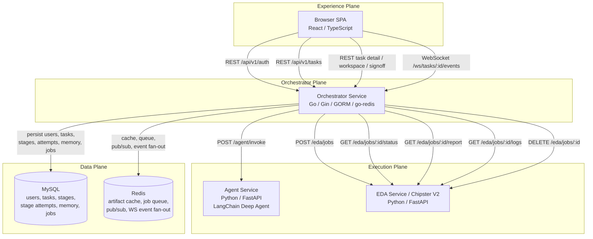
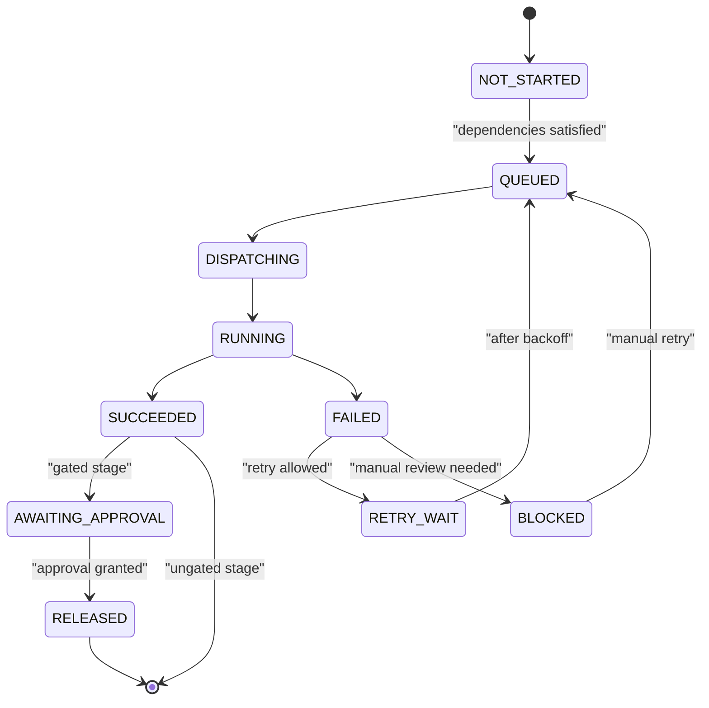
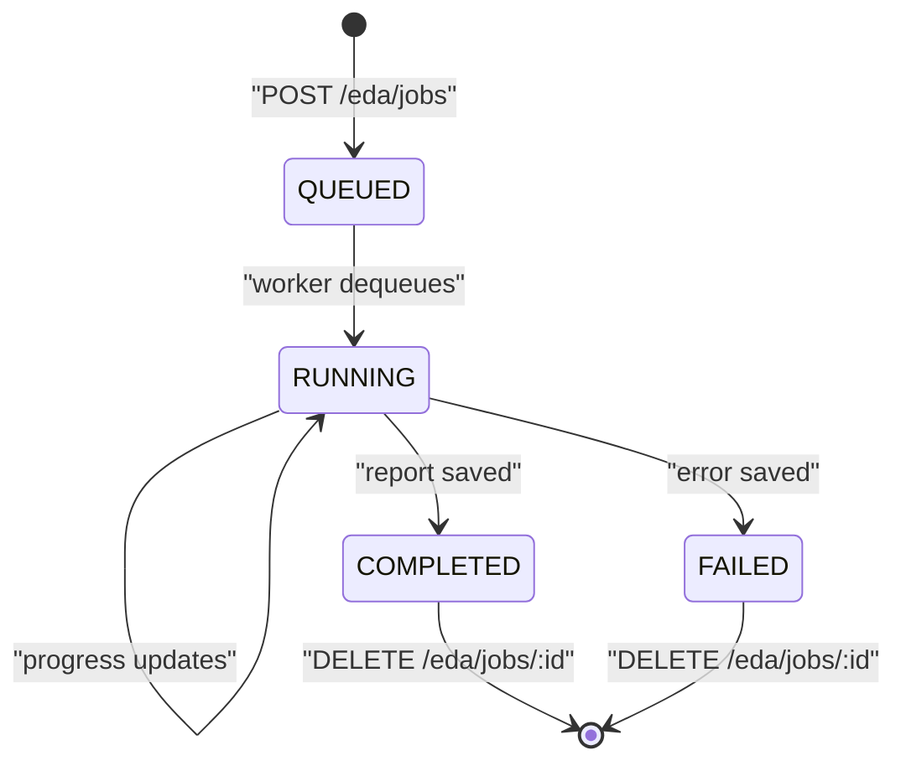

# Chip Orchestra Technical Architecture Design — Final Implementation

**System name:** Chip Orchestra  
**Final control-plane naming:** **Orchestrator Service** in the **Orchestrator Plane**  
**Scope:** Final MVP implementation as reflected by the current repository and deployment stack

---

## 1. Executive summary

Chip Orchestra is a browser-based digital IC workflow platform built as a four-plane system:

- **Experience Plane** — React/TypeScript browser SPA
- **Orchestrator Plane** — **Orchestrator Service** in Go, combining API gateway, task orchestration, DAG scheduling, agent dispatch, and EDA mediation
- **Execution Plane** — Agent Service (Python/FastAPI/LangChain deep agent) plus EDA Service / Chipster V2 (Python/FastAPI)
- **Data Plane** — MySQL for persistent relational state and Redis for artifact caching, queueing, pub/sub, SSE/WebSocket fan-out, and transient runtime coordination

The final implementation intentionally keeps the control path simple:

1. The browser talks only to the **Orchestrator Service**.
2. The **Orchestrator Service** owns workflow state and decides when to invoke the Agent Service or the EDA Service.
3. The Agent Service never talks directly to the browser and does not own orchestration state.
4. The EDA Service runs asynchronous jobs behind a small HTTP contract and Redis-backed worker loop.
5. MVP authentication is **JWT HS256 only**, with the access token stored in `localStorage` and sent as `Authorization: Bearer <token>`.

---

## 2. Architecture overview

### 2.1 Design goals

- Keep orchestration logic centralized and explicit.
- Make long-running chip-design work observable from a browser-first UI.
- Separate reasoning work from deterministic execution work.
- Keep the MVP deployable with a single `docker-compose.yml`.
- Preserve task, stage, report, artifact, and memory data in infrastructure that is simple to run locally.

### 2.2 Four-plane model

| Plane | Purpose | Implemented components | Key responsibilities |
|---|---|---|---|
| Experience Plane | User interaction and live visibility | Browser SPA (React/TypeScript) | Login, task creation, task detail, runbook, workspace, signoff, live task events |
| Orchestrator Plane | Unified control plane | **Orchestrator Service** (Go, Gin, GORM, go-redis) | REST API, WebSocket endpoint, JWT auth, task lifecycle, DAG scheduler, agent dispatch, EDA client |
| Execution Plane | AI reasoning and EDA execution | Agent Service, EDA Service / Chipster V2 | Agent graph execution, memory lookup, tool invocation, EDA job execution, log streaming, report generation |
| Data Plane | Persistent and transient state | MySQL, Redis | User/task/stage/job persistence, memory persistence, artifact cache, job queue, pub/sub, event fan-out |

### 2.3 Architecture diagram



### 2.4 Final implementation decisions

1. **One control-plane service:** the Orchestrator Service owns task and stage state.
2. **Go for orchestration:** the Orchestrator Service is implemented in Go with Gin, GORM, and go-redis.
3. **MySQL as relational system of record:** relational persistence is MySQL across the stack.
4. **Redis instead of object storage:** Redis is used for artifact caching, job queueing, pub/sub, SSE support, and WebSocket event fan-out in the MVP.
5. **LangChain deep-agent runtime:** the Agent Service is implemented as a FastAPI wrapper over a LangGraph/DeepAgentGraph workflow.
6. **FastAPI EDA service:** the EDA Service exposes a small asynchronous job API with MySQL-backed status and Redis-backed queue/log transport.

---

## 3. Orchestrator Service

### 3.1 Role in the system

The Orchestrator Service is the system-of-record and control-plane entry point for Chip Orchestra. It consolidates:

- browser-facing REST APIs
- JWT authentication and principal extraction
- task and stage lifecycle ownership
- DAG dependency evaluation
- dispatch to the Agent Service
- dispatch and polling for the EDA Service
- event persistence and event streaming through Redis
- signoff, waiver, retry, and export flow APIs

### 3.2 Internal subcomponents

| Subcomponent | Implementation role |
|---|---|
| API layer | Gin router, request validation, response shaping |
| Auth module | Login endpoint, JWT issue/verify, principal injection middleware |
| Orchestration service | Stage definitions, task evaluation, dispatch loop, retry and approval logic |
| Agent client | HTTP client for `POST /agent/invoke` |
| EDA client | HTTP client for `POST /eda/jobs` and job polling/report fetch |
| Persistence layer | GORM models for users, tasks, stages, and stage attempts |
| Redis integration | Event list storage, pub/sub, workspace cache, artifact list, diagnosis list |

### 3.3 Implemented external interfaces

#### Authentication

- `POST /api/v1/auth/login`
- `GET /api/v1/auth/me`

#### Task lifecycle

- `POST /api/v1/tasks`
- `GET /api/v1/tasks`
- `GET /api/v1/tasks/:id`
- `PATCH /api/v1/tasks/:id`
- `GET /api/v1/tasks/:id/stages`
- `POST /api/v1/tasks/:id/stages/:stage/retry`

#### Runbook and workspace

- `GET /api/v1/tasks/:id/attempts/latest/events`
- `GET /api/v1/tasks/:id/attempts/latest/artifacts`
- `GET /api/v1/tasks/:id/attempts/latest/diagnosis`
- `GET /api/v1/tasks/:id/workspace/files`
- `GET /api/v1/tasks/:id/workspace/file?path=...`
- `POST /api/v1/tasks/:id/workspace/propose-patch`

#### Signoff and export

- `GET /api/v1/tasks/:id/signoff/status`
- `POST /api/v1/tasks/:id/approvals/:stage`
- `POST /api/v1/tasks/:id/waivers`
- `POST /api/v1/tasks/:id/export-bundle`

#### Live updates

- `GET /ws/tasks/:id/events`

### 3.4 Auth model

- **Algorithm:** JWT HS256
- **Login input:** username or email plus password
- **Token transport:** `Authorization: Bearer <token>`
- **Frontend storage:** `localStorage`
- **Claims surfaced to handlers:** `user_id`, `username`, `full_name`, `roles`
- **MVP scope:** no SSO, no external identity federation

### 3.5 Core request and response schemas

#### `POST /api/v1/auth/login`

**Request**
```json
{
  "username": "radhian.armansyah",
  "password": "********"
}
```

**Response**
```json
{
  "access_token": "jwt-token",
  "token_type": "Bearer",
  "expires_in": 3600,
  "user": {
    "id": "usr_123",
    "username": "radhian.armansyah",
    "full_name": "Radhian Ferel Armansyah",
    "roles": ["ADMIN", "DESIGNER"]
  }
}
```

#### `POST /api/v1/tasks`

**Request**
```json
{
  "name": "uart_tx_controller",
  "description": "UART TX controller with APB interface",
  "design_brief": "Generate synthesizable RTL, testbench, and implementation reports.",
  "launch_mode": "FULL_FLOW_GATED",
  "repo": {
    "mode": "TEMPLATE",
    "template_id": "digital-core-starter"
  },
  "design_context": {
    "pdk_id": "sky130",
    "stdcell_lib_id": "sky130_fd_sc_hd"
  }
}
```

**Response**
```json
{
  "task_id": "tsk_001",
  "id": "tsk_001",
  "attempt_id": "tsk_001-attempt-1",
  "status": "PENDING",
  "current_stage": "SPEC_INGEST",
  "created_at": "2026-06-20T04:53:00Z"
}
```

#### `GET /api/v1/tasks/:id`

**Representative response shape**
```json
{
  "id": "tsk_001",
  "name": "uart_tx_controller",
  "description": "UART TX controller with APB interface",
  "ownerName": "Radhian Ferel Armansyah",
  "ownerId": "usr_123",
  "currentStage": "SIM",
  "etaLabel": "9m left",
  "statusLabel": "Running",
  "tone": "blue",
  "repoName": "digital-core-starter",
  "pdkLabel": "sky130 / sky130_fd_sc_hd",
  "reviewGateLabel": "Before signoff",
  "runtimeLabel": "Orchestrator Service + Agent Service + EDA Service",
  "artifactLineageCount": 6,
  "stages": [],
  "attempts": []
}
```

#### `PATCH /api/v1/tasks/:id`

**Request**
```json
{
  "description": "Updated task description",
  "status": "RUNNING",
  "current_stage": "RTL_GEN"
}
```

#### `POST /api/v1/tasks/:id/stages/:stage/retry`

**Response**
```json
{
  "status": "queued",
  "stage": "SIM"
}
```

#### WebSocket message example

```json
{
  "type": "stage.updated",
  "task_id": "tsk_001",
  "stage": "SIM",
  "status": "RUNNING",
  "progress": 55,
  "timestamp": "2026-06-20T04:58:10Z"
}
```

### 3.6 Canonical stage graph

The implemented stage definition order is:

1. `SPEC_INGEST`
2. `PLAN`
3. `RTL_GEN`
4. `TB_GEN`
5. `SIM`
6. `LINT`
7. `SYNTH`
8. `PNR`
9. `DRC_LVS`
10. `SIGNOFF`
11. `EXPORT`

Dependency structure:

- `PLAN` depends on `SPEC_INGEST`
- `RTL_GEN` depends on `PLAN`
- `TB_GEN` depends on `PLAN`
- `SIM` depends on `RTL_GEN` and `TB_GEN`
- `LINT` depends on `RTL_GEN`
- `SYNTH` depends on `SIM` and `LINT`
- `PNR` depends on `SYNTH`
- `DRC_LVS` depends on `PNR`
- `SIGNOFF` depends on `DRC_LVS`
- `EXPORT` depends on `SIGNOFF`

Gated stages:

- `SYNTH`
- `SIGNOFF`

### 3.7 Orchestrator stage state machine



### 3.8 Persistence owned by the Orchestrator Service

#### MySQL entities

| Entity | Purpose |
|---|---|
| `users` | Login identity, profile, roles |
| `tasks` | Top-level design workflow state |
| `stages` | Stage instance state, dependency string, progress, retry count, external job id |
| `stage_attempts` | Audit trail of each dispatch attempt and terminal result |

#### Redis keys and lists

| Redis key pattern | Purpose |
|---|---|
| `task:{id}:events` | Append-only runbook/event list |
| `task:{id}:events:pubsub` | Live WebSocket event fan-out |
| `task:{id}:artifacts` | Artifact metadata list |
| `task:{id}:diagnosis` | Diagnosis list from agent outputs |
| `task:{id}:workspace:index` | Workspace file index |
| `task:{id}:workspace:file:{path}` | Cached/generated workspace content |
| `task:{id}:artifact:{name}` | Cached EDA report payload |

---

## 4. Agent Service

### 4.1 Role in the system

The Agent Service executes reasoning-heavy work, but it does **not** own orchestration state. It receives stage requests from the Orchestrator Service and returns structured outputs.

### 4.2 Implemented API

- `GET /health`
- `POST /agent/invoke`

### 4.3 `POST /agent/invoke` schema

**Request**
```json
{
  "task_id": "tsk_001",
  "stage": "RTL_GEN",
  "prompt": "Create synthesizable RTL for the accepted plan.",
  "tools": ["update_task_status", "track_task_progress", "write_artifact"],
  "context": {
    "task_name": "uart_tx_controller",
    "task_status": "RUNNING",
    "current_stage": "RTL_GEN",
    "pdk_id": "sky130",
    "stdcell_lib_id": "sky130_fd_sc_hd"
  },
  "artifacts": {},
  "instructions": {}
}
```

**Response**
```json
{
  "status": "success",
  "agent": "RTLAuthor",
  "summary": "RTLAuthor completed RTL_GEN for task tsk_001.",
  "diagnostics": [
    {
      "id": "diag-rtl_gen",
      "title": "RTLAuthor summary for RTL_GEN"
    }
  ],
  "artifacts": [
    {
      "id": "artifact-rtl_gen",
      "name": "rtl_gen_summary.md",
      "type": "REPORT",
      "owner": "RTLAuthor"
    }
  ],
  "workspace_files": {
    "rtl/generated_top.v": "module generated_top ..."
  },
  "recommended_next": "Validate generated RTL and queue verification stages."
}
```

### 4.4 Internal execution graph

The implemented deep-agent workflow is:

1. `load_memory`
2. `select_agent`
3. `execute_agent`
4. `persist_feedback`

Stage-to-agent routing:

| Stage | Agent role |
|---|---|
| `SPEC_INGEST` | `SpecInterpreter` |
| `PLAN` | `FlowAssistant` |
| `RTL_GEN` | `RTLAuthor` |
| `TB_GEN` | `Verifier` |
| `SIM` | `Verifier` |
| `LINT` / `SYNTH` / `PNR` / `DRC_LVS` | `Diagnoser` |
| `SIGNOFF` / `EXPORT` | `FlowAssistant` |

### 4.5 State and storage usage

| Store | Usage |
|---|---|
| MySQL | agent memories persisted through `MemoryStore` |
| Redis | latest diagnosis, task progress, artifact registry, generated artifact content |

Representative Redis keys:

- `agent:diagnosis:{task_id}`
- `agent:task_status:{task_id}:{stage}`
- `agent:progress:{task_id}`
- `artifact:{task_id}:{path}`
- `artifact:index:{task_id}`

### 4.6 Tool contract from the Orchestrator Service

The Agent Service is invoked with a tool list and uses only named tools exposed by the Orchestrator path, including:

- `update_task_status`
- `track_task_progress`
- `get_user_context`
- `submit_eda_job`
- `get_eda_result`
- `read_artifact`
- `write_artifact`

---

## 5. EDA Service / Chipster V2

### 5.1 Role in the system

The EDA Service is an asynchronous execution service. It persists jobs in MySQL, uses Redis as the queue and log transport, and exposes a compact HTTP API to the Orchestrator Service.

### 5.2 Implemented API surface

- `GET /health`
- `POST /eda/jobs`
- `GET /eda/jobs/{job_id}/status`
- `GET /eda/jobs/{job_id}/report`
- `GET /eda/jobs/{job_id}/logs`
- `DELETE /eda/jobs/{job_id}`

### 5.3 API schemas

#### `POST /eda/jobs`

**Request**
```json
{
  "task_id": "tsk_001",
  "stage": "SIM",
  "spec": "Run simulation for the generated RTL.",
  "metadata": {},
  "artifacts": {}
}
```

**Response**
```json
{
  "job_id": "job-1234",
  "status": "QUEUED",
  "message": "SIM job accepted"
}
```

#### `GET /eda/jobs/{job_id}/status`

**Response**
```json
{
  "job_id": "job-1234",
  "status": "RUNNING",
  "stage": "SIM",
  "progress": 55,
  "report": {},
  "error": "",
  "updated_at": "2026-06-20T05:05:00Z"
}
```

#### `GET /eda/jobs/{job_id}/report`

**Response**
```json
{
  "summary": "Mock toolchain completed",
  "metrics": {
    "timing": "met",
    "power_mw": 12.4,
    "area_um2": 18321
  }
}
```

#### `GET /eda/jobs/{job_id}/logs`

This endpoint returns an **SSE stream** where each frame is emitted as:

```text
data: 2026-06-20T05:02:10Z Starting mock toolchain
```

#### `DELETE /eda/jobs/{job_id}`

**Response**
```json
{
  "status": "deleted",
  "job_id": "job-1234"
}
```

### 5.4 EDA job state machine



### 5.5 Internal implementation notes

- Jobs are persisted in the `eda_jobs` table.
- The worker loop uses `BLPOP` on `eda:jobs:queue`.
- Log lines are appended to `eda:job:{job_id}:logs`.
- Progress and terminal updates are published on `eda:job:{job_id}:status`.
- The SSE endpoint replays stored log lines and then subscribes to the Redis pub/sub channel for live updates.

---

## 6. Data Plane

### 6.1 MySQL responsibilities

MySQL is the durable store for:

- users and roles
- tasks
- stages
- stage attempts
- agent memories
- EDA jobs

### 6.2 Redis responsibilities

Redis is the transient and high-frequency runtime store for:

- artifact cache
- workspace file cache
- task event lists
- diagnosis lists
- EDA job queue
- EDA log replay lists
- EDA pub/sub notifications
- WebSocket fan-out source messages

### 6.3 Why this split works for the MVP

- MySQL keeps the authoritative business state simple and queryable.
- Redis keeps event-heavy and queue-heavy behavior fast.
- The architecture avoids introducing extra message-bus or object-storage infrastructure in the MVP.

---

## 7. Frontend and authentication behavior

### 7.1 Frontend role

The Experience Plane SPA provides:

- Overview Console
- Create Design Task
- Task Detail & Runbook
- Workspace file views
- Signoff and export actions

### 7.2 Authentication flow

1. User logs in through `POST /api/v1/auth/login`.
2. Frontend stores the returned JWT in `localStorage`.
3. Authenticated REST requests send `Authorization: Bearer <token>`.
4. WebSocket connections authenticate against the same token flow.
5. `GET /api/v1/auth/me` hydrates the current user session.

---

## 8. Test coverage

### 8.1 Orchestrator Service tests (Go)

Implemented suites:

- handler unit tests
- integration tests
- JWT middleware tests
- DAG state machine tests

Concrete coverage from the repository:

- `internal/api/tasks_test.go`
- `internal/api/integration_test.go`
- `internal/middleware/jwt_test.go`
- `internal/orchestrator/dag_test.go`

### 8.2 Agent Service tests (Python)

Implemented suites:

- tool unit tests
- agent role tests
- invoke integration test

Concrete coverage from the repository:

- `tests/test_tools.py`
- `tests/test_agents.py`
- `tests/test_invoke.py`

### 8.3 EDA Service tests (Python)

Implemented suites:

- endpoint tests
- state machine tests
- SSE streaming test
- full job round-trip integration test

Concrete coverage from the repository:

- `tests/test_jobs.py`
- `tests/test_state_machine.py`
- `tests/test_sse_logs.py`
- `tests/test_integration.py`

### 8.4 Cross-service runner

The repository exposes one backend test runner:

```bash
./scripts/test.sh
```

That script runs:

- Orchestrator Service tests
- Agent Service tests
- EDA Service tests

---

## 9. Deployment and runtime

### 9.1 Deployment model

The final MVP deployment uses a **single `docker-compose.yml`** to start:

- frontend
- Orchestrator Service
- Agent Service
- EDA Service
- MySQL
- Redis

### 9.2 Lifecycle scripts

```bash
./scripts/setup.sh
./scripts/start.sh
./scripts/stop.sh
./scripts/migrate.sh
./scripts/test.sh
```

Responsibilities:

| Script | Purpose |
|---|---|
| `./scripts/setup.sh` | checks dependencies, creates `.env` from `.env.example`, pulls base images |
| `./scripts/start.sh` | builds and starts the full stack |
| `./scripts/stop.sh` | stops the stack |
| `./scripts/migrate.sh` | runs MySQL schema migration through the Orchestrator Service with `MIGRATE_ONLY=true` |
| `./scripts/test.sh` | runs all backend automated tests |

### 9.3 Service ports

The architecture document standardizes on these host-facing ports:

| Service | Port |
|---|---:|
| Frontend | 3000 |
| Orchestrator Service | 8080 |
| Agent Service | 8001 |
| EDA Service | 8002 |
| MySQL | 3306 |
| Redis | 6379 |

### 9.4 Environment and dependencies

- MySQL 8.4 container
- Redis 7.2 container with AOF enabled
- Orchestrator Service depends on MySQL, Redis, Agent Service, and EDA Service
- Agent Service depends on MySQL and Redis
- EDA Service depends on MySQL and Redis
- Frontend depends on the Orchestrator Service

---

## 10. Final consistency checklist

This document applies the final naming and implementation corrections:

- **Orchestrator Service** only
- **Orchestrator Plane** only
- **Chip Orchestra** only
- **MySQL** as the only relational system of record in the MVP
- **Redis** as the runtime cache, queue, pub/sub layer, and artifact cache in the MVP
- **Python + LangChain deep agent** for the Agent Service
- **Python + FastAPI** for the EDA Service
- **Go + Gin + GORM + go-redis** for the Orchestrator Service

This is the final architecture narrative to use for local documentation and the synchronized Lark document.
