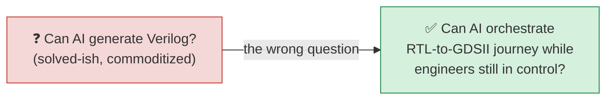
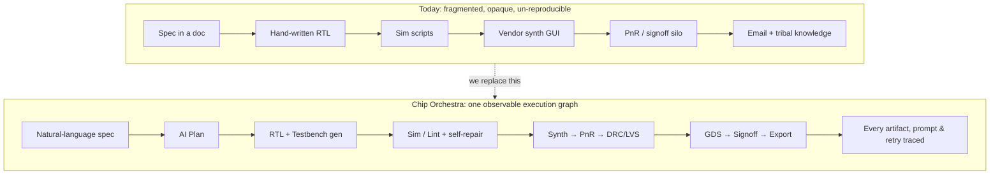
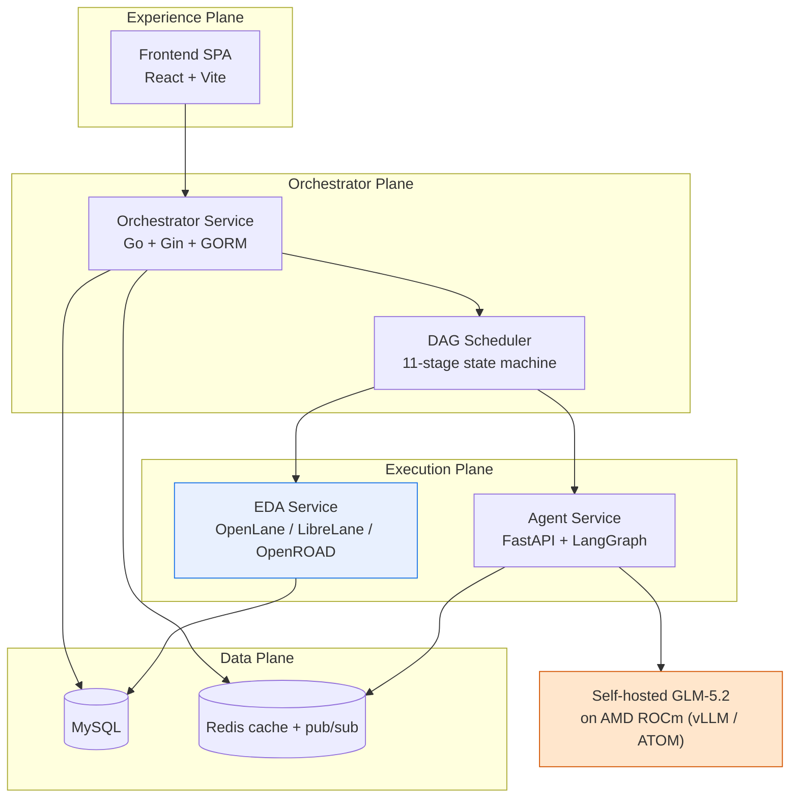
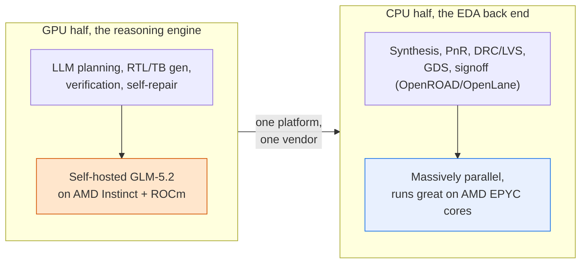
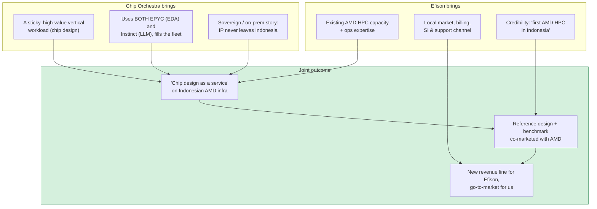
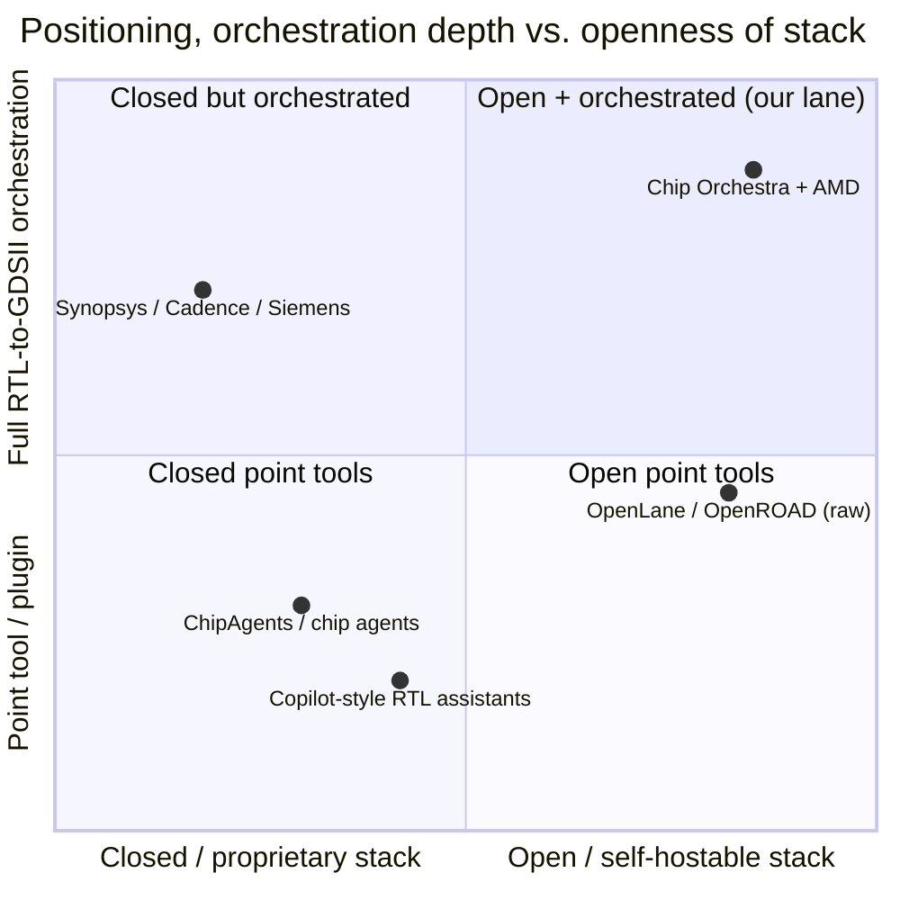
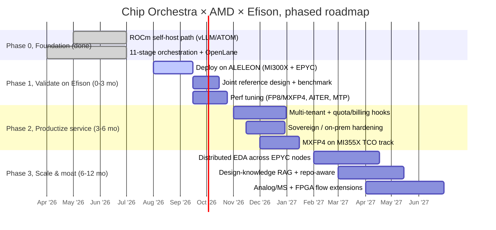
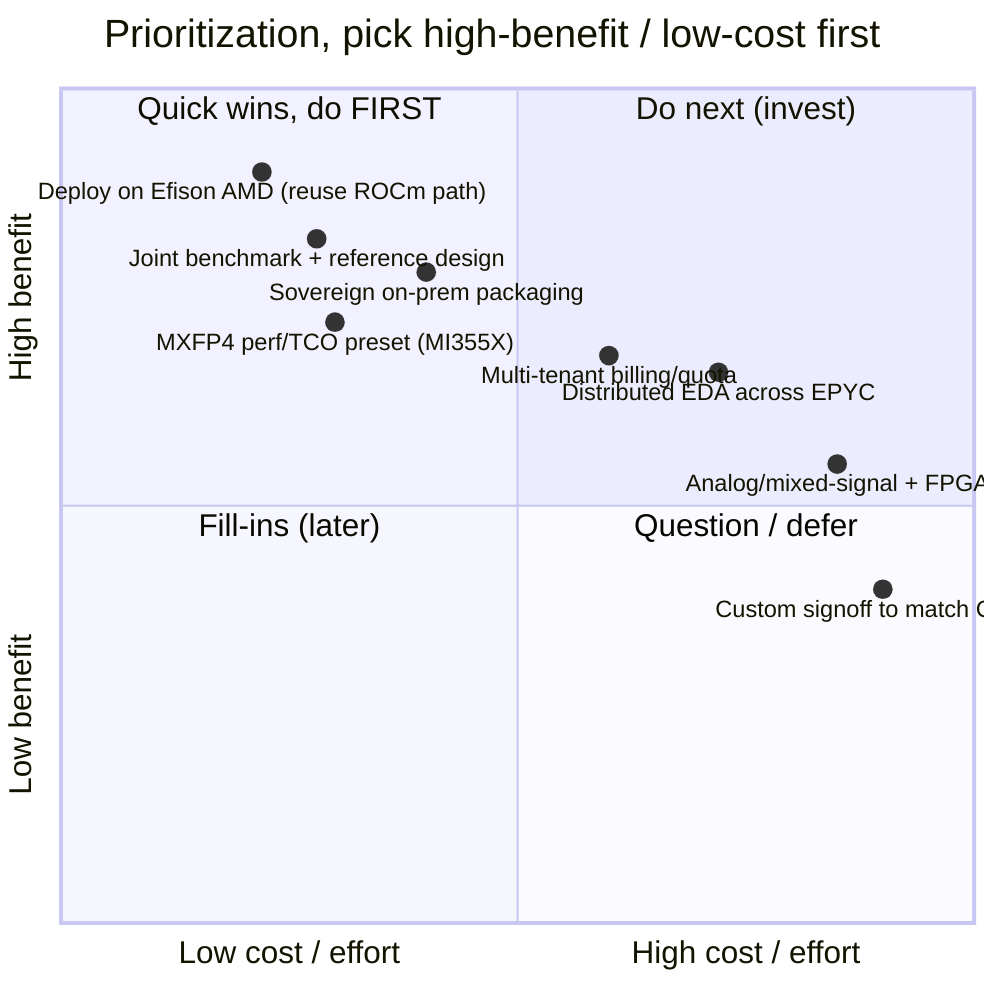
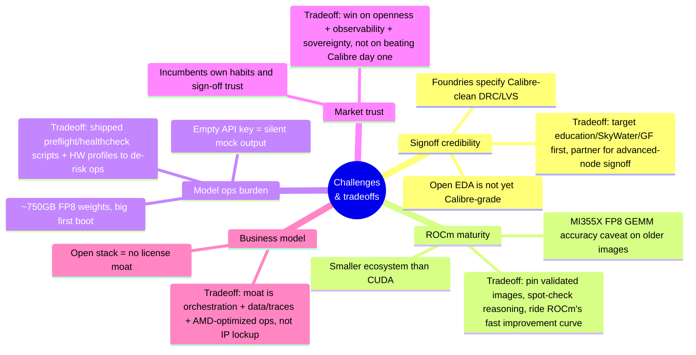
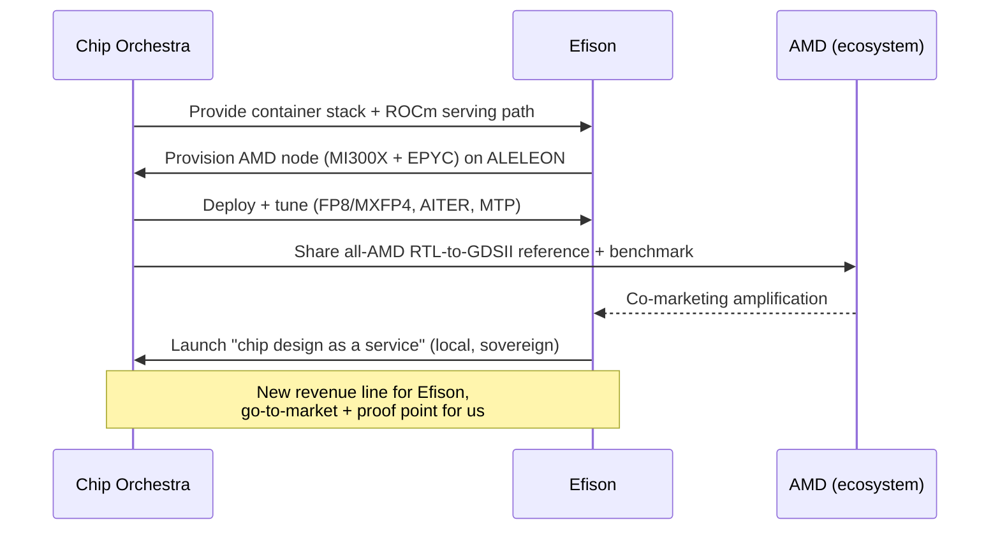

# Chip Orchestra × AMD 

### An AI-native EDA orchestration platform, built to run fully on AMD

**Partnership deck**
Prepared for: Efison Lisan Teknologi (efisonlt.com)
Prepared by: Radhian Ferel Armansyah

---

## TL;DR

- **What Chip Orchestra is:** an AI-native platform that turns a natural-language spec into
  verified RTL and a manufacturable GDSII, running the *entire* RTL-to-GDSII lifecycle as one
  observable, human-gated execution graph, not a pile of disconnected scripts.
- **Why now:** LLMs made "generate Verilog" easy; nobody made "orchestrate the whole chip flow"
  trustworthy. The gap is orchestration + observability + open compute, exactly our lane.
- **The AMD thesis:** the whole stack, the LLM (self-hosted GLM-5.2 on ROCm) *and* the EDA
  back end (OpenLane/OpenROAD, which is CPU/EPYC-bound), runs on AMD silicon. No CUDA, no
  proprietary-API lock-in.
- **The Efison thesis:** Efison already operates AMD-powered HPC (ALELEON, EPYC + accelerators)
  and sells "Computation for Everybody." Chip Orchestra is a high-value, sticky, sovereign
  workload that monetizes that exact fleet.
- **The ask:** co-validate Chip Orchestra on Efison's AMD hardware, publish a joint reference
  design + benchmark, and stand up "Chip design as a service, on Indonesian AMD infrastructure."

---

## Why we built Chip Orchestra

Modern digital chip development is still stitched together from disconnected tools, tribal Tcl
scripts, and manual hand-offs. AI improved *RTL generation*, but there is still no unified
execution layer that owns the **complete** design lifecycle with observability and human control.

We deliberately reframed the question:

The status quo vs. what we orchestrate:

**Core design principles that make it defensible:**

- **Task-first orchestration**, every design is a structured task owning its inputs, DAG,
  artifacts, reports, approvals and outputs.
- **Transparent AI**, every prompt, retrieved context, patch, retry and reasoning step stays
  visible. No black box.
- **Unified EDA execution**, sim, lint, synth, PnR, GDS, signoff run in one pipeline with full
  artifact lineage.
- **Human-in-the-loop**, RTL edits, implementation and tapeout stay gated behind explicit human
  approval.

---

## The system today (what already works)

An 11-stage orchestrated pipeline across four planes and six containers.

The 11 stages, every one observable (AI reasoning, logs, artifacts, retries, reports, approval
checkpoints):

`SPEC_INGEST → PLAN → RTL_GEN → TB_GEN → SIM → LINT → SYNTH → PNR → DRC_LVS → SIGNOFF → EXPORT`

The **ROCm self-hosting path already exists** in this very folder
(`deploy/selfhosted-llm-rocm/`): it points `agent-service` at an OpenAI-compatible vLLM-ROCm /
ATOM server with **zero application code changes**, only env vars and a serving container.

---

## Why AMD, and why "fully AMD" is a genuine differentiator

Chip Orchestra has **two compute-hungry halves**, and both map cleanly onto AMD silicon:

Most "AI for chips" stories are GPU-only and quietly assume NVIDIA + CUDA. Ours is different:

- **The LLM runs on AMD Instinct via ROCm**, ROCm is the industry's only *open* GPU software
  platform, which frees customers from single-vendor lock-in [1]. The MI300X packs 192 GB HBM3
  at 5.3 TB/s [2]; MI325X extends HBM to 256 GB; MI355X (CDNA4) reaches 288 GB, ~8 TB/s and
  native FP4 [3].
- **The EDA back end is CPU-bound** and thrives on EPYC core counts, so an all-AMD node keeps
  *both* halves on the same fleet, same procurement, same support contract.
- **Model quality is identical to cloud** (same open GLM-5.2 weights); only throughput/latency
  depends on tuning (FP8/MXFP4, MTP speculative decoding, AITER kernels, correct DSA backend).

Hardware profiles already shipped in this folder:

| `HW_PROFILE` | GPUs | HBM/GPU | Quant | Note |
|---|---|---|---|---|
| `mi300x` | 8× MI300X | 192 GB | FP8 | Mainstream, validated, start here |
| `mi325x` | 8× MI325X | 256 GB | FP8 | More KV/concurrency headroom |
| `mi355x-fp8` | 4× MI355X | 288 GB | FP8 | CDNA4, ~8 TB/s |
| `mi355x-fp4` | 4× MI355X | 288 GB | MXFP4 | Native FP4, **best perf/TCO** |

---

## Why Efison, the mutual benefit

Efison Lisan Teknologi ("Computation for Everybody") already operates **AMD-powered HPC** in
Indonesia: the ALELEON Supercomputer is built on **AMD EPYC** CPUs with accelerators and 100 Gbps
Mellanox interconnect, and offers public HPC plus system integration [4][5]. Chip Orchestra is a
near-perfect workload for that fleet.

**Why it's compelling for Efison specifically:**

- **Higher-margin utilization** of AMD capacity than generic HPC batch jobs, chip design is
  premium, recurring, and latency-sensitive (keeps GPUs warm).
- **Sovereign compute angle**, semiconductor IP is sensitive; "your design never leaves
  Indonesian soil, on open AMD infrastructure" is a real selling point vs. US SaaS EDA.
- **AMD co-marketing**, a published all-AMD RTL-to-GDSII reference is exactly the kind of
  ecosystem win AMD amplifies, giving Efison visibility beyond Indonesia.
- **Zero lock-in for Efison's customers**, ROCm + open-source EDA (OpenLane/OpenROAD) means no
  per-seat proprietary EDA license floor to resell.

---

## Market position, where the money and the moats are

The EDA market is a tight oligopoly: TrendForce data for 2024 puts **Synopsys ~31%, Cadence ~30%,
Siemens EDA ~13%, ~74% combined** [6], and the big three's combined share has climbed from under
75% (2014) to over 85% (2023) by other counts [7]. Synopsys closed a **$35B Ansys acquisition** in
July 2025, consolidating further [8]. Meanwhile a new wave of **AI chip agents** (e.g. ChipAgents,
which raised a $21M Series A backed by Micron/MediaTek/Ericsson, claiming up to 10x productivity)
is attacking the *design-authoring* layer [9][10].

Two structural gaps neither camp fills well:

1. Incumbents own signoff-grade tools but are **closed, expensive, GPU/CUDA-agnostic-at-best**, and
   not orchestration-native.
2. New chip agents are **IDE plugins for RTL/verification**, they make an engineer faster inside
   the old flow, but they don't own the *end-to-end orchestrated pipeline* or the *compute layer*.

---

## How we differentiate (feature-level)

| Dimension | Incumbent EDA (Synopsys/Cadence/Siemens) | AI chip agents (ChipAgents et al.) | Raw open EDA (OpenLane) | **Chip Orchestra + AMD** |
|---|---|---|---|---|
| Scope | Full flow, best-in-class signoff | RTL/verification authoring | Full flow, batch/no-UI | **Full flow, AI-orchestrated + observable** |
| AI orchestration | Bolt-on GenAI features | Agent inside editor | None | **Native, multi-agent, 11-stage DAG** |
| Observability | Log files, closed | Editor-scoped | Terminal logs | **Every prompt/retry/artifact traced in browser** |
| Human-in-the-loop | Manual, tool-by-tool | Suggestion accept/reject | N/A | **Explicit approval gates on RTL/impl/tapeout** |
| Compute stack | Proprietary, mostly NVIDIA/x86 | Cloud API (NVIDIA) | CPU tools | **Fully AMD: ROCm LLM + EPYC EDA** |
| Lock-in | High (licenses + APIs) | High (SaaS API) | Low | **Low, open weights + open EDA + open ROCm** |
| Deploy | On-prem/cloud, heavy | SaaS | Self-host | **Self-host, sovereign, container-native** |

**Our wedge in one sentence:** *the only AI-native, fully observable RTL-to-GDSII orchestrator that
runs end-to-end on open, self-hostable, all-AMD infrastructure.* Incumbents won't abandon their
CUDA/proprietary margins; agent startups won't build the compute layer or the signoff pipeline.

---

## Product & development roadmap

---

## Opportunity map, benefit vs. cost vs. risk

Detailed table (H = high, M = medium, L = low):

| Opportunity | Benefit | Cost/effort | Risk | Verdict |
|---|---|---|---|---|
| **Deploy on Efison AMD reusing the existing ROCm path** | H | **L** | L | ⭐ Do first |
| **Joint reference design + published benchmark (co-market w/ AMD)** | H | **L** | L | ⭐ Do first |
| **MXFP4 perf/TCO preset on MI355X** | H | L–M | M (CDNA4 accuracy caveat) | ⭐ Do first |
| Sovereign/on-prem packaging (IP-stays-local) | H | M | L | Do next |
| Multi-tenant + quota/billing for "design-as-a-service" | H | M–H | M | Do next |
| Distributed EDA across EPYC nodes (parallel PnR) | M–H | H | M | Phase 3 |
| Design-knowledge RAG / repo-aware assistant | M | M | M | Phase 3 |
| Analog/mixed-signal + FPGA flows | M | H | H | Later |
| Custom signoff to rival Calibre-clean | H (long term) | **H** | **H** | Defer / partner |

**High-benefit, low-cost wins (start here):**

1. **Stand it up on Efison's AMD box using the ROCm path we already shipped**, near-zero net-new
   engineering; env vars + serving container only.
2. **Publish a joint all-AMD RTL-to-GDSII reference + benchmark**, cheap to produce, high
   marketing leverage, and the single most credible proof point for the partnership.
3. **Ship the MXFP4/MI355X preset**, best perf/TCO with tuning we already understand; strong
   "cheaper than the NVIDIA+proprietary alternative" narrative.

---

## Challenges & tradeoffs

We are not pretending this is free. Key tradeoffs we've consciously made:

Explicit tradeoff decisions worth calling out:

- **We chose openness over a license moat.** Open weights + open EDA + ROCm means low lock-in for
  customers (a selling point) but no software-license annuity, so our moat must be the
  orchestration layer, observability/traces, and AMD-tuned operations, not lock-in.
- **We chose self-hosting over easy SaaS.** Sovereignty and cost control win in target markets, at
  the price of heavier ops (large model weights, ROCm tuning), mitigated by the preflight /
  healthcheck / profile scripts already in this folder.
- **We chose to *not* fight Calibre on day one.** Advanced-node signoff trust is the incumbents'
  fortress; we start where open PDKs (SkyWater SKY130, GF180) and education/prototyping demand is
  real, and treat advanced-node signoff as a partner/later problem.
- **We chose GLM-5.2 open weights over a frontier closed API.** Quality is competitive and
  self-hostable on AMD; we accept being one step behind the absolute frontier in exchange for
  control, cost, and the all-AMD story.

---

## The ask & next steps

**Concrete asks for a pilot (all low-cost, high-signal):**

1. One AMD node (ideally 8× MI300X + EPYC head node) for a 6–8 week validation.
2. Co-author a public reference design + benchmark on Efison AMD infrastructure.
3. Explore a joint "Chip Design as a Service" offering with Efison as the local/sovereign channel.

**What we bring on day one:** a working, container-native platform whose ROCm self-hosting path
(this exact folder) needs *only env vars and a serving container*, no application code changes.

---

## References

1. AMD, *Accelerating AI and HPC with AMD Instinct MI300X* (ROCm as the industry's only open GPU software platform): https://www.amd.com/en/partner/articles/instinct-mi300x-accelerating-ai-hpc.html
2. AMD, *Instinct MI300X Accelerators* (192 GB HBM3, 5.3 TB/s, 304 CUs): https://www.amd.com/en/products/accelerators/instinct/mi300/mi300x.html
3. AMD ROCm docs, *MI300 Series / MI350 Series microarchitecture* (CDNA, FP8/FP4, memory): https://rocm.docs.amd.com/en/latest/reference/gpu-arch/mi300.html
4. Efison Lisan Teknologi, company homepage (ALELEON, AMD EPYC + accelerators + Mellanox, public HPC): https://efisonlt.com/
5. Efison, *Spesifikasi ALELEON Supercomputer* (ALELEON Mk.V specs): https://wiki.efisonlt.com/wiki/Spesifikasi_ALELEON_Supercomputer
6. TrendForce via press (2024 EDA share: Synopsys ~31%, Cadence ~30%, Siemens ~13%, ~74% combined): https://finance.sina.com.cn/jjxw/2025-07-04/doc-infehuet9617966.shtml
7. Embedded.com, *Taking Stock of the EDA Industry* (top-3 combined share >85% by 2023, Griffin Securities/DAC 2024): https://www.embedded.com/taking-stock-of-the-eda-industry/
8. Mordor Intelligence, EDA tools market (Synopsys' $35B Ansys acquisition, July 2025): https://www.mordorintelligence.com/industry-reports/electronic-design-automation-eda-tools-market
9. ChipAgents, *Oversubscribed $21M Series A* (Bessemer; Micron, MediaTek, Ericsson): https://www.businesswire.com/news/home/20251021677325/en/
10. ChipAgents, product site (agentic AI chip design/verification, "10x faster"): https://chipagents.ai/
11. OpenROAD Project, open-source RTL-to-GDSII physical design (SkyWater SKY130, GF180): https://en.wikipedia.org/wiki/OpenROAD_Project
12. vLLM GLM-5.2 recipe (ROCm serving reference): https://recipes.vllm.ai/zai-org/GLM-5.2

> Market-share and funding figures are drawn from the sources above; specific quantitative claims
> (EDA shares, funding amounts) should be re-verified against the primary source before external use.
