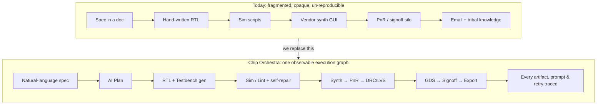
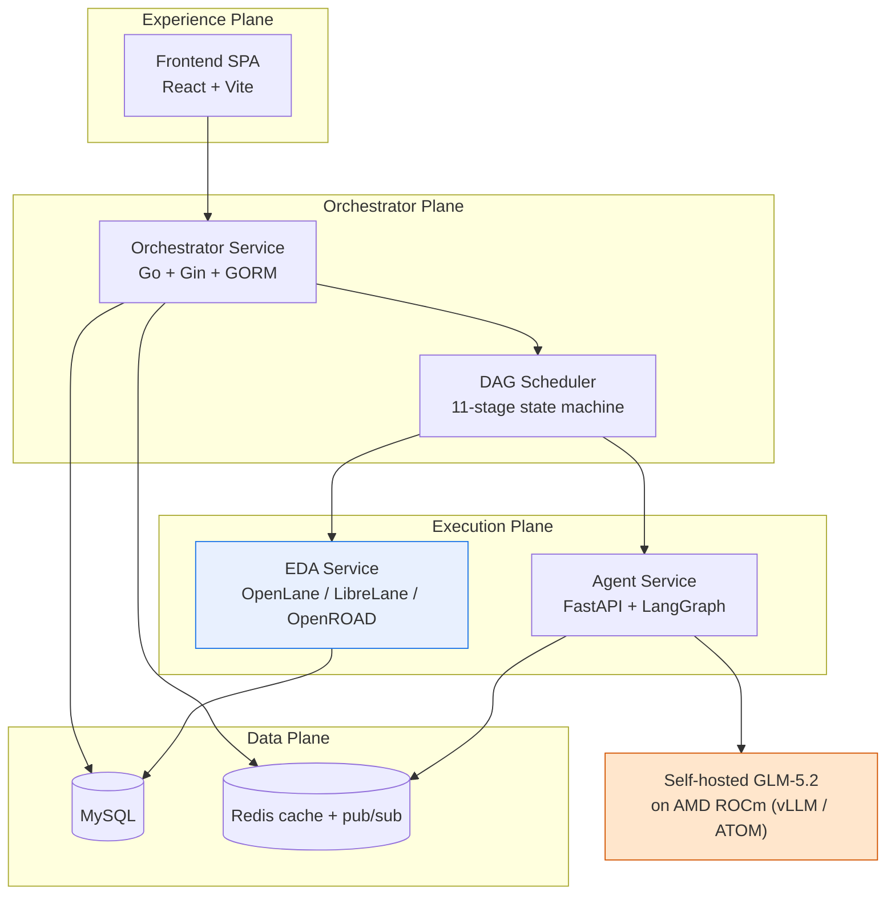
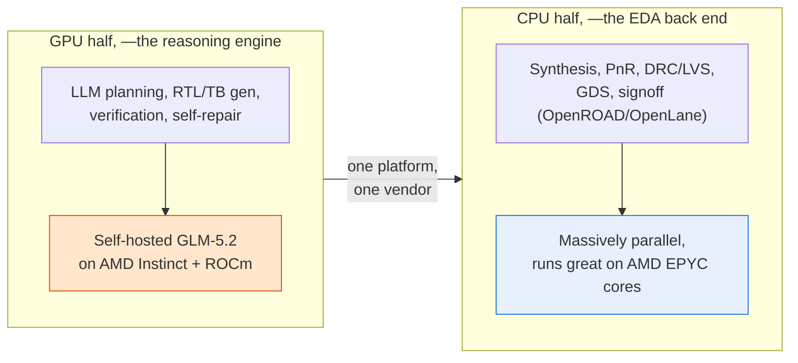
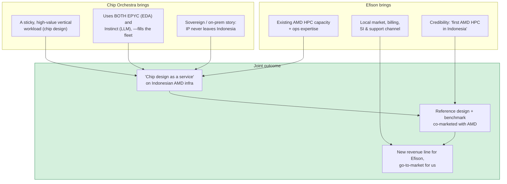
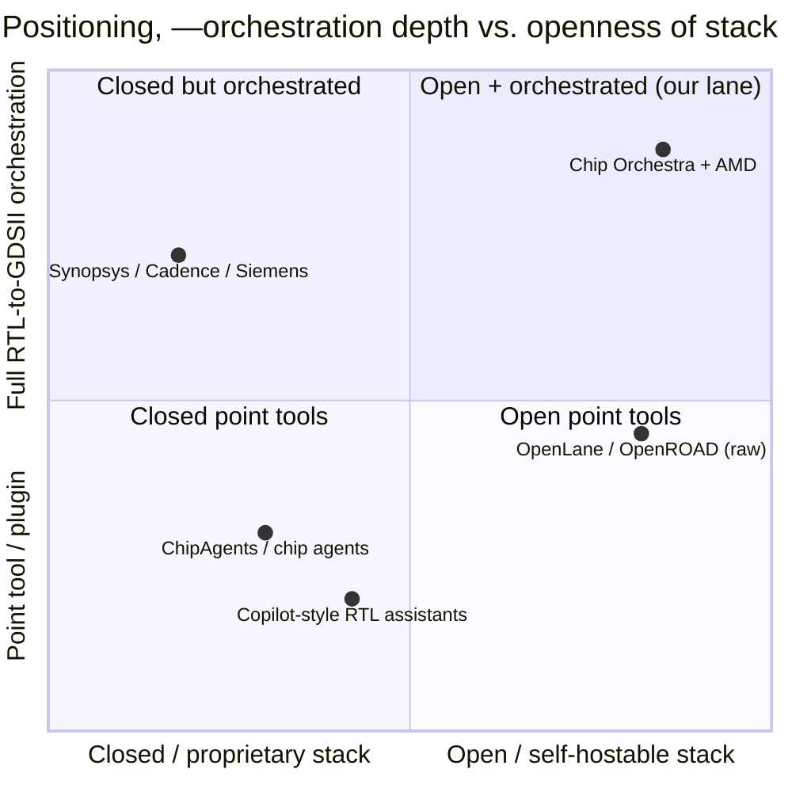
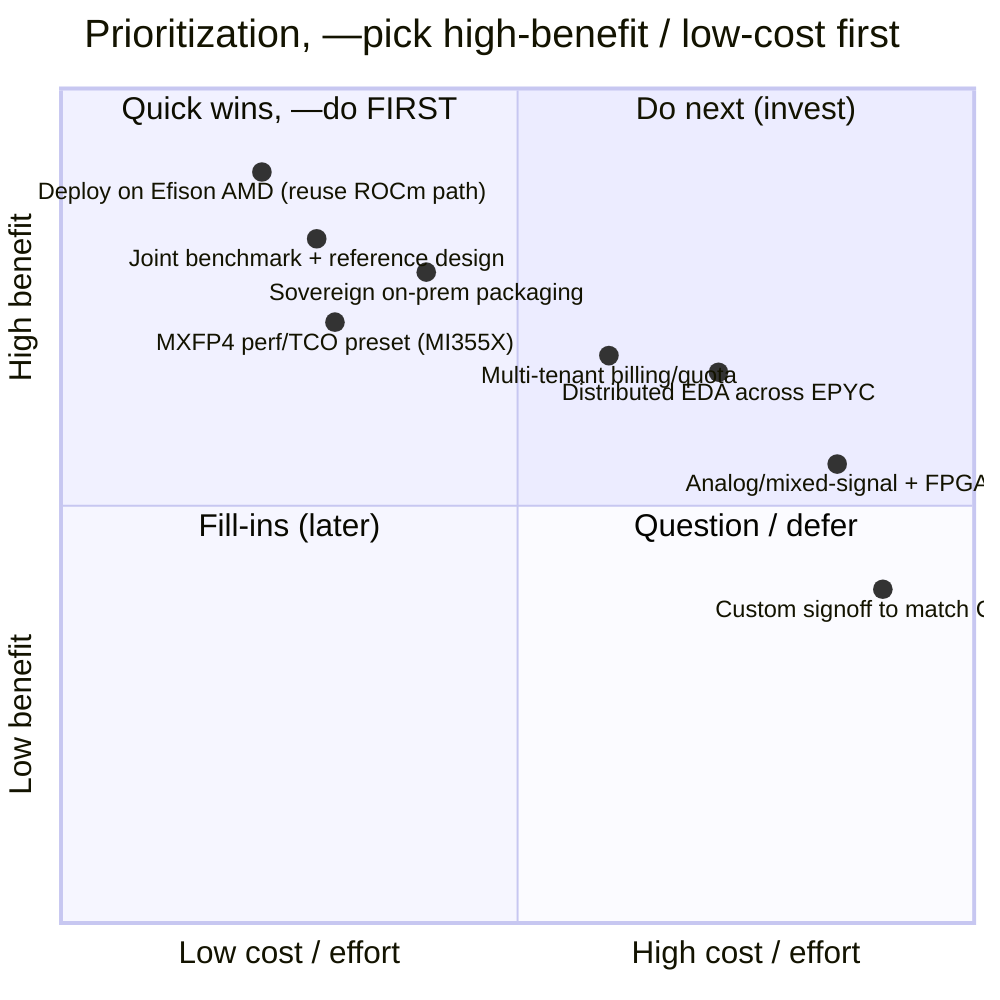
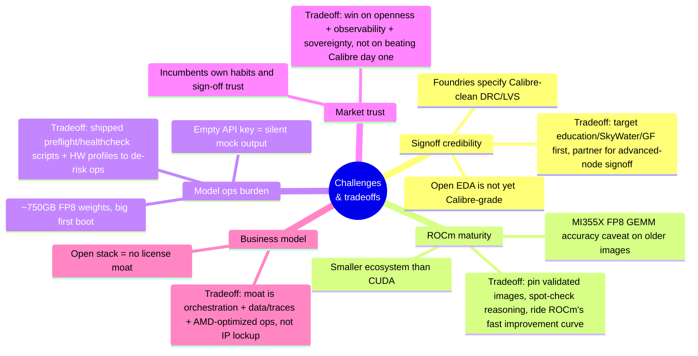
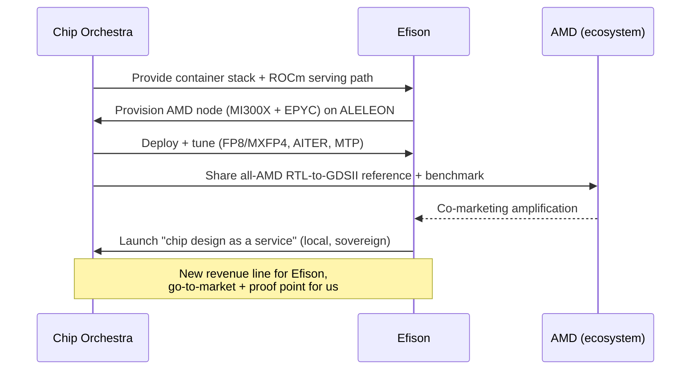

# Chip Orchestra × AMD

### Building an AI-native chip workflow that can run fully on AMD

**Partnership deck**
Prepared for: Efison Lisan Teknologi (efisonlt.com)
Prepared by: Radhian Ferel Armansyah

---

## In one page

If I had to say this in the simplest possible way:

- **What Chip Orchestra is:** a platform that takes a natural-language chip spec and drives it all the way to verified RTL and manufacturable GDSII, with the full RTL-to-GDSII flow run as one visible, controllable system instead of a messy chain of scripts.
- **Why this matters now:** LLMs made “generate some Verilog” much easier. What still feels unfinished is the rest of the journey: planning, verification, execution, retries, artifacts, signoff, and keeping engineers in control the whole time.
- **Why AMD matters:** both sides of the workload fit AMD well. The LLM side can run on self-hosted GLM-5.2 over ROCm, and the EDA side is CPU-heavy and a good fit for EPYC. That gives us a real all-AMD story without CUDA dependence or proprietary API lock-in.
- **Why Efison makes sense:** Efison already has AMD-powered HPC infrastructure with ALELEON and already speaks the language of open compute. Chip Orchestra is the kind of high-value workload that can make that infrastructure more strategic, not just more utilized.
- **What I’d love to do together:** validate Chip Orchestra on Efison’s AMD hardware, publish a joint reference design and benchmark, and explore a “chip design on Indonesian AMD infrastructure” offering.

---

## Why we started Chip Orchestra

What pushed us to build this was pretty simple: chip development is still more fragmented than it should be.

A lot of real-world flows are still held together by scattered tools, old scripts, manual handoffs, and knowledge that mostly lives in people’s heads. AI has clearly helped on the RTL generation side, but the bigger problem was never just “can a model write Verilog?” The bigger problem is whether the whole flow can be orchestrated in a way that is trustworthy, visible, and still engineer-controlled.

That’s the question we cared about.

This is the shift we’re trying to make:

A few principles shaped the product from the beginning:

- **Task-first orchestration**, —every design should live as a structured task with its own inputs, execution graph, artifacts, reports, approvals, and outputs.
- **Transparent AI**, —if the AI plans something, retries something, patches something, or reasons about something, engineers should be able to see it.
- **Unified EDA execution**, —simulation, lint, synthesis, PnR, GDS, and signoff should feel like one flow, not disconnected islands.
- **Human control at the important moments**, —engineers should stay in charge of the decisions that actually matter.

---

## What already exists today

This is not a concept deck built around a future idea. A working system already exists.

Today Chip Orchestra runs an 11-stage orchestrated pipeline across four planes and six containers.

The pipeline is:

`SPEC_INGEST → PLAN → RTL_GEN → TB_GEN → SIM → LINT → SYNTH → PNR → DRC_LVS → SIGNOFF → EXPORT`

What matters here is not just the stages themselves, but that every stage is observable: reasoning, logs, artifacts, retries, reports, approval checkpoints.

Just as important for this conversation: the **ROCm self-hosting path already exists** in this exact folder (`deploy/selfhosted-llm-rocm/`). It already points `agent-service` at an OpenAI-compatible vLLM-ROCm or ATOM server with **no application code changes required**. It’s basically env vars plus the serving container.

---

## Why AMD is more than a hardware choice for us

What makes the AMD angle genuinely interesting is that Chip Orchestra is not just “an AI app that happens to need GPUs.” It has two heavy compute halves, and both land naturally on AMD.

A lot of “AI for chips” narratives quietly assume NVIDIA plus CUDA somewhere underneath. Ours does not need to.

- **The model side can run on AMD Instinct through ROCm**, —ROCm is positioned as the industry’s only open GPU software platform, which matters if you care about avoiding single-vendor dependency [1]. MI300X brings 192 GB HBM3 and 5.3 TB/s [2]; MI325X pushes memory further; MI355X adds even more headroom with native FP4 [3].
- **The EDA side is fundamentally CPU-heavy**, —synthesis, PnR, and physical flow execution are a very natural fit for EPYC cores.
- **So the all-AMD story is real, not cosmetic**, —one infrastructure direction can cover both the AI layer and the EDA execution layer.
- **The model quality story is also clean**, —it’s the same open GLM-5.2 weights as the cloud path. The difference is really about operational tuning and throughput, not model identity.

The hardware profiles already in this folder are below:

| `HW_PROFILE` | GPUs | HBM/GPU | Quant | Note |
|---|---|---|---|---|
| `mi300x` | 8× MI300X | 192 GB | FP8 | Mainstream, validated, —start here |
| `mi325x` | 8× MI325X | 256 GB | FP8 | More KV/concurrency headroom |
| `mi355x-fp8` | 4× MI355X | 288 GB | FP8 | CDNA4, ~8 TB/s |
| `mi355x-fp4` | 4× MI355X | 288 GB | MXFP4 | Native FP4, —**best perf/TCO** |

---

## Why I think Efison is the right partner

Efison already has something rare and valuable: real AMD-powered HPC infrastructure in Indonesia, plus the operational muscle to make it useful.

ALELEON is built on **AMD EPYC** with accelerators and 100 Gbps Mellanox interconnect, and Efison already offers public HPC and system integration around that stack [4][5]. That means this is not a hypothetical fit. The infrastructure and the operating model are already close to what Chip Orchestra needs.

Why this feels especially compelling for Efison:

- **It gives Efison a higher-value workload than generic HPC cycles.** Chip design is premium, recurring, and operationally sticky.
- **It creates a strong sovereign-compute story.** Semiconductor IP is sensitive. “Your chip design stays on Indonesian infrastructure, on open AMD compute” is a meaningful pitch.
- **It is something AMD itself can amplify.** A credible all-AMD RTL-to-GDSII reference is exactly the kind of ecosystem example that gets attention.
- **It avoids the classic resale trap of proprietary EDA.** ROCm plus open-source EDA means you’re not building the offer around expensive per-seat licensing dependency.

---

## Where we sit in the market

The current EDA market is still dominated by a small number of incumbents. TrendForce-linked reporting for 2024 puts **Synopsys at ~31%, Cadence at ~30%, and Siemens EDA at ~13%**, for a combined **~74%** [6]. Other reporting puts the top-three share above 85% by 2023 [7]. Synopsys’ **$35B Ansys acquisition** in July 2025 only reinforces how concentrated the market has become [8].

At the same time, there’s a newer wave of AI-native chip companies attacking parts of the flow, especially authoring and verification. ChipAgents is a good example: a $21M Series A, strong strategic backers, and a very clear productivity story [9][10].

To me, that creates a very clear opening.

The incumbents are powerful, but they are still mostly closed, expensive, and not truly built around orchestration as the product.

The AI-agent newcomers are exciting, but most of them still live inside the old workflow. They make a designer faster in the editor, but they do not own the full end-to-end pipeline, nor the compute stack that runs it.

That is the space I believe Chip Orchestra occupies: open, self-hostable, and orchestration-native.

---

## What makes us different in practical terms

The easiest way to say it is this: we are not trying to be just another chip copilot, and we are not trying to be another traditional EDA stack.

| Dimension | Incumbent EDA (Synopsys/Cadence/Siemens) | AI chip agents (ChipAgents et al.) | Raw open EDA (OpenLane) | **Chip Orchestra + AMD** |
|---|---|---|---|---|
| Scope | Full flow, best-in-class signoff | RTL/verification authoring | Full flow, batch/no-UI | **Full flow, AI-orchestrated + observable** |
| AI orchestration | Bolt-on GenAI features | Agent inside editor | None | **Native, multi-agent, 11-stage DAG** |
| Observability | Log files, closed | Editor-scoped | Terminal logs | **Every prompt/retry/artifact traced in browser** |
| Human-in-the-loop | Manual, tool-by-tool | Suggestion accept/reject | N/A | **Explicit approval gates on RTL/impl/tapeout** |
| Compute stack | Proprietary, mostly NVIDIA/x86 | Cloud API (NVIDIA) | CPU tools | **Fully AMD: ROCm LLM + EPYC EDA** |
| Lock-in | High (licenses + APIs) | High (SaaS API) | Low | **Low, —open weights + open EDA + open ROCm** |
| Deploy | On-prem/cloud, heavy | SaaS | Self-host | **Self-host, sovereign, container-native** |

If I had to compress our differentiation into one sentence:

**Chip Orchestra is an AI-native RTL-to-GDSII orchestrator that is observable end to end and can run on open, self-hostable, all-AMD infrastructure.**

That matters because the incumbents are unlikely to walk away from their closed economics, and the newer agent companies are unlikely to build the full compute + orchestration + physical-flow stack.

---

## Opportunity map, benefit vs. cost vs. risk

If the goal is to be smart about effort, the first moves should be the ones that are easy to ship but strong in proof value.

A more grounded breakdown:

| Opportunity | Benefit | Cost/effort | Risk | Verdict |
|---|---|---|---|---|
| **Deploy on Efison AMD reusing the existing ROCm path** | H | **L** | L | ⭐ Do first |
| **Joint reference design + published benchmark (co-market w/ AMD)** | H | **L** | L | ⭐ Do first |
| **MXFP4 perf/TCO preset on MI355X** | H | L–M | M (CDNA4 accuracy caveat) | ⭐ Do first |
| Sovereign/on-prem packaging (IP-stays-local) | H | M | L | Do next |
| Multi-tenant + quota/billing for "design-as-a-service" | H | M–H | M | Do next |
| Distributed EDA across EPYC nodes (parallel PnR) | M–H | H | M | Phase 3 |
| Design-knowledge RAG / repo-aware assistant | M | M | M | Phase 3 |
| Analog/mixed-signal + FPGA flows | M | H | H | Later |
| Custom signoff to rival Calibre-clean | H (long term) | **H** | **H** | Defer / partner |

If I were prioritizing this together with Efison, I would start with these three:

1. **Deploy it on Efison’s AMD hardware using the ROCm path already in the repo**, this is the fastest path to something real.
2. **Publish a joint all-AMD reference design and benchmark**, this is probably the strongest credibility-per-week move available.
3. **Productize the MXFP4 / MI355X preset**, this sharpens the perf/TCO story in a way the market will immediately understand.

---

## The honest part: challenges and tradeoffs

I don’t think this story works unless we are honest about where the rough edges still are.

The tradeoffs we’ve made are pretty intentional:

- **We chose openness over a traditional software moat.** Open weights, open EDA, and ROCm make adoption easier and lock-in lower. That’s good for customers, but it means our moat has to come from orchestration, traces, workflow quality, and AMD-optimized operations.
- **We chose self-hosting over the easiest SaaS route.** That creates more operational work, but it also gives us sovereignty, control, and a much better fit for sensitive semiconductor IP.
- **We chose not to pretend we can replace advanced-node signoff overnight.** Open EDA is real and useful, but “Calibre-clean” still matters. So the practical move is to win first in open-PDK, education, prototyping, and selected production-adjacent workflows, then expand.
- **We chose open GLM-5.2 over a closed frontier API.** That gives us control and a cleaner all-AMD story, even if it means accepting that the absolute frontier moves fast.

I actually think this honesty helps the partnership story rather than hurts it. It makes the near-term path much clearer.

---

## What I’d like to do next

The partnership path I have in mind is straightforward: prove the stack on Efison’s AMD hardware, tune it, publish the result, then decide how big to make the commercial offer.

My suggested pilot ask is simple:

1. One AMD node, ideally **8× MI300X with an EPYC head node**, for a 6–8 week validation window.
2. A joint public reference design and benchmark run on Efison AMD infrastructure.
3. A serious conversation about a local, sovereign **Chip Design as a Service** offer once the validation is done.

And what we bring immediately is not a vague promise. We bring a working, container-native platform whose ROCm self-hosting path already exists in this exact folder and only needs env vars plus a serving container to connect.

---

## References

1. AMD, *Accelerating AI and HPC with AMD Instinct MI300X* (ROCm as the industry's only open GPU software platform): https://www.amd.com/en/partner/articles/instinct-mi300x-accelerating-ai-hpc.html
2. AMD, *Instinct MI300X Accelerators* (192 GB HBM3, 5.3 TB/s, 304 CUs): https://www.amd.com/en/products/accelerators/instinct/mi300/mi300x.html
3. AMD ROCm docs, *MI300 Series / MI350 Series microarchitecture* (CDNA, FP8/FP4, memory): https://rocm.docs.amd.com/en/latest/reference/gpu-arch/mi300.html
4. Efison Lisan Teknologi, company homepage (ALELEON, AMD EPYC + accelerators + Mellanox, public HPC): https://efisonlt.com/
5. Efison, *Spesifikasi ALELEON Supercomputer* (ALELEON Mk.V specs): https://wiki.efisonlt.com/wiki/Spesifikasi_ALELEON_Supercomputer
6. TrendForce via press (2024 EDA share: Synopsys ~31%, Cadence ~30%, Siemens ~13%, ~74% combined): https://finance.sina.com.cn/jjxw/2025-07-04/doc-infehuet9617966.shtml
7. Embedded.com, *Taking Stock of the EDA Industry* (top-3 combined share >85% by 2023, Griffin Securities/DAC 2024): https://www.embedded.com/taking-stock-of-the-eda-industry/
8. Mordor Intelligence, EDA tools market (Synopsys' $35B Ansys acquisition, July 2025): https://www.mordorintelligence.com/industry-reports/electronic-design-automation-eda-tools-market
9. ChipAgents, *Oversubscribed $21M Series A* (Bessemer; Micron, MediaTek, Ericsson): https://www.businesswire.com/news/home/20251021677325/en/
10. ChipAgents, product site (agentic AI chip design/verification, "10x faster"): https://chipagents.ai/
11. OpenROAD Project, open-source RTL-to-GDSII physical design (SkyWater SKY130, GF180): https://en.wikipedia.org/wiki/OpenROAD_Project
12. vLLM GLM-5.2 recipe (ROCm serving reference): https://recipes.vllm.ai/zai-org/GLM-5.2

> Market-share and funding figures are drawn from the sources above; specific quantitative claims
> (EDA shares, funding amounts) should be re-verified against the primary source before external use.
