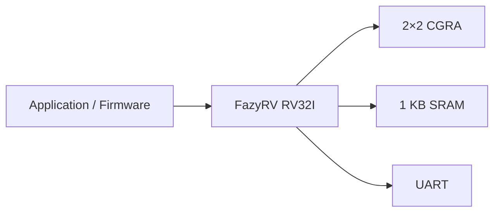
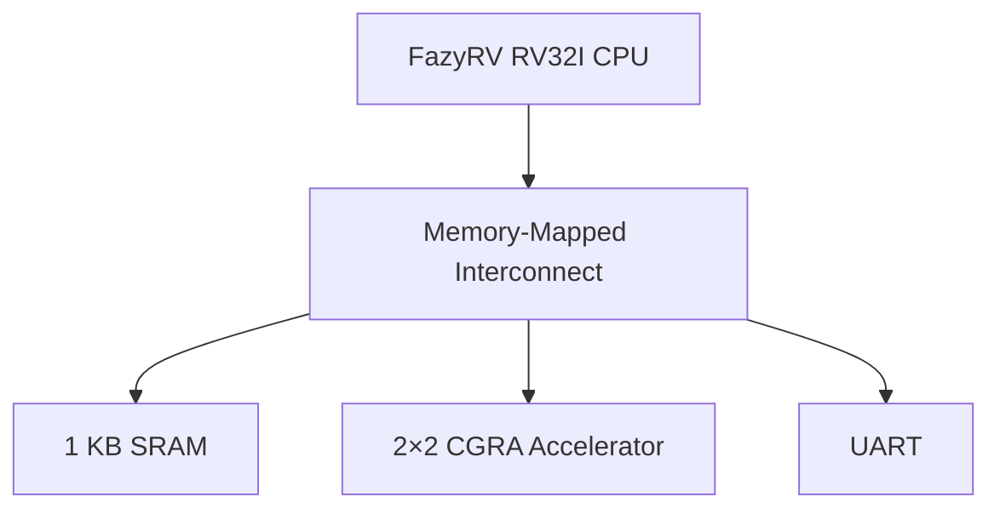
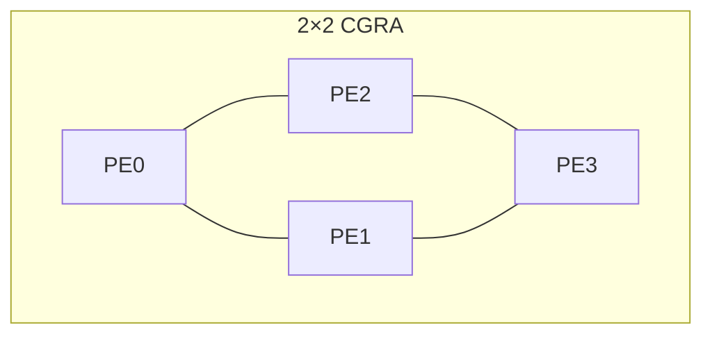
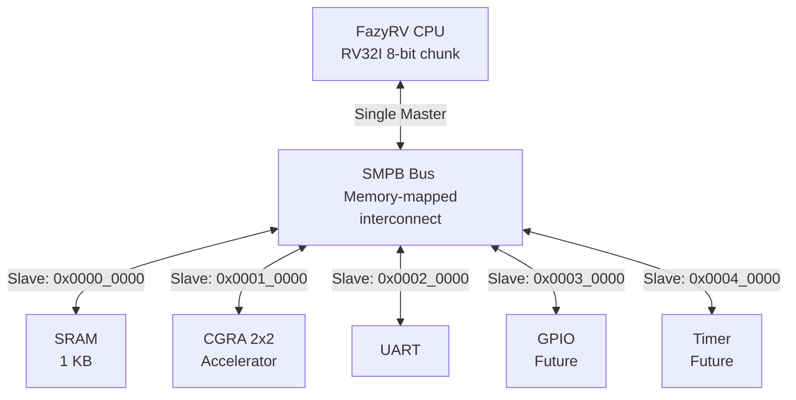
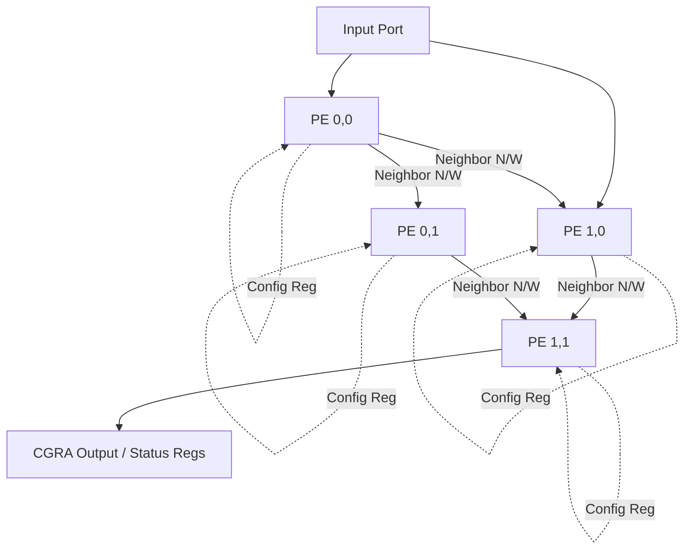
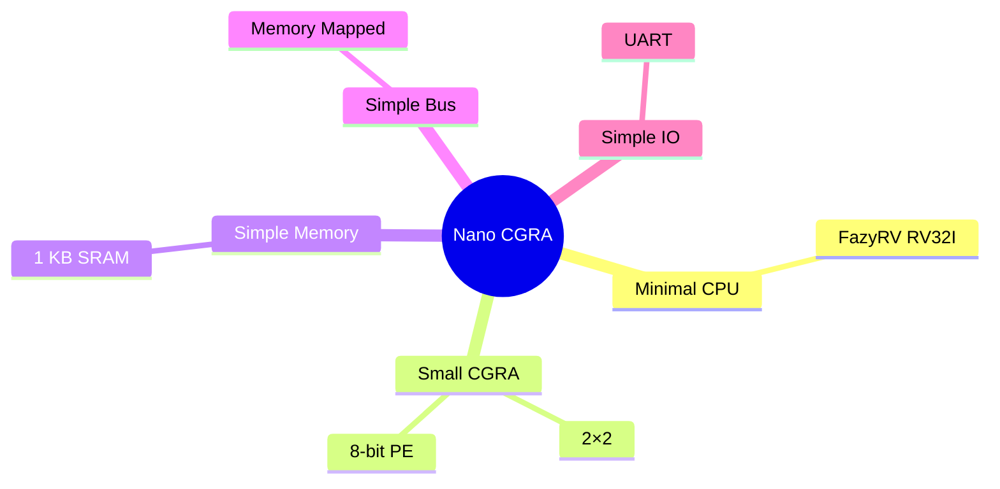
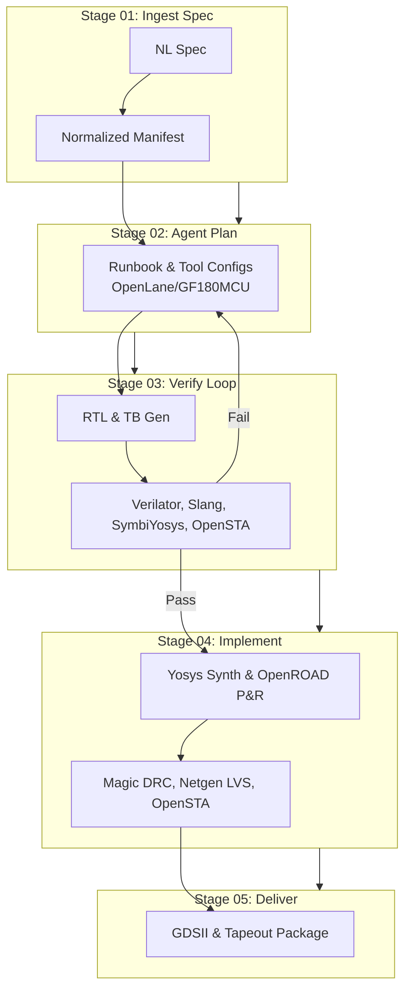

# Nano CGRA SoC 

Open-source Nano CGRA SoC targeting GF180MCU.

**Technology:** GF180MCU  
**Target Die Size:** 0.25 mm × 0.25 mm (0.0625 mm²)

---

# Motivation & Design Goals

## Motivation

- Demonstrate software-controlled CGRA acceleration
- Minimal-area SoC for GF180MCU
- Simple architecture for first-silicon success
- Low power and easy verification

## Design Targets

| Component | Specification |
|-----------|---------------|
| CPU | FazyRV RV32I (8-bit chunksize) |
| Accelerator | 2×2 CGRA |
| Processing Element | 8-bit ALU |
| SRAM | 1 KB |
| Peripheral | UART |
| Interface | Memory-Mapped |


## Overall Architecture



**Key Takeaway**

A minimal SoC that demonstrates software-controlled CGRA acceleration while prioritizing low area, low power, and implementation simplicity.

---

# System Architecture

## Top-Level Architecture



### CPU

- Executes firmware
- Configures CGRA
- Reads computation results

### Memory-Mapped Interconnect

- Simple address decoder
- Minimal routing overhead
- Easy integration

### Peripherals

- SRAM stores firmware and data
- UART provides programming and debugging

---

# CGRA Architecture

## 2×2 CGRA Accelerator



### Processing Element

Each PE supports only five operations:

- ADD
- SUB
- AND
- OR
- PASS

### Configuration Registers

```text
Operation
Source A
Source B
Destination
Enable
```

**Design Philosophy**

- Small datapath
- Simple routing
- Minimal configuration bits
- Easy verification

---

# Software-Controlled Execution

## Execution Flow


# SoC Architecture

## SoC Block Diagram


## Memory Map
| Address Range | Peripheral | Size / Note |
| --- | --- | --- |
| `0x0000_0000` | SRAM | 1 KB |
| `0x0001_0000` | CGRA Config Registers | - |
| `0x0002_0000` | UART | - |
| `0x0003_0000` | GPIO | Future |
| `0x0004_0000` | Timer | Future |

## CGRA Microarchitecture

### 2×2 PE Grid


*Note: The host CPU configures the CGRA by writing to memory-mapped configuration registers.*

### PE Configuration Register Layout
| Field Name | Bits | Description |
| --- | --- | --- |
| `op` | `[2:0]` | Operation code for the PE |
| `in_sel_a` | `[1:0]` | Input A selection (N/W neighbor or input port) |
| `in_sel_b` | `[1:0]` | Input B selection (N/W neighbor or input port) |

### Supported Operations
| Operation | Encoding (`op[2:0]`) | Description |
| --- | --- | --- |
| ADD | 0 | Addition |
| SUB | 1 | Subtraction |
| AND | 2 | Bitwise AND |
| OR | 3 | Bitwise OR |
| PASS | 4 | Pass-through input |

---

### Advantages

- Memory-mapped programming model
- No DMA required
- Simple software interface
- Straightforward debugging

---

# Design Tradeoffs & Summary

## Design Philosophy
- **Area-first:** Strict 0.25×0.25 mm die constraint requires minimal configurations and lightweight interconnect.
- **Simplicity:** Reduced instruction sets and operations for deterministic execution.
- **First-silicon:** Predictable signoff loops leveraging automated DRC/LVS/STA checks minimize tape-out risk.

## Area Optimization




# ChipOrchestra Design Flow

ChipOrchestra is an AI-orchestrated RTL-to-GDS design workflow driving the NanoCGRA SoC pipeline.

## Flow Pipeline


## Benefits for NanoCGRA SoC
- ⚡ **Faster RTL iteration:** AI generates and refines RTL directly from specs.
- 🔄 **Automated Verify Loop:** Unified simulation & formal checks catch bugs early.
- 📐 **Area-aware Planning:** Selects minimal configs for the 0.25×0.25mm target.
- 🛠️ **Consistent Flow:** Ensures reliable OpenLane/GF180MCU execution.
- 🏅 **First-Silicon Confidence:** Automated DRC/LVS/STA signoff.

---

# Verification Plan

## Strategy
- **Unit Tests per Block:** Isolated testing for SRAM, UART, PE, and the SMPB bus.
- **Integration Simulation:** Verifying block interconnect and system-level operations.
- **Formal Checks:** Ensuring logical correctness of state machines and bus protocols.

## Toolchain
- **Simulation:** Verilator
- **Testbenches:** Cocotb / SystemVerilog TB
- **Formal Verification:** SymbiYosys
- **Static Timing Analysis:** OpenSTA

## Key Test Cases
1. **CGRA Configuration:** Write and readback validation for config registers.
2. **UART Loopback:** Ensuring serial transmit/receive fidelity.
3. **SRAM Read/Write:** Full address space integrity checks.
4. **Full SoC Smoke Test:** End-to-end execution combining CPU, bus, and CGRA operations.

*ChipOrchestra fully automates this loop, feeding failures back to the Agent Plan stage.*

---

# Implementation & Tapeout Plan

## Synthesis & Implementation
- **Synthesis:** Yosys targeting OpenLane flow for GF180MCU.
- **Place & Route (P&R):** OpenROAD focused on strict 0.25×0.25mm die area constraint.

## Signoff Procedures
- **DRC (Design Rule Check):** Magic
- **LVS (Layout vs. Schematic):** Netgen
- **Timing Closure:** OpenSTA

## Deliverables
- **GDSII:** Final layout generated via KLayout.
- **Signoff Reports:** Comprehensive documentation for DRC, LVS, and STA.
- **Tapeout Package:** Foundry-ready final assets.

## Risk Mitigations
- **Area Budget:** Constant monitoring during P&R to fit 0.25 mm².
- **Timing Closure:** Frequent STA checks throughout the flow.
- **First-silicon Checklist:** Strict adherence to automated verify and signoff loop.
