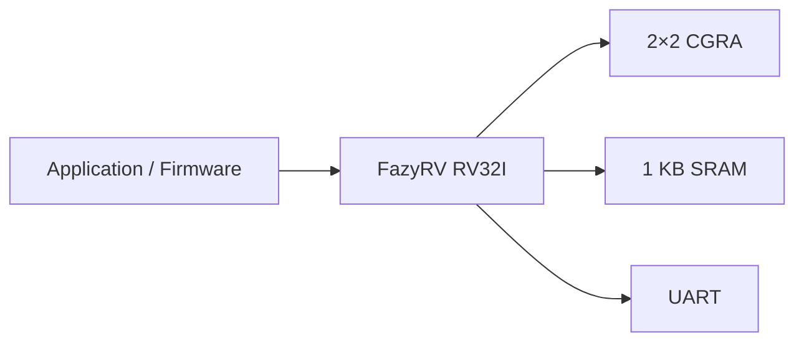
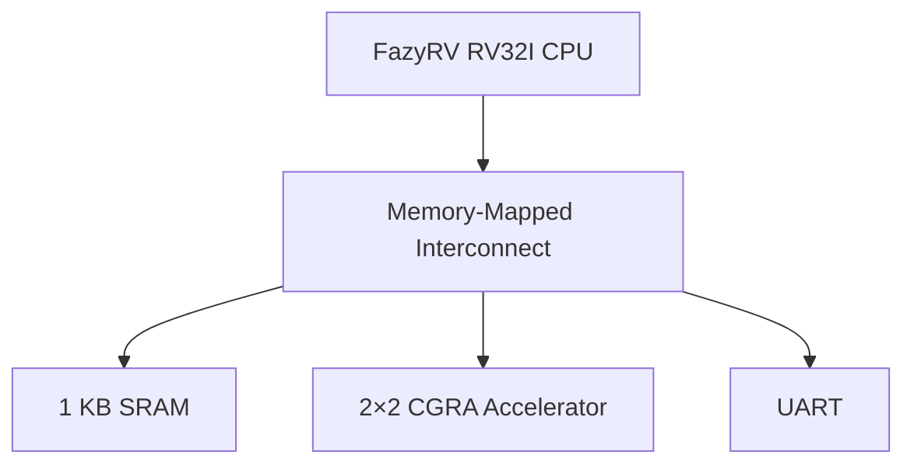
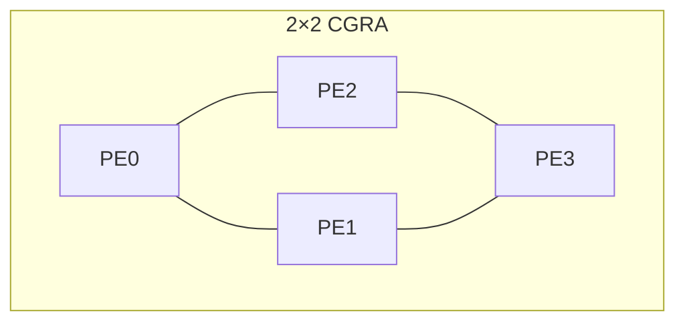
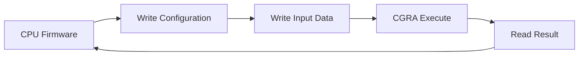
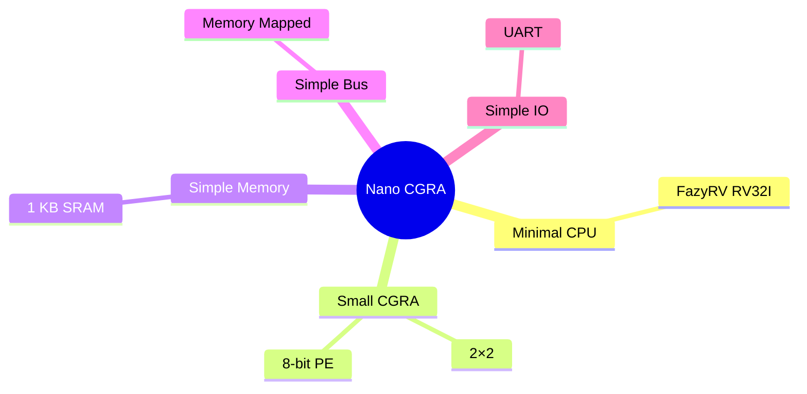

# Nano CGRA SoC 

Open-source Nano CGRA SoC targeting GF180MCU.

**Technology:** GF180MCU  
**Target Die Size:** 0.25 mm × 0.25 mm (0.0625 mm²)

---

# Motivation & Design Goals

## Motivation

- Demonstrate software-controlled CGRA acceleration
- Minimal-area SoC for GF180MCU
- Simple architecture for first-silicon success
- Low power and easy verification

## Design Targets

| Component | Specification |
|-----------|---------------|
| CPU | FazyRV RV32I (8-bit chunksize) |
| Accelerator | 2×2 CGRA |
| Processing Element | 8-bit ALU |
| SRAM | 1 KB |
| Peripheral | UART |
| Interface | Memory-Mapped |


## Overall Architecture



**Key Takeaway**

A minimal SoC that demonstrates software-controlled CGRA acceleration while prioritizing low area, low power, and implementation simplicity.

---

# System Architecture

## Top-Level Architecture



### CPU

- Executes firmware
- Configures CGRA
- Reads computation results

### Memory-Mapped Interconnect

- Simple address decoder
- Minimal routing overhead
- Easy integration

### Peripherals

- SRAM stores firmware and data
- UART provides programming and debugging

---

# CGRA Architecture

## 2×2 CGRA Accelerator



### Processing Element

Each PE supports only five operations:

- ADD
- SUB
- AND
- OR
- PASS

### Configuration Registers

```text
Operation
Source A
Source B
Destination
Enable
```

**Design Philosophy**

- Small datapath
- Simple routing
- Minimal configuration bits
- Easy verification

---

# Software-Controlled Execution

## Execution Flow



## Memory Map

| Address | Function |
|---------|----------|
| 0x0000 | SRAM |
| 0x1000 | CGRA Configuration |
| 0x1100 | CGRA Data |
| 0x2000 | UART |

### Advantages

- Memory-mapped programming model
- No DMA required
- Simple software interface
- Straightforward debugging

---

# Design Tradeoffs & Summary

## Area Optimization



## Design Decisions

- Lightweight RV32I host processor
- Four 8-bit processing elements
- Memory-mapped accelerator interface
- Lightweight interconnect
- Small on-chip SRAM
- No DMA or cache
- Optimized for first-silicon success

## Expected Outcome

- Minimal silicon area
- Low routing complexity
- Low power consumption
- Easy verification
- Software-controlled acceleration
- Fits the GF180MCU 0.25 mm × 0.25 mm target
