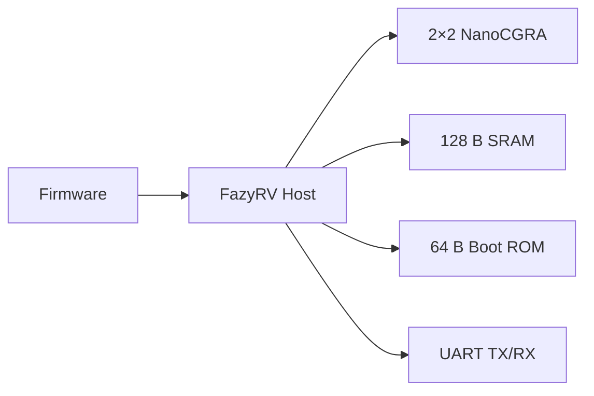
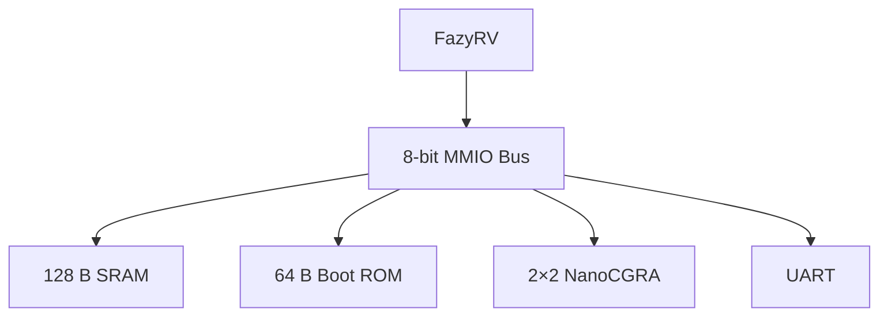
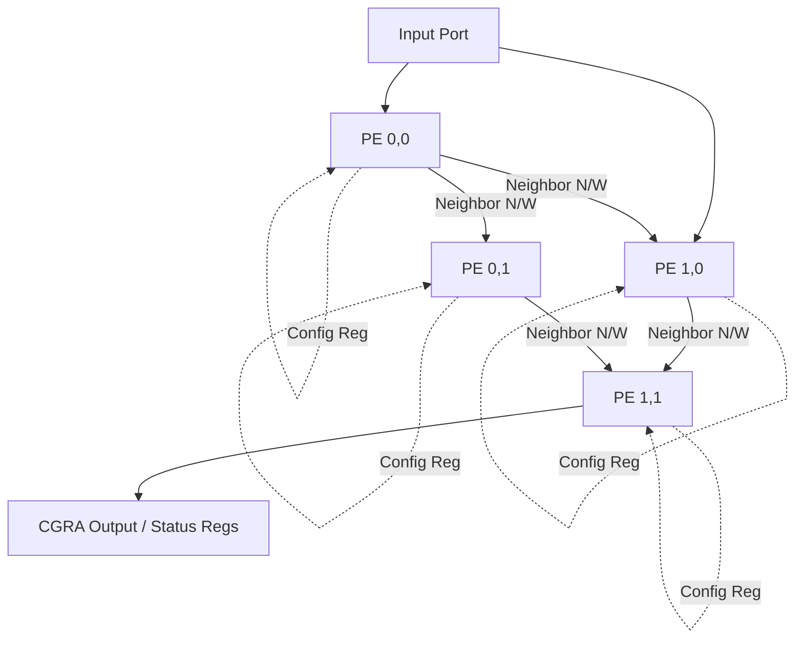
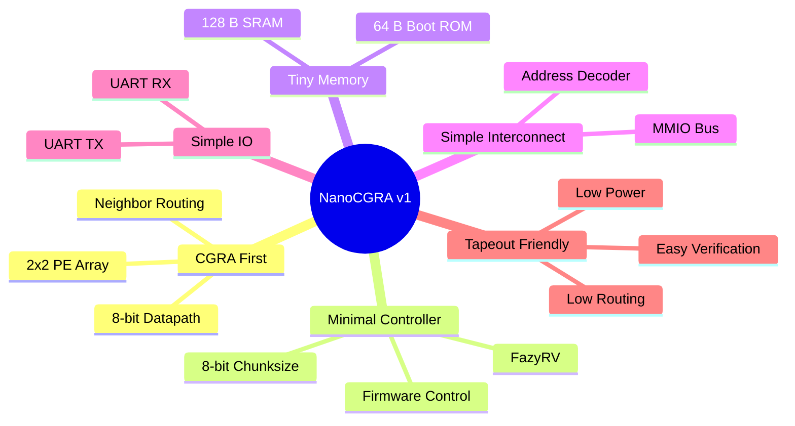
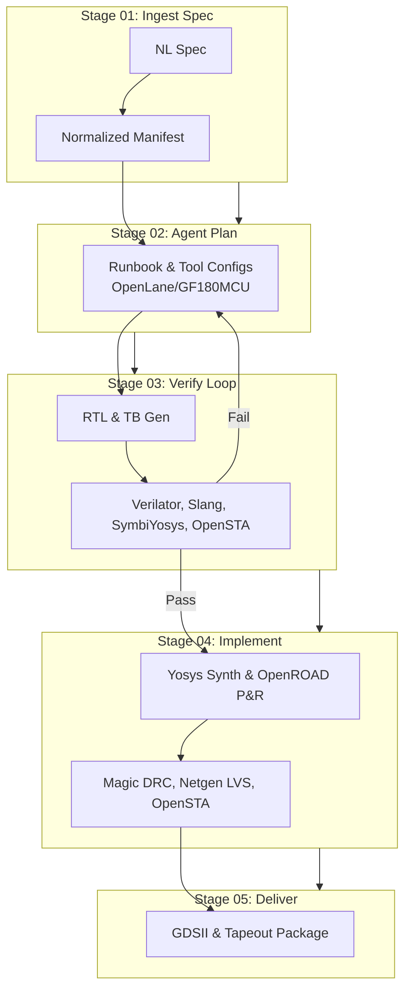

# NanoCGRA v1 SoC

> **Open-source CGRA-centric SoC targeting GF180MCU for TinyML and Edge AI.**

**Technology:** GF180MCU  
**Target Die Size:** **≤ 0.40 mm × 0.40 mm (0.16 mm²)**

---

# Motivation & Design Goals

NanoCGRA v1 is a **CGRA-first** research SoC. Unlike conventional microcontroller-centric SoCs, most silicon area is dedicated to a reconfigurable compute array while the CPU acts only as a lightweight host controller.

## Design Targets

| Component | Specification |
|---|---|
| CPU | FazyRV RV32I (8-bit chunksize) |
| Accelerator | 2×2 NanoCGRA |
| Processing Elements | 4 × 8-bit |
| Operations | ADD, SUB, AND, OR, XOR, PASS |
| SRAM | 128 B |
| Boot ROM | 64 B |
| Bus | 8-bit Memory-Mapped |
| UART | TX/RX |
| Frequency | 10 MHz |
| Die Size | ≤0.40×0.40 mm |

---

# Overall Architecture

# Software-Controlled Execution

# SoC Architecture

# Memory Map

| Address | Peripheral | Note |
|---|---|---|
|0x00-0x7F|128 B SRAM|Firmware/Data|
|0x80-0x83|UART|TX/RX|
|0x90-0x97|CGRA Registers|Configuration|
|0xC0-0xFF|64 B Boot ROM|Boot|

## CGRA Microarchitecture

### 2×2 PE Grid

*Note: The host CPU configures the CGRA by writing to memory-mapped configuration registers.*

### PE Configuration Register Layout
| Field Name | Bits | Description |
| --- | --- | --- |
| `op` | `[2:0]` | Operation code for the PE |
| `in_sel_a` | `[1:0]` | Input A selection (N/W neighbor or input port) |
| `in_sel_b` | `[1:0]` | Input B selection (N/W neighbor or input port) |

### Supported Operations
| Operation | Encoding (`op[2:0]`) | Description |
| --- | --- | --- |
| ADD | 0 | Addition |
| SUB | 1 | Subtraction |
| AND | 2 | Bitwise AND |
| OR | 3 | Bitwise OR |
| PASS | 4 | Pass-through input |

---

### Advantages

- Memory-mapped programming model
- No DMA required
- Simple software interface
- Straightforward debugging

---

# Design Tradeoffs & Summary

## Design Philosophy
- **Area-first:** Strict 0.4×0.4 mm die constraint requires minimal configurations and lightweight interconnect.
- **Simplicity:** Reduced instruction sets and operations for deterministic execution.
- **First-silicon:** Predictable signoff loops leveraging automated DRC/LVS/STA checks minimize tape-out risk.

## Area Optimization

# ChipOrchestra Design Flow

ChipOrchestra is an AI-orchestrated RTL-to-GDS design workflow driving the NanoCGRA SoC pipeline.

## Flow Pipeline

## Benefits for NanoCGRA SoC
- ⚡ **Faster RTL iteration:** AI generates and refines RTL directly from specs.
- 🔄 **Automated Verify Loop:** Unified simulation & formal checks catch bugs early.
- 📐 **Area-aware Planning:** Selects minimal configs for the 0.25×0.25mm target.
- 🛠️ **Consistent Flow:** Ensures reliable OpenLane/GF180MCU execution.
- 🏅 **First-Silicon Confidence:** Automated DRC/LVS/STA signoff.

## Estimated Development Time Comparison

| Stage | Manual Workflow | With ChipOrchestra | Estimated Improvement |
|-------|----------------:|-------------------:|----------------------:|
| RTL Coding | 3–5 days | 1–2 hours | ~24–60× faster |
| Testbench Writing | 2–3 days | 30–60 minutes | ~16–48× faster |
| Verification & Debug | 1–2 weeks | 2–4 days | ~3–5× faster |
| Physical Design Setup | 2–3 days | <1 day | ~2–3× faster |
| Full RTL → GDSII | 3–5 weeks | 3–7 days | ~5–7× faster |

> **Note:** These values are estimated for a small research-scale SoC (e.g., Nano CGRA) and assume an AI-assisted design flow using ChipOrchestra with open-source EDA tools (Verilator, Slang, SymbiYosys, Yosys, OpenROAD, Magic, and OpenLane). Actual results depend on design complexity, compute resources, and the number of verification iterations.

---

# Verification Plan

## Strategy
- **Unit Tests per Block:** Isolated testing for SRAM, UART, PE, and the SMPB bus.
- **Integration Simulation:** Verifying block interconnect and system-level operations.
- **Formal Checks:** Ensuring logical correctness of state machines and bus protocols.

## Toolchain
- **Simulation:** Verilator
- **Testbenches:** Cocotb / SystemVerilog TB
- **Formal Verification:** SymbiYosys
- **Static Timing Analysis:** OpenSTA

## Key Test Cases
1. **CGRA Configuration:** Write and readback validation for config registers.
2. **UART Loopback:** Ensuring serial transmit/receive fidelity.
3. **SRAM Read/Write:** Full address space integrity checks.
4. **Full SoC Smoke Test:** End-to-end execution combining CPU, bus, and CGRA operations.

*ChipOrchestra fully automates this loop, feeding failures back to the Agent Plan stage.*

---

# Implementation & Tapeout Plan

## Synthesis & Implementation
- **Synthesis:** Yosys targeting OpenLane flow for GF180MCU.
- **Place & Route (P&R):** OpenROAD focused on strict 0.25×0.25mm die area constraint.

## Signoff Procedures
- **DRC (Design Rule Check):** Magic
- **LVS (Layout vs. Schematic):** Netgen
- **Timing Closure:** OpenSTA

## Deliverables
- **GDSII:** Final layout generated via KLayout.
- **Signoff Reports:** Comprehensive documentation for DRC, LVS, and STA.
- **Tapeout Package:** Foundry-ready final assets.

## Risk Mitigations
- **Area Budget:** Constant monitoring during P&R to fit 0.25 mm².
- **Timing Closure:** Frequent STA checks throughout the flow.
- **First-silicon Checklist:** Strict adherence to automated verify and signoff loop.
