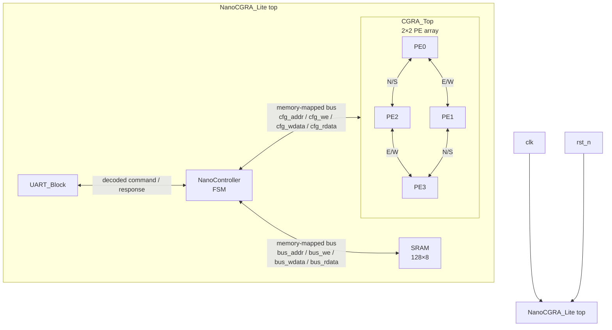
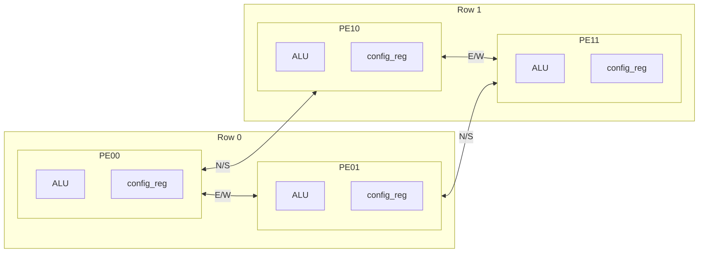
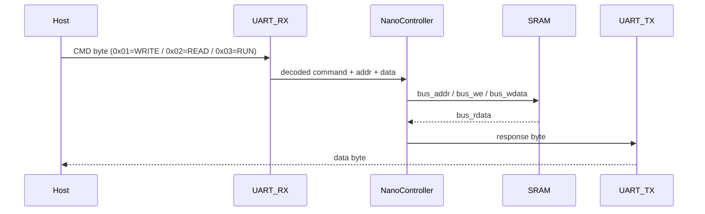
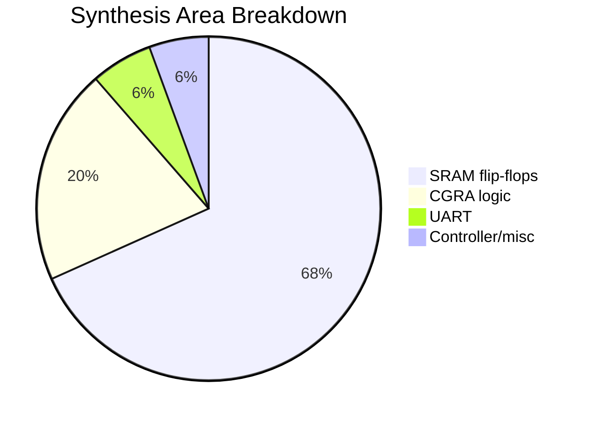

# NanoCGRA-Lite — 2×2 CGRA + 128B SRAM

NanoCGRA-Lite is a compact coarse-grained reconfigurable array (CGRA) soft-IP generated by **Chip Orchestra** and implemented on the open **GF180MCU** PDK. The baseline design combines a 2×2 processing-element mesh, a synthesized 128-byte SRAM, a memory-mapped NanoController FSM, and a UART command interface. The metrics below are actual verified EDA results from the `output/nanocgra_lite/` implementation artifacts, including synthesis, STA, power, DRC, LVS, RTL simulation, and gate-level simulation reports.

## 1. Architecture Block Diagram



## 2. Full RTL-to-GDS Flow


## 3. CGRA 2×2 PE Mesh



## 4. UART Packet Protocol



## 5. Synthesis Area Breakdown



## 6. Design Metrics Summary

This comparison covers the three verified NanoCGRA-Lite variants. Power is plotted as **mW×1000** so it can be shown on the same axis as cell area.

```mermaid
xychart-beta
    title "NanoCGRA-Lite Variant Comparison"
    x-axis ["2×2 + 128B", "4×2 + 64B", "3×3 + 32B"]
    y-axis "Value" 0 --> 170000
    bar "Cell area (µm²)" [163308, 137038, 116523]
    bar "Power (mW×1000)" [10523, 5903, 4154]
```



If the Markdown renderer does not support `xychart-beta`, use this fallback table:

| Variant | Cell Area (µm²) | Power (mW×1000) |
|---|---:|---:|
| 2×2 + 128B | 163,308 | 10,523 |
| 4×2 + 64B | 137,038 | 5,903 |
| 3×3 + 32B | 116,523 | 4,154 |

## Key Metrics

| Metric | Verified Result | Source |
|---|---:|---|
| PEs | 4 (2×2) | RTL configuration |
| SRAM | 128B (128×8) | `rtl/sram.v` |
| Standard Cells | 6,219 | `logs/yosys_synth.log` |
| Cell Area | 163,307.5 µm² | `logs/yosys_synth.log` |
| Die Size | 533×533 µm | `logs/openroad_pnr.log` |
| Utilization | 76% | `reports/sta.txt` / `logs/openroad_pnr.log` |
| Setup Slack | +56.46 ns | `reports/sta.txt` |
| Hold Slack | +0.48 ns | `reports/sta.txt` |
| Power | 10.523 mW @ 10 MHz, 5V, 25°C | `reports/power_analysis.txt` |
| DRC | CLEAN | `logs/drc.log` |
| LVS | 6,312/6,312 device match | `logs/netgen_lvs.log` |
| RTL Sim | 5/5 PASS | `reports/sim_logs/nanocgra_lite_tb.log` |
| GL Sim | PASS | `reports/gate_level_sim.txt` |

## Directory Structure

```text
output/nanocgra_lite/
├── rtl/
│   ├── nanocgra_lite.v
│   ├── pe.v
│   ├── cgra.v
│   ├── sram.v
│   ├── uart.v
│   ├── nano_controller.v
│   ├── bus_decoder.v
│   └── params.vh
├── tb/
│   ├── nanocgra_lite_tb.v
│   ├── pe_tb.v
│   ├── sram_tb.v
│   ├── uart_tb.v
│   └── nano_controller_tb.v
├── synth/
│   ├── synth.ys
│   └── nanocgra_lite.synth.v
├── pnr/
│   ├── flow.tcl
│   ├── nanocgra_lite.def
│   ├── nanocgra_lite.odb
│   ├── nanocgra_lite.pnr.v
│   └── route.guide
├── gds/
│   └── nanocgra_lite.gds
├── logs/
│   ├── yosys_synth.log
│   ├── openroad_pnr.log
│   ├── drc.log
│   └── netgen_lvs.log
└── reports/
    ├── sta.txt
    ├── power_analysis.txt
    ├── gate_level_sim.txt
    ├── route_drc.rpt
    └── sim_logs/
        └── nanocgra_lite_tb.log
```

## How to Reproduce

These steps outline the local reproduction flow for the verified baseline. Exact command names can vary depending on whether OpenLane/OpenROAD are installed natively or through Docker.

```bash
# 1. Install or make available the core open-source EDA tools.
sudo apt-get update
sudo apt-get install -y iverilog yosys

# 2. Configure OpenLane/OpenROAD with GF180MCU PDK support.
# Follow the OpenLane setup instructions for the chosen host or Docker flow.

# 3. Run RTL simulation.
iverilog -g2012 -I output/nanocgra_lite/rtl \
  -o output/nanocgra_lite/sim/nanocgra_lite.vvp \
  output/nanocgra_lite/tb/nanocgra_lite_tb.v \
  output/nanocgra_lite/rtl/*.v
vvp output/nanocgra_lite/sim/nanocgra_lite.vvp

# 4. Run synthesis with Yosys.
yosys -s output/nanocgra_lite/synth/synth.ys | tee output/nanocgra_lite/logs/yosys_synth.log

# 5. Run placement and routing with OpenLane/OpenROAD.
# Example entrypoint; adapt to the local OpenLane installation.
openlane output/nanocgra_lite/pnr/flow.tcl

# 6. Run static timing analysis.
opensta output/nanocgra_lite/reports/sta.tcl

# 7. Review signoff artifacts.
# Check DRC, LVS, STA, power, RTL sim, GLS, and final GDS outputs.
```

## License / Credits

Generated by **Chip Orchestra** using open-source EDA tooling on the **GF180MCU PDK**. The implementation flow uses **Yosys** for synthesis, **OpenLane/OpenROAD** for physical implementation, **OpenSTA** for timing and power analysis, **KLayout** for DRC, **Netgen** for LVS, and **Icarus Verilog** for RTL and gate-level simulation.
