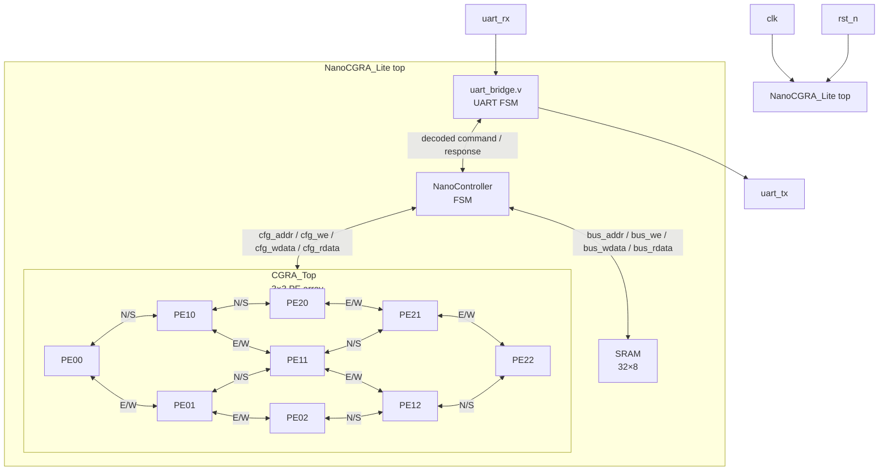
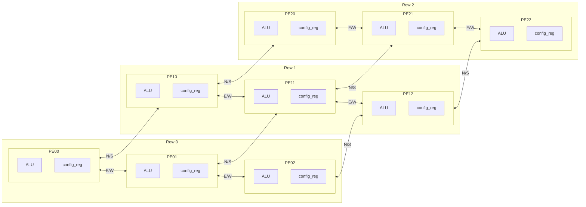
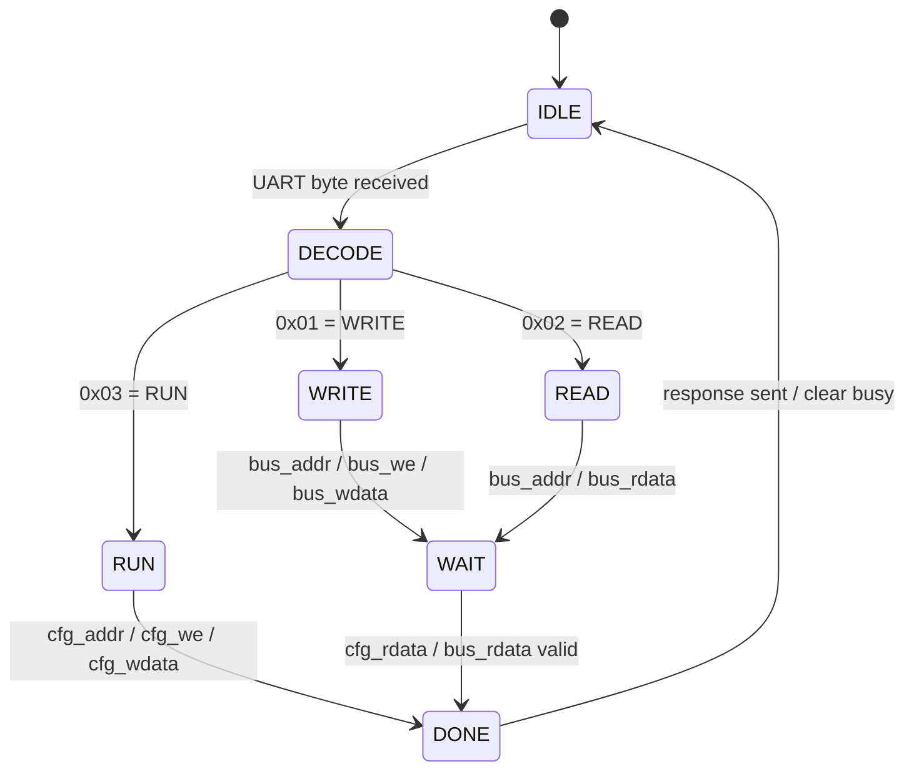
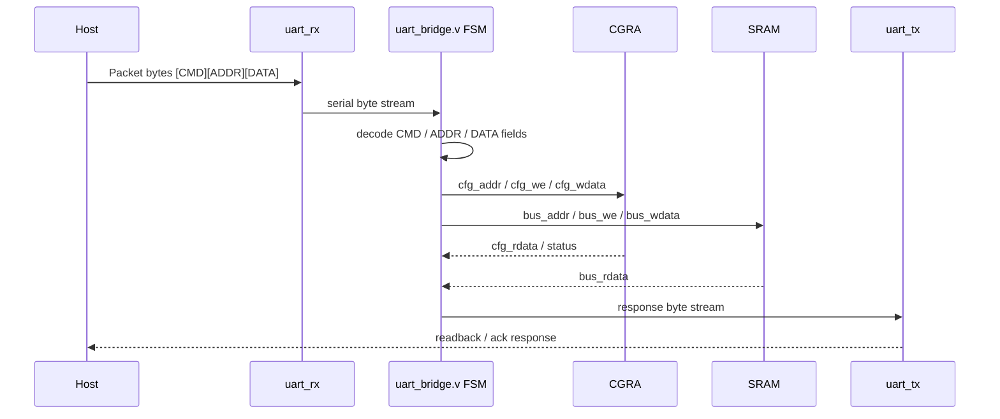
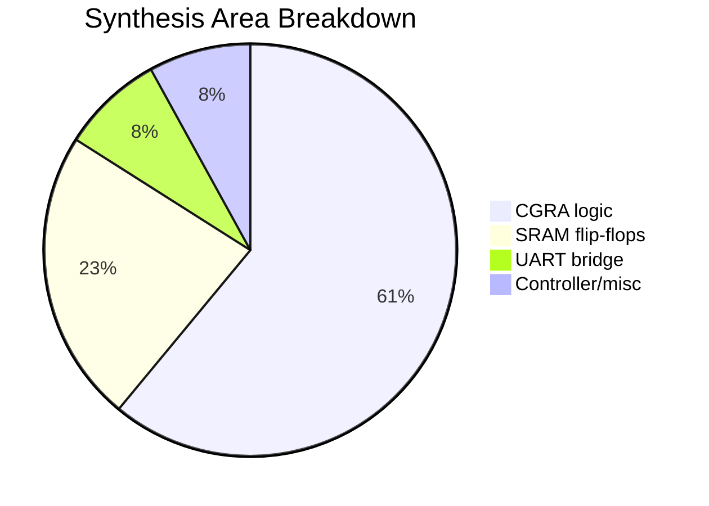

# NanoCGRA-Lite — 3×3 CGRA + 32B SRAM

NanoCGRA-Lite is a minimal coarse-grained reconfigurable array (CGRA) soft-IP built on the open GF180MCU PDK and generated by **Chip Orchestra**. This optimized tapeout configuration integrates a 3×3 processing-element mesh, a compact 32-byte SRAM implemented as a 32×8-bit memory, and a 4-pin UART-only interface (`clk`, `rst_n`, `uart_rx`, `uart_tx`) driven by the `uart_bridge.v` packet FSM. The results in this README are from the verified EDA run for the canonical 3×3 + 32B design.

## 1. Architecture Block Diagram



## 2. Full RTL-to-GDS Flow


## 3. CGRA 3×3 PE Mesh



## 4. NanoController FSM



## 5. UART Packet Protocol



## 6. Synthesis Area Breakdown



## 7. Design Metrics Summary

The chart compares the three verified NanoCGRA-Lite variants. Power is plotted as mW×1000 so the values can share a chart with cell area.

```mermaid
xychart-beta
    title "NanoCGRA-Lite Variant Comparison"
    x-axis ["2×2 + 128B", "4×2 + 64B", "3×3 + 32B"]
    y-axis "Value" 0 --> 170000
    bar "Cell area (µm²)" [163308, 137038, 123634]
    bar "Power (mW×1000)" [10523, 5903, 4675]
```



If `xychart-beta` is not supported by the Markdown renderer, use the table below as the fallback source of truth.

| Variant | Cell Area (µm²) | Power (mW×1000) |
|---|---:|---:|
| 2×2 + 128B | 163,308 | 10,523 |
| 4×2 + 64B | 137,038 | 5,903 |
| 3×3 + 32B | 123,634 | 4,675 |

## Key Metrics

| Metric | Verified Result |
|---|---:|
| Branding | Chip Orchestra |
| PDK | GF180MCU |
| PEs | 9 (3×3) |
| SRAM | 32B (32×8-bit) |
| Interface | 4-pin UART-only (`clk`, `rst_n`, `uart_rx`, `uart_tx`) |
| Protocol | `[CMD][ADDR][DATA]` via `uart_bridge.v` FSM |
| Standard Cells | 5,296 |
| Cell Area | 123,634 µm² |
| Die Size | 466×466 µm |
| Setup Slack @ 10 MHz | +76.72 ns |
| Hold Slack | +0.82 ns |
| Fmax | 83.3 MHz |
| Power | 4.675 mW @ 10 MHz |
| DRC | CLEAN |
| LVS | CLEAN — 5,325/5,325 devices, 96/96 cell classes |
| RTL Sim | 5/5 PASS |
| Gate-Level Sim | PASS |
| Synthesis Report | `output/nanocgra_3x3/reports/synthesis/` |
| STA Report | `output/nanocgra_3x3/reports/sta/` |
| Power Report | `output/nanocgra_3x3/reports/power/` |
| DRC Report | `output/nanocgra_3x3/reports/drc/` |
| LVS Report | `output/nanocgra_3x3/reports/lvs/` |
| Simulation Logs | `output/nanocgra_3x3/reports/sim/` |

## Directory Structure

```text
output/nanocgra_3x3/
├── rtl/              # Verilog RTL for NanoCGRA-Lite top, 3×3 PE mesh, 32B SRAM, and uart_bridge
│   ├── nanocgra_lite_top.v
│   ├── cgra_top_3x3.v
│   ├── pe.v
│   ├── sram_32x8.v
│   └── uart_bridge.v
├── tb/               # RTL and gate-level simulation testbenches
├── netlist/          # Synthesized netlists and related generated views
├── gds/              # Final GDS/signoff layout artifacts
├── reports/          # Synthesis, P&R, STA, power, DRC, LVS, and simulation reports
└── scripts/          # Reproduction and flow helper scripts
```

## How to Reproduce

The following commands describe the expected local reproduction flow for the verified 3×3 + 32B run. Tool installation and environment setup can vary by host, but the flow is standard for an open-source GF180MCU digital implementation path.

```bash
# 1. Install core tooling.
# Ubuntu packages are commonly available for iverilog and yosys.
sudo apt-get update
sudo apt-get install -y iverilog yosys

# 2. Install or configure OpenLane with GF180MCU PDK support.
# Follow the OpenLane documentation for Docker or native setup.

# 3. Run RTL simulation.
iverilog -g2012 -o output/nanocgra_3x3/sim/nanocgra_3x3_tb.vvp \
  output/nanocgra_3x3/tb/*.v output/nanocgra_3x3/rtl/*.v
vvp output/nanocgra_3x3/sim/nanocgra_3x3_tb.vvp

# 4. Run synthesis.
yosys -s output/nanocgra_3x3/synth/run_synth.ys

# 5. Run placement and routing with OpenLane.
# Example; adjust to the local OpenLane entrypoint/config path.
openlane output/nanocgra_3x3/config.json

# 6. Run static timing analysis.
opensta output/nanocgra_3x3/reports/sta.tcl

# 7. Review DRC, LVS, timing, power, and simulation reports.
```

## License / Credits

Generated by **Chip Orchestra** using open-source EDA tooling: **Yosys** for synthesis, **OpenLane** for physical implementation, **KLayout** for DRC, **Netgen** for LVS, and **OpenSTA** for timing analysis. The implementation targets the open **GF180MCU PDK**.
