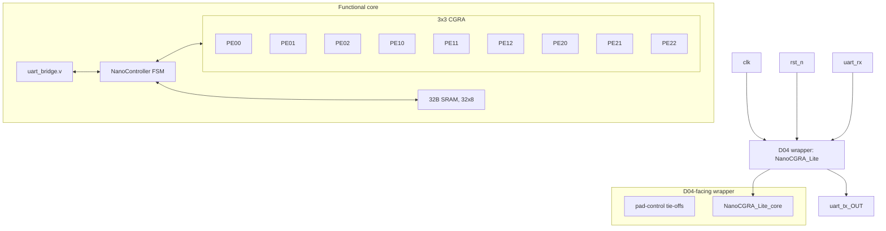

# NanoCGRA-Lite 3×3 OPT — D04 Re-hardened Submission

NanoCGRA-Lite is a compact GF180MCU digital accelerator generated by **Chip Orchestra**. This `_opt` variant preserves the original 3×3 CGRA + 32-byte SRAM + UART-controlled functionality, and has been re-hardened for the official **D04** template constraints.

The latest D04 update fixes the audit issue where the previous GDS block size was approximately `466.555 µm × 466.555 µm`. The regenerated design now uses the D04-required `550 µm × 550 µm` block size, the D04 pin geometry, refreshed GDS pin labels, and regenerated signoff artifacts.

## Functional Summary

The functional core remains the same as the previous registered `_opt` design:

- 3×3 coarse-grained reconfigurable array (9 processing elements)
- 32-byte SRAM implemented as 32×8-bit storage
- UART-controlled command path through `uart_bridge.v`
- GF180MCU 5 V standard-cell implementation using `gf180mcu_fd_sc_mcu7t5v0`

For D04 compatibility, the original core is wrapped by a D04-facing top-level module named `NanoCGRA_Lite`. The functional mapping is:

| D04-facing signal | Internal core signal / behavior |
|---|---|
| `clk` | core `clk` |
| `rst_n` | core `rst_n` |
| `uart_rx` | core `uart_rx` |
| `uart_tx_OUT` | driven by core `uart_tx` |
| D04 pad-control pins | tied to fixed safe values |
| `uart_tx_IN` | present for D04 interface compatibility; not used by the UART-only core |
| `vdd`, `vss` | chip power and ground |

The added D04 wrapper changes the physical/top-level interface but does not change the internal NanoCGRA datapath, controller, SRAM, or UART protocol.

## Architecture


```mermaid
graph TD
    CLK[clk] --> WRAP[D04 wrapper: NanoCGRA_Lite]
    RST[rst_n] --> WRAP
    RX[uart_rx] --> WRAP
    WRAP --> TX[uart_tx_OUT]

    subgraph WRAP_BOX[D04-facing wrapper]
        TIE[pad-control tie-offs]
        CORE[NanoCGRA_Lite_core]
    end

    subgraph CORE_BOX[Functional core]
        UART[uart_bridge.v]
        CTRL[NanoController FSM]
        SRAM[32B SRAM, 32x8]
        subgraph CGRA[3x3 CGRA]
            PE00[PE00]
            PE01[PE01]
            PE02[PE02]
            PE10[PE10]
            PE11[PE11]
            PE12[PE12]
            PE20[PE20]
            PE21[PE21]
            PE22[PE22]
        end
    end

    WRAP --> CORE
    UART <--> CTRL
    CTRL <--> SRAM
    CTRL <--> CGRA
```

## UART Protocol

The design is controlled through a simple byte-oriented UART protocol:

| Command | Meaning | Behavior |
|---:|---|---|
| `0x01` | WRITE | write `DATA` to internal address `ADDR` |
| `0x02` | READ | read internal address `ADDR` and return one byte |
| `0x03` | RUN | start a CGRA operation through the controller |

Packet format:

```text
[CMD][ADDR][DATA]
```

## D04 Physical Update

| Item | Result |
|---|---:|
| Target slot/template | D04 |
| DEF database units | 2000 DBU/µm |
| Die area in DEF | `( 0 0 ) ( 1100000 1100000 )` |
| Physical block size | `550 µm × 550 µm` |
| D04-facing top-level pins | 21 |
| DEF pin geometry | matches provided `D04_D.def` after 10× DBU scaling |
| Base GDS bbox | `550 µm × 550 µm` |
| Filled GDS bbox | `550 µm × 550 µm` |
| GDS pin labels | refreshed at D04 template pin centers |

## Signoff Summary

| Check | Result | Evidence |
|---|---:|---|
| P&R route check | PASS | `logs/pnr_d04.log`: 0 pin violations, 0 net violations |
| Main DRC | PASS | `reports/signoff/drc_main_d04_summary.txt`: 0 violations |
| Density | PASS | `reports/signoff/density_filled_d04_summary.txt`: 0 violations |
| Antenna | PASS | `reports/signoff/antenna_filled_d04_summary.txt`: 0 violations |
| LVS | PASS | `reports/lvs/netgen_final.log`: `Netlists match uniquely.` |
| Timing | PASS | `logs/pnr_d04.log`: setup/hold WNS reported as non-negative |

Final LVS result:

```text
Circuit 1 contains 5321 devices, Circuit 2 contains 5321 devices.
Circuit 1 contains 5339 nets,    Circuit 2 contains 5339 nets.
Netlists match uniquely.
Result: Circuits match uniquely.
```

## Key Files

```text
output/nanocgra_lite_3x3_opt/
├── rtl/
│   ├── nanocgra_lite.v                  # functional core, renamed NanoCGRA_Lite_core
│   └── nanocgra_lite_d04_wrapper.v      # D04-facing NanoCGRA_Lite wrapper
├── synth/
│   ├── synth.ys
│   └── nanocgra_lite_3x3_opt.synth.v
├── pnr/
│   ├── flow.tcl
│   ├── nanocgra_lite_3x3_opt.def
│   ├── nanocgra_lite_3x3_opt.pnr.v
│   └── nanocgra_lite_3x3_opt.pnr.pwr.v
├── gds/
│   ├── nanocgra_lite_3x3_opt.gds
│   ├── nanocgra_lite_3x3_opt_filled.gds
│   ├── add_density_fill.py
│   ├── clip_to_die.py
│   └── reconcile_d04_pin_labels.py
├── reports/
│   ├── lvs/
│   │   ├── netgen_final.log
│   │   ├── netgen_final_d04.log
│   │   ├── run_lvs_final.tcl
│   │   ├── normalize_layout_lvs.py
│   │   └── verilog_to_lvs_spice.py
│   └── signoff/
│       ├── drc_main_d04_summary.txt
│       ├── density_filled_d04_summary.txt
│       ├── antenna_filled_d04_summary.txt
│       ├── d04_size_check.md
│       └── d04_rerun_status.md
└── scripts_reconcile_def_pins.py
```

## Reproduction Notes

The D04 rerun uses the following high-level flow:

1. Synthesize the D04-wrapped top module with Yosys.
2. Place and route with OpenROAD using a `550 µm × 550 µm` floorplan.
3. Reconcile DEF pin geometry to the official D04 template.
4. Generate GDS from DEF.
5. Clip final GDS geometry to the D04 die box.
6. Refresh GDS pin labels at D04 template pin centers.
7. Insert GF180 dummy fill on dummy-purpose metal layers.
8. Run KLayout main DRC, density, and antenna checks.
9. Extract LVS with Magic using a GF180-compatible Magic build.
10. Run Netgen LVS using normalized layout/source SPICE views.

The final LVS flow intentionally compares two LVS-clean SPICE views:

- layout SPICE extracted from Magic and normalized for physical power/well aliases
- source SPICE generated from the post-route power Verilog with explicit ordered cell pins

This avoids false mismatches from Verilog escaping, power aliases, and well/substrate naming while preserving the actual routed standard-cell connectivity.

## Credits

Generated by **Chip Orchestra** using open-source EDA tooling: Yosys, OpenROAD/OpenSTA, KLayout, Magic, Netgen, and the GF180MCU PDK.
