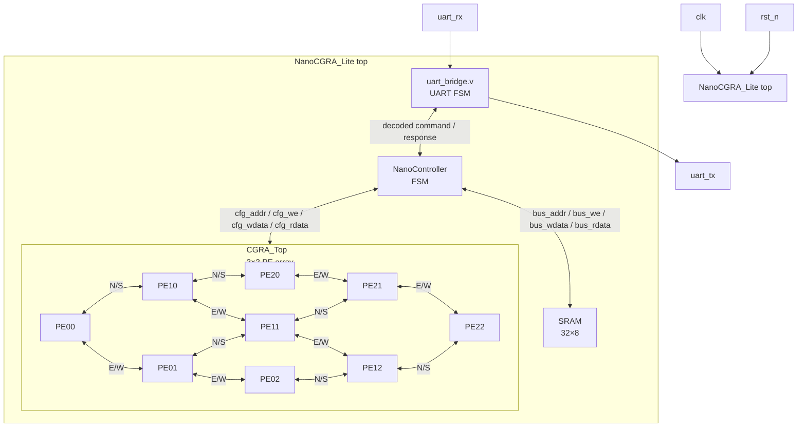
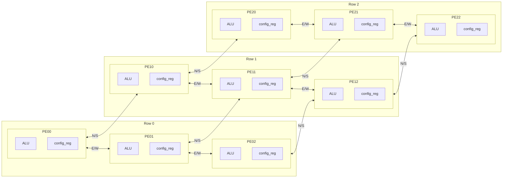
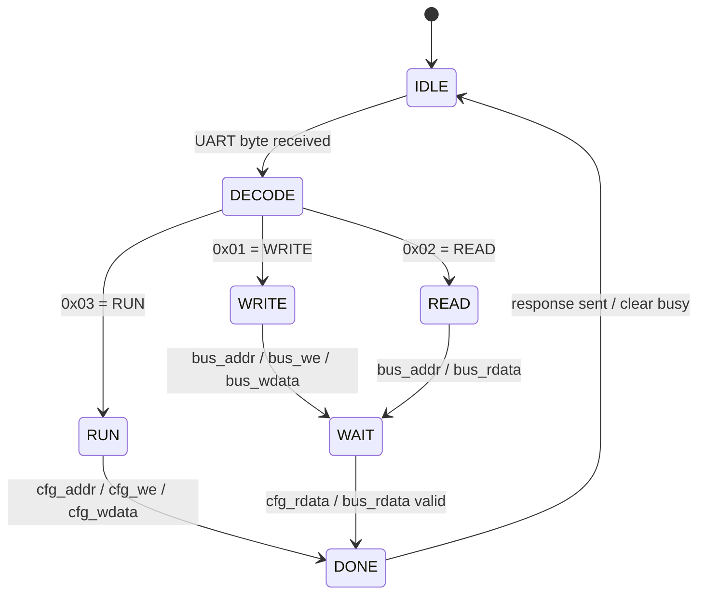
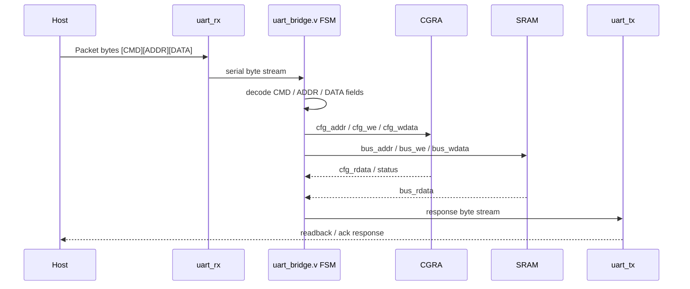
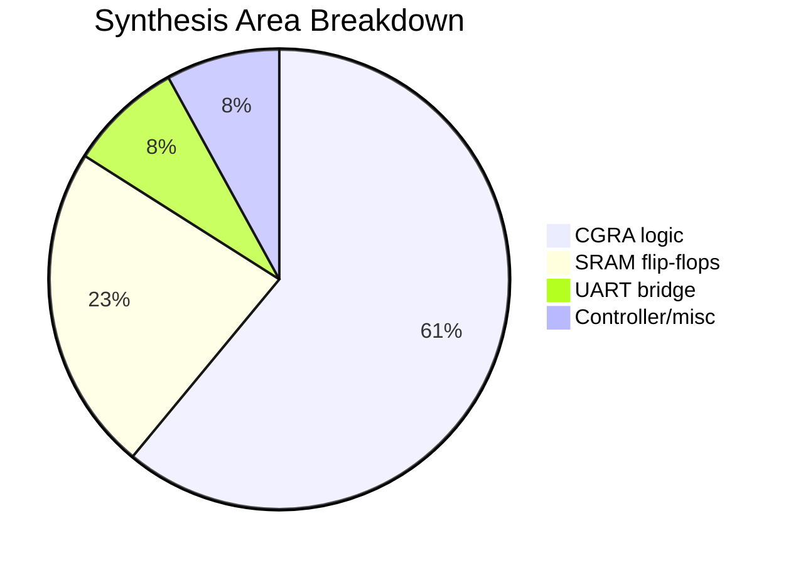

# NanoCGRA-Lite — 3×3 CGRA + 32B SRAM

**NanoCGRA-Lite** is a minimal, ultra-compact **coarse-grained reconfigurable array (CGRA) soft-IP** implemented using the open **GF180MCU PDK** and generated through **Chip Orchestra**, targeting low-cost experimentation and deployment of reconfigurable hardware for resource-constrained embedded systems. The canonical tapeout configuration integrates a **3×3 processing-element (PE) mesh** with nine lightweight compute elements, a compact **32-byte SRAM implemented as a 32×8-bit memory** for local data and intermediate results, and a simple **4-pin UART-only interface** (`clk`, `rst_n`, `uart_rx`, `uart_tx`) controlled by the packet-based `uart_bridge.v` FSM. The architecture provides configurable parallel computation while minimizing silicon area, memory requirements, and interface complexity, making it suitable for **embedded signal processing, sensor data processing, vector and arithmetic operations, lightweight image processing, control-oriented computation, communication data processing, and experimentation with reconfigurable computing architectures**. Workloads can be configured and executed through the UART interface, allowing an external host to load data, configure the CGRA, trigger computation, and retrieve results. By combining a small programmable compute fabric with local memory and a minimal communication interface, NanoCGRA-Lite explores the design space between a conventional processor and a fixed-function accelerator while providing an open platform for **CGRA research, ASIC prototyping, embedded computing, and application-specific hardware acceleration**. The results documented in this README correspond to the **verified EDA implementation flow for the canonical 3×3 PE + 32-byte SRAM configuration**.


## Re-harden Update (2026-09-05)

The final GDS was regenerated after the integration review of Metal2/3/4
minimum-area and Metal2 pad-connection errors. Router-generated signal pins are
now preserved instead of being overwritten by undersized D04 reference shapes;
every signal pin is at least 0.28 µm wide. KLayout-generated `VIA_*` helper
cells now have independently legal landing metal of at least 0.1444 µm², so
hierarchical top-level checks do not depend on merging those shapes with parent
routes.

Fresh checks completed:

- Detailed-route DRC: PASS, zero violations.
- Full GF180 KLayout DRC in both flat and deep modes: PASS, zero items, with FEOL, BEOL, and connectivity rules explicitly enabled.
- Canonical GDS audit: PASS, sole `NanoCGRA_Lite` top, 550.000 × 550.000 µm; all generated via landing shapes meet 0.1444 µm².
- Real transistor-level LVS: PASS, unique match; 5,362 devices and 5,367 nets on both sides.
- Post-route STA at ss/125°C/4.5 V: WNS/TNS 0.00, setup slack 74.67 ns, hold slack 1.49 ns, with no reported max slew/capacitance/fanout violators.
- Internal VDD/VSS connectivity: PASS; PDNSim completed with the documented block-level source assumptions.
- No project-level dummy-purpose fill; required `fill_1/2/4/8/16`, `filltie`, and `endcap` cells remain present.


### Canonical flow

1. Synthesis produces `synth/nanocgra_lite_3x3_opt.synth.v`.
2. `pnr/flow.tcl` performs the fixed D04 floorplan, tap/endcap insertion, PDN,
   placement, CTS, timing repair, global/detailed routing, approved row-filler
   insertion, PG checks, electrical reports, and DEF/ODB/netlist generation.
3. `pnr/apply_d04_pin_contract.py` applies only the disjoint D04 VDD/VSS
   boundary geometry. Router-generated signal-pin geometry is preserved, so
   legal width and spacing are not replaced after detailed routing.
4. DEF-to-GDS conversion writes the **unfilled** canonical layout and repairs
   generated `VIA_*` helper-cell landing metal to the GF180 0.1444 µm² minimum:
   `gds/nanocgra_lite_3x3_opt.gds`.
5. `reports/lvs/extract_gds.tcl` extracts the canonical GDS with compatible
   Magic and normalizes Magic's GF180 MOS proxy syntax into MOS device records
   without changing extracted geometry or connectivity.
6. `reports/lvs/verilog_to_lvs_spice.py` converts the populated powered
   post-route Verilog to source SPICE using official GF180 PDK CDL pin order.
7. `reports/lvs/run_lvs_final.tcl` compares the extracted layout and independent
   source views with the official PDK setup. It fails closed unless Netgen
   reports a unique match.
8. `reports/pdnsim_ir.tcl` produces VDD/VSS diagnostic PDNSim reports.
9. `validate.sh` checks config paths, GDS top/size, forbidden dummy layers,
   generated-via minimum area, physical fillers, legal signal-pin width, D04
   PG topology, empty route-DRC output, zero-item full flat/deep FEOL+BEOL DRC,
   required reports, and fresh completion/pass markers.

The prior normalized empty-stub LVS result and legacy `_filled.gds` are not
valid signoff evidence and must not be used. `gds/add_density_fill.py` is
intentionally fail-fast because chip-level integration owns density fill.

### Reproduction

Run from any directory without embedding checkout-specific paths:

```sh
export UPRJ_ROOT=/path/to/Chip-Orchestra
export PDK_ROOT=/path/to/pdks
export OPENROAD_BIN=/path/to/openroad
export MAGIC_BIN=/path/to/magic       # must be >= 8.3.411
export NETGEN_BIN=/path/to/netgen

"$UPRJ_ROOT/output/nanocgra_lite_3x3_opt/scripts/run_repair_signoff.sh"
```

The runner fails closed on non-zero full flat/deep FEOL+BEOL DRC or LVS
mismatch. Final validation also rejects undersized generated-via landing metal,
illegal signal-pin widths, and non-empty detailed-route DRC output.

### Integration note

Density/antenna closure against the assembled chip remains the responsibility
of the chip-top integration flow. Package-aware IR signoff should be rerun when
actual pad/bump locations and current assumptions are available.


## D04 Re-harden Update (2026-08-29)

The registered `_opt` design was re-hardened against the provided D04 DEF/template after review feedback that the submitted block size did not match the expected D04 slot. The functional NanoCGRA-Lite core is preserved; the update changes the physical/template-facing wrapper and signoff artifacts.

| D04 Update Item | Result |
|---|---:|
| Target template | D04 |
| DEF/GDS block size | 550 µm × 550 µm |
| D04-facing top-level pins | 21 |
| Functional core mapping | `clk`, `rst_n`, `uart_rx`, and core `uart_tx` preserved through wrapper |
| DEF pin geometry | D04 placement preserved; signal pins use legal router-generated M2 geometry |
| Full DRC | CLEAN — 0 violations in flat and deep FEOL+BEOL runs |
| Dummy-purpose fill | NONE — chip-top integration owns density fill |
| Antenna | CLEAN — 0 detailed-route antenna violations |
| LVS | CLEAN — 5,362 devices and 5,367 nets on both sides; unique match |

Key D04 artifacts are under `output/nanocgra_lite_3x3_opt/pnr/`, `output/nanocgra_lite_3x3_opt/gds/`, `output/nanocgra_lite_3x3_opt/reports/signoff/`, and `output/nanocgra_lite_3x3_opt/reports/lvs/`.

## 1. Architecture Block Diagram


```mermaid
graph TD
    CLK[clk] --> TOP[NanoCGRA_Lite top]
    RST[rst_n] --> TOP

    subgraph TOP_BOX[NanoCGRA_Lite top]
        CTRL[NanoController<br/>FSM]
        UART[uart_bridge.v<br/>UART FSM]
        SRAM[SRAM<br/>32×8]

        subgraph CGRA[CGRA_Top<br/>3×3 PE array]
            PE00[PE00]
            PE01[PE01]
            PE02[PE02]
            PE10[PE10]
            PE11[PE11]
            PE12[PE12]
            PE20[PE20]
            PE21[PE21]
            PE22[PE22]
        end
    end

    UART <-->|decoded command / response| CTRL
    CTRL <-->|cfg_addr / cfg_we / cfg_wdata / cfg_rdata| CGRA
    CTRL <-->|bus_addr / bus_we / bus_wdata / bus_rdata| SRAM
    RX[uart_rx] --> UART
    UART --> TX[uart_tx]

    PE00 <-->|E/W| PE01
    PE01 <-->|E/W| PE02
    PE10 <-->|E/W| PE11
    PE11 <-->|E/W| PE12
    PE20 <-->|E/W| PE21
    PE21 <-->|E/W| PE22

    PE00 <-->|N/S| PE10
    PE10 <-->|N/S| PE20
    PE01 <-->|N/S| PE11
    PE11 <-->|N/S| PE21
    PE02 <-->|N/S| PE12
    PE12 <-->|N/S| PE22
```

## 2. Full RTL-to-GDS Flow


```mermaid
flowchart LR
    RTL[RTL Design] -->|netlist| YOSYS[Yosys Synthesis]
    YOSYS -->|DEF/GDS| OPENLANE[OpenLane P&R]
    OPENLANE -->|timing report| STA[OpenSTA STA]
    STA -->|DRC report| DRC[KLayout DRC]
    DRC -->|LVS report| LVS[Netgen LVS]
    LVS -->|GL sim pass| GLS[Gate-Level Sim]
    GLS -->|signoff artifacts| GDS[GDS Signoff]
```

## 3. CGRA 3×3 PE Mesh


```mermaid
graph LR
    subgraph ROW0[Row 0]
        direction LR
        subgraph PE00[PE00]
            PE00_ALU[ALU]
            PE00_CFG[config_reg]
        end
        subgraph PE01[PE01]
            PE01_ALU[ALU]
            PE01_CFG[config_reg]
        end
        subgraph PE02[PE02]
            PE02_ALU[ALU]
            PE02_CFG[config_reg]
        end
    end

    subgraph ROW1[Row 1]
        direction LR
        subgraph PE10[PE10]
            PE10_ALU[ALU]
            PE10_CFG[config_reg]
        end
        subgraph PE11[PE11]
            PE11_ALU[ALU]
            PE11_CFG[config_reg]
        end
        subgraph PE12[PE12]
            PE12_ALU[ALU]
            PE12_CFG[config_reg]
        end
    end

    subgraph ROW2[Row 2]
        direction LR
        subgraph PE20[PE20]
            PE20_ALU[ALU]
            PE20_CFG[config_reg]
        end
        subgraph PE21[PE21]
            PE21_ALU[ALU]
            PE21_CFG[config_reg]
        end
        subgraph PE22[PE22]
            PE22_ALU[ALU]
            PE22_CFG[config_reg]
        end
    end

    PE00 <-->|E/W| PE01
    PE01 <-->|E/W| PE02
    PE10 <-->|E/W| PE11
    PE11 <-->|E/W| PE12
    PE20 <-->|E/W| PE21
    PE21 <-->|E/W| PE22

    PE00 <-->|N/S| PE10
    PE10 <-->|N/S| PE20
    PE01 <-->|N/S| PE11
    PE11 <-->|N/S| PE21
    PE02 <-->|N/S| PE12
    PE12 <-->|N/S| PE22
```

## 4. NanoController FSM


```mermaid
stateDiagram-v2
    [*] --> IDLE
    IDLE --> DECODE: UART byte received
    DECODE --> WRITE: 0x01 = WRITE
    DECODE --> READ: 0x02 = READ
    DECODE --> RUN: 0x03 = RUN

    WRITE --> WAIT: bus_addr / bus_we / bus_wdata
    READ --> WAIT: bus_addr / bus_rdata
    RUN --> DONE: cfg_addr / cfg_we / cfg_wdata

    WAIT --> DONE: cfg_rdata / bus_rdata valid
    DONE --> IDLE: response sent / clear busy
```

## 5. UART Packet Protocol


```mermaid
sequenceDiagram
    participant Host
    participant UART_RX as uart_rx
    participant UART_BRIDGE as uart_bridge.v FSM
    participant CGRA
    participant SRAM
    participant UART_TX as uart_tx

    Host->>UART_RX: Packet bytes [CMD][ADDR][DATA]
    UART_RX->>UART_BRIDGE: serial byte stream
    UART_BRIDGE->>UART_BRIDGE: decode CMD / ADDR / DATA fields
    UART_BRIDGE->>CGRA: cfg_addr / cfg_we / cfg_wdata
    UART_BRIDGE->>SRAM: bus_addr / bus_we / bus_wdata
    CGRA-->>UART_BRIDGE: cfg_rdata / status
    SRAM-->>UART_BRIDGE: bus_rdata
    UART_BRIDGE->>UART_TX: response byte stream
    UART_TX-->>Host: readback / ack response
```

## 6. Synthesis Area Breakdown


```mermaid
pie title Synthesis Area Breakdown
    "CGRA logic" : 61.0
    "SRAM flip-flops" : 23.0
    "UART bridge" : 8.0
    "Controller/misc" : 8.0
```

## 7. Design Metrics Summary

The chart compares the three verified NanoCGRA-Lite variants. Power is plotted as mW×1000 so the values can share a chart with cell area.


```mermaid
xychart-beta
    title "NanoCGRA-Lite Variant Comparison"
    x-axis ["2×2 + 128B", "4×2 + 64B", "3×3 + 32B"]
    y-axis "Value" 0 --> 170000
    bar "Cell area (µm²)" [163308, 137038, 123634]
    bar "Power (mW×1000)" [10523, 5903, 4675]
```

If `xychart-beta` is not supported by the Markdown renderer, use the table below as the fallback source of truth.

| Variant | Cell Area (µm²) | Power (mW×1000) |
|---|---:|---:|
| 2×2 + 128B | 163,308 | 10,523 |
| 4×2 + 64B | 137,038 | 5,903 |
| 3×3 + 32B | 123,634 | 4,675 |

## Key Metrics

| Metric | Verified Result |
|---|---:|
| Branding | Chip Orchestra |
| PDK | GF180MCU |
| PEs | 9 (3×3) |
| SRAM | 32B (32×8-bit) |
| Interface | 4-pin UART-only (`clk`, `rst_n`, `uart_rx`, `uart_tx`) |
| Protocol | `[CMD][ADDR][DATA]` via `uart_bridge.v` FSM |
| Standard Cells | 5,296 |
| Cell Area | 123,634 µm² |
| Die Size | 466×466 µm |
| Setup Slack @ 10 MHz | +76.72 ns |
| Hold Slack | +0.82 ns |
| Fmax | 83.3 MHz |
| Power | 4.675 mW @ 10 MHz |
| DRC | CLEAN |
| LVS | CLEAN — 5,325/5,325 devices, 96/96 cell classes |
| RTL Sim | 5/5 PASS |
| Gate-Level Sim | PASS |
| Synthesis Report | `output/nanocgra_3x3/reports/synthesis/` |
| STA Report | `output/nanocgra_3x3/reports/sta/` |
| Power Report | `output/nanocgra_3x3/reports/power/` |
| DRC Report | `output/nanocgra_3x3/reports/drc/` |
| LVS Report | `output/nanocgra_3x3/reports/lvs/` |
| Simulation Logs | `output/nanocgra_3x3/reports/sim/` |

## Directory Structure

```text
output/nanocgra_3x3/
├── rtl/              # Verilog RTL for NanoCGRA-Lite top, 3×3 PE mesh, 32B SRAM, and uart_bridge
│   ├── nanocgra_lite_top.v
│   ├── cgra_top_3x3.v
│   ├── pe.v
│   ├── sram_32x8.v
│   └── uart_bridge.v
├── tb/               # RTL and gate-level simulation testbenches
├── netlist/          # Synthesized netlists and related generated views
├── gds/              # Final GDS/signoff layout artifacts
├── reports/          # Synthesis, P&R, STA, power, DRC, LVS, and simulation reports
└── scripts/          # Reproduction and flow helper scripts
```

## How to Reproduce

The following commands describe the expected local reproduction flow for the verified 3×3 + 32B run. Tool installation and environment setup can vary by host, but the flow is standard for an open-source GF180MCU digital implementation path.

```bash
# 1. Install core tooling.
# Ubuntu packages are commonly available for iverilog and yosys.
sudo apt-get update
sudo apt-get install -y iverilog yosys

# 2. Install or configure OpenLane with GF180MCU PDK support.
# Follow the OpenLane documentation for Docker or native setup.

# 3. Run RTL simulation.
iverilog -g2012 -o output/nanocgra_3x3/sim/nanocgra_3x3_tb.vvp \
  output/nanocgra_3x3/tb/*.v output/nanocgra_3x3/rtl/*.v
vvp output/nanocgra_3x3/sim/nanocgra_3x3_tb.vvp

# 4. Run synthesis.
yosys -s output/nanocgra_3x3/synth/run_synth.ys

# 5. Run placement and routing with OpenLane.
# Example; adjust to the local OpenLane entrypoint/config path.
openlane output/nanocgra_3x3/config.json

# 6. Run static timing analysis.
opensta output/nanocgra_3x3/reports/sta.tcl

# 7. Review DRC, LVS, timing, power, and simulation reports.
```

## License / Credits

Generated by **Chip Orchestra** using open-source EDA tooling: **Yosys** for synthesis, **OpenLane** for physical implementation, **KLayout** for DRC, **Netgen** for LVS, and **OpenSTA** for timing analysis. The implementation targets the open **GF180MCU PDK**.
