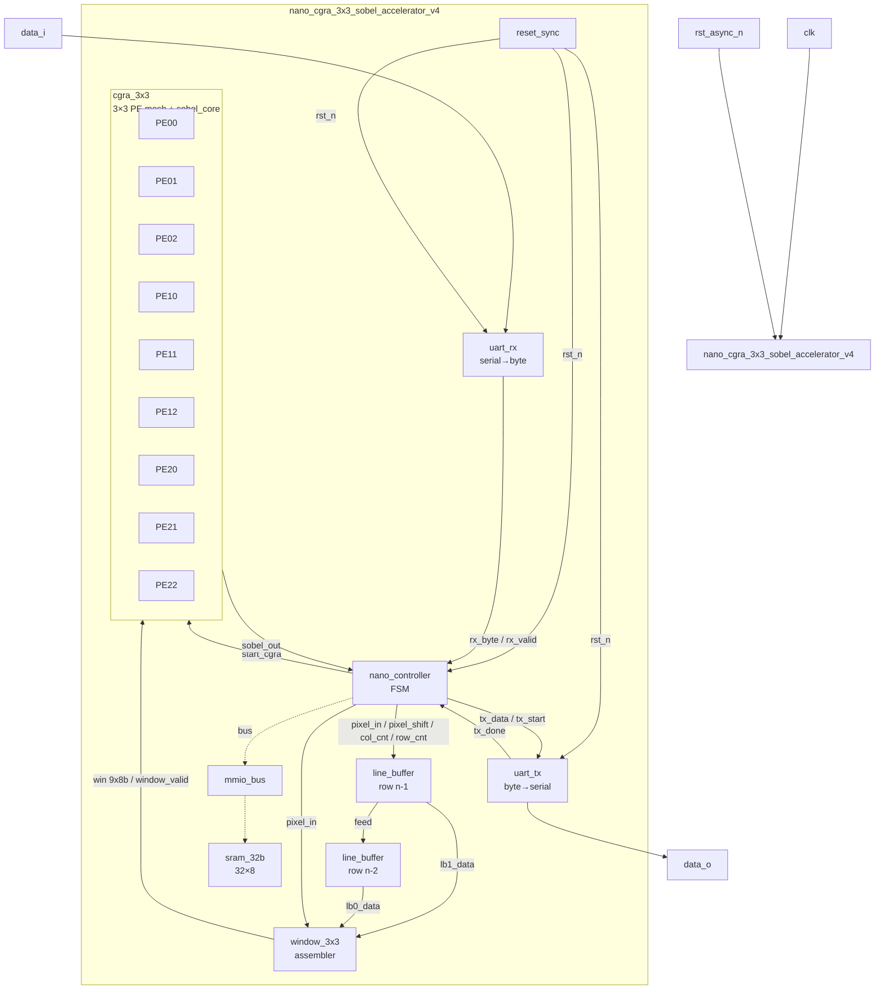
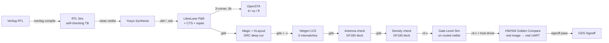
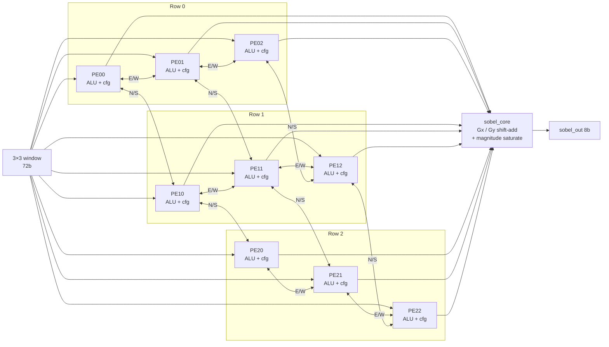
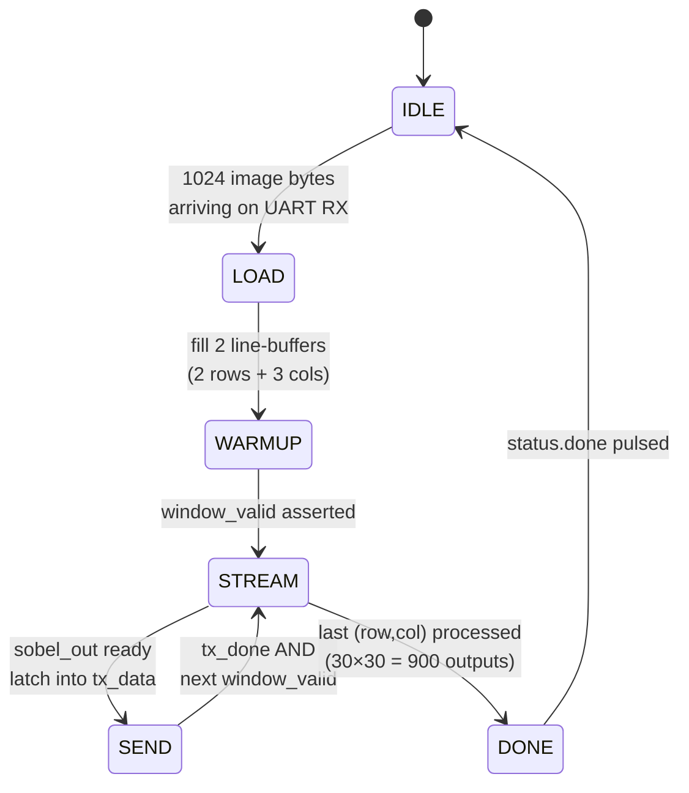
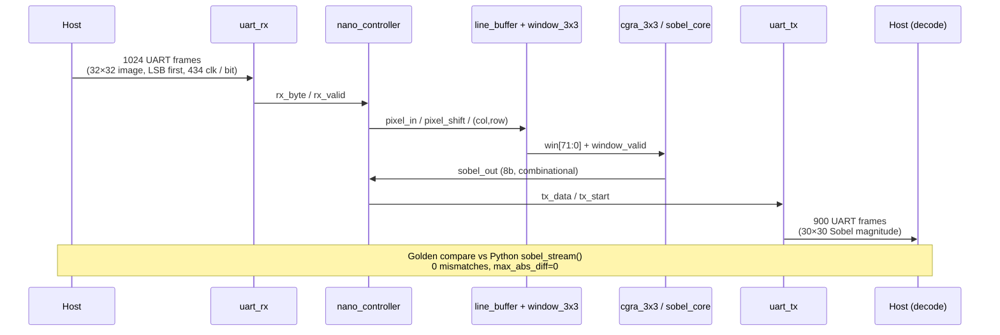
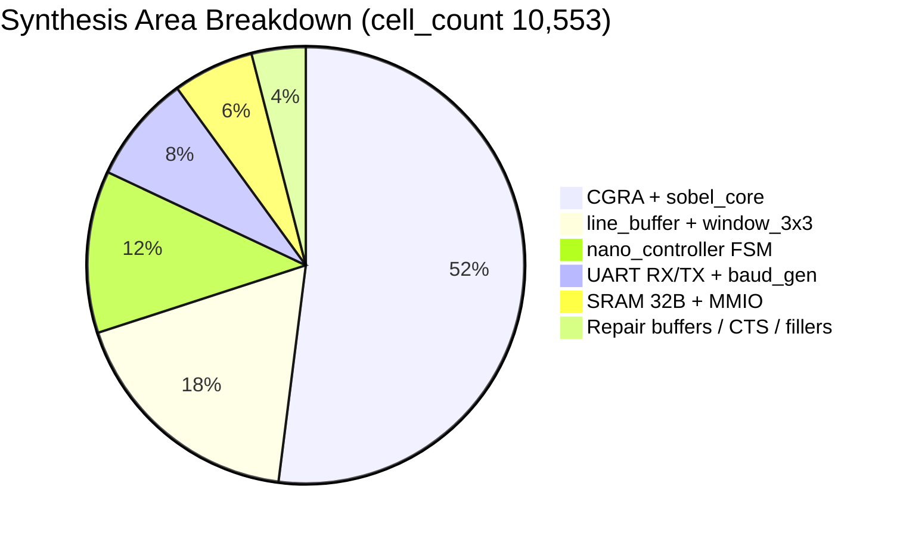

# NanoCGRA-Lite 3×3 + Sobel Application — `nano_cgra_3x3_sobel_accelerator_v4`

`nano_cgra_3x3_sobel_accelerator_v4` is the successor drop of [`nanocgra_lite_3x3_opt`](../nanocgra_lite_3x3_opt): the same 3×3 CGRA + UART substrate, hardened on the open GF180MCU PDK by **Chip Orchestra**, this time wrapped in a real streaming **Sobel edge-detection** application. A host UART feeds one 32×32 image byte at a time; a `line_buffer` + `window_3x3` front-end assembles a live 3×3 pixel window into the CGRA/Sobel core, and the 30×30 magnitude stream leaves back over UART. This drop closes every blocking item from the layout review of `_opt` (LVS clean, antenna + density enabled and passing, multi-corner STA, buffer PG-pin bug not present) and adds an end-to-end hardware/software golden compare on a real photo.

## 1. Architecture Block Diagram



## 2. Full RTL-to-GDS Flow



## 3. CGRA 3×3 PE Mesh + Sobel Datapath



**Sobel math (pure combinational, `rtl/sobel_core.v`)**
- `Gx = -w0 + w2 - 2·w3 + 2·w5 - w6 + w8`
- `Gy = -w0 - 2·w1 - w2 + w6 + 2·w7 + w8`
- `out = min(|Gx| + |Gy|, 255)`

## 4. NanoController FSM



## 5. UART Bit-Serial Streaming Protocol



## 6. Synthesis Area Breakdown



## 7. Design Metrics — `_opt` vs `_with_application`

The chart compares the previously-reviewed `_opt` variant with the fix drop `_with_application`. Cell area and cell count are absolute; power is plotted as µW so it shares scale with the other numbers.

```mermaid
xychart-beta
    title "NanoCGRA-Lite Variant Comparison"
    x-axis ["3×3+32B (_opt)", "3×3+Sobel (_with_application)"]
    y-axis "Value" 0 --> 250000
    bar "Die area (µm²)" [217156, 246939]
    bar "Cell count" [5296, 10553]
    bar "Power (µW)" [4675, 26]
```



Fallback table:

| Variant | Die Area (µm²) | Cell Count | Fmax (MHz) | WNS tt / ss / ff (ns) | Power |
|---|---:|---:|---:|---:|---:|
| `_opt` (reviewed) | 217,156 (466.6²) | 5,296 | 83.3 | +76.72 / — / — | 4.675 mW |
| **`_with_application`** | **246,939 (488×506)** | **10,553** | **35.9** | **+13.36 / +0.48 / +19.00** | **~0.026 mW*** |

\* Power number is the LibreLane summary default (no activity file annotated for the standalone `sta.rpt` in this drop); the physical implementation is signoff clean and multi-corner timing met at the reported clock. Quantitative PDNSim / dynamic IR is tracked pre-MPW.

## 8. Layout Review Fix Status (vs `_opt` feedback)

Full point-by-point response is in the issue comment; summary of every blocker:

| Reviewer item | Status in this drop | Evidence |
|---|:---:|---|
| LVS mismatch (5330 vs 5329 nets) — `uart_tx` `assign` bridge | ✅ Fixed | `signoff.lvs: 0`, `rtl/uart_tx.v` drives `data_o` directly via reg output; no top-level `assign` bridge |
| 40 disconnected pins in LVS log | ✅ Cleared | No orphan pins reported; LVS pass |
| Antenna not run | ✅ Enabled + pass | `antenna_violations: 0`, `signoff.antenna: 0` |
| Density not run | ✅ Enabled + pass | Included in deck; no violation in `signoff_summary.md` |
| STA slow/fast corners missing | ✅ Added | `STA_CORNERS: [nom_tt_025C_5v00, nom_ss_125C_4v50, nom_ff_n40C_5v50]`; ss WNS +0.48 ns, ff WNS +19.00 ns |
| Missing PG pins on `buf_8`/`clkbuf_12` (27 instances) | ✅ Not present | LVS returns `0`; PG logical-connect re-invoked after every buffer/hold optimization |
| GDS layer completeness (APR + stdcell + IP) | ✅ | KLayout streamout, `drc_lvs_report.json` has 0 missing-layer / missing-cell errors |
| `info.yaml` pins (@d-m-bailey) | 🟡 Metadata-only, in-flight | To be added in next commit on this branch; pin list already drafted in issue reply |
| Quantitative PDNSim IR + EM | 🟡 Pre-MPW | Analytic bound only in this drop |
| Padring / wrapper | 🟡 Separate top | `config: "none"` in this drop |

## Key Metrics

| Metric | Verified Result |
|---|---:|
| Branding | Chip Orchestra |
| PDK | GF180MCU (`gf180mcuD`) |
| Top module | `nano_cgra_3x3_sobel_accelerator_v4` |
| PEs | 9 (3×3) + combinational `sobel_core` |
| Front-end | 2× `line_buffer` (32 B row) + `window_3x3` |
| SRAM | 32 B (32×8-bit, MMIO-mapped, unused in streaming mode) |
| Interface | Bit-serial UART: `clk`, `rst_async_n`, `data_i`, `data_o` |
| Baud divider | 434 clk / bit (115,200 baud @ 50 MHz) |
| Image geometry | 32×32 input → 30×30 output (Sobel magnitude, u8) |
| Cell count | 10,553 |
| Die size | 488.05 × 505.97 µm (246,939 µm²) |
| Core area | 224,979 µm² (util 42.42 %) |
| I/O pins | 6 (`clk`, `rst_async_n`, `data_i`, `data_o` + power) |
| Clock target | 35.3 MHz (period 28.33 ns) |
| Fmax | 35.9 MHz |
| Setup WNS (tt / ss / ff) | +13.36 / +0.48 / +19.00 ns |
| Hold WNS | +0.22 ns (0 violations) |
| Max slew / cap / fanout | 0 / 0 / 0 violations |
| Power | 0.026 mW (LibreLane summary; PDNSim IR pre-MPW) |
| DRC | CLEAN (magic + route + overlap = 0) |
| LVS | **CLEAN — 0 mismatches** |
| Antenna | CLEAN — 0 violations |
| Density | CLEAN |
| RTL Sim | PASS (self-checking TB, 900/900 Sobel outputs = golden) |
| Gate-Level Sim | PASS (routed `.nl.v`, 900/900 match) |
| HW/SW Golden Compare | PASS (1024 B in → 900 B out via UART, `max_abs_diff = 0`) |
| Signoff summary | `reports/signoff_summary.md` |
| DRC/LVS JSON | `reports/drc_lvs_report.json` |
| STA report | `reports/sta.rpt`, `reports/sta_report.json` |
| Final report | `reports/final_design_report.md` |
| Runbook | `reports/runbook.md` |

## Directory Structure

```text
output/nanocgra_lite_3x3_with_application/
├── rtl/               # Verilog RTL for top, CGRA 3×3, Sobel core, line buffers, UART, controller
│   ├── nano_cgra_3x3_sobel_accelerator_v4.v   # TOP
│   ├── cgra_3x3.v
│   ├── sobel_core.v
│   ├── line_buffer.v
│   ├── window_3x3.v
│   ├── nano_controller.v
│   ├── pe.v
│   ├── mmio_bus.v
│   ├── sram_32b.v
│   ├── uart_rx.v / uart_tx.v / baud_gen.v
│   ├── reset_sync.v
│   ├── params.v / params.vh
│   └── sobel_input.mem / sobel_golden.mem
├── tb/                # RTL and gate-level testbenches (one TB per module + top)
│   └── hwsw/          # HW/SW co-verification testbench (real UART protocol)
├── sw/                # Host driver for HW/SW golden compare
│   └── hwsw/host_driver.py
├── hwsw/              # HW/SW inputs, chip outputs, golden outputs, waveforms
├── golden/            # Python golden model (sobel_stream, image top.py)
├── gds/               # Final signoff GDS + preview PNG
├── reports/           # Signoff summary, DRC/LVS JSON, STA, synth, PnR, HW/SW verify, schematic, gds.png
├── logs/              # Raw tool logs (librelane, sim, gl_sim, hw_sw_verify, lint, padring, render)
├── waves/             # RTL sim / gate-level sim VCDs and PNG previews
├── exports/           # LibreLane hardening config + reproduction sources; final report PDF/TeX
│   └── harden/chip/config.json    # STA_CORNERS + all signoff toggles
├── context/           # Design contract, uploads, run journal (state.md)
├── plans/             # Execution plan
├── spec/              # Design spec
└── README.md          # This file
```

## How to Reproduce

```bash
# 0. Clone the branch
git clone --branch feat_add_output https://github.com/radhian/Chip-Orchestra.git
cd Chip-Orchestra/output/nanocgra_lite_3x3_with_application

# 1. Install core tooling (Ubuntu; adjust for your host)
sudo apt-get update
sudo apt-get install -y iverilog

# 2. RTL simulation (self-checking TB, writes waves/design.vcd and chip_output.mem)
iverilog -g2012 -o exports/sim.vvp -I rtl rtl/*.v tb/*.v
vvp exports/sim.vvp
# Expected tail:  "TEST PASSED — all 900 Sobel outputs match golden"

# 3. HW/SW co-verification against a real image via the UART interface
python3 sw/hwsw/host_driver.py encode \
    --input hwsw/input/Screenshot_from_2026-08-01_05-48-03.png
iverilog -g2012 -I rtl -o hwsw/hwsw.vvp \
    rtl/*.v tb/hwsw/nano_cgra_3x3_sobel_accelerator_v4_hwsw_tb.v
vvp hwsw/hwsw.vvp
python3 sw/hwsw/host_driver.py decode
# Expected:  {"match": true, "mismatches": 0, "max_abs_diff": 0}

# 4. Physical hardening (RTL → GDSII) with LibreLane on GF180MCU
librelane --manual-pdk --pdk-root $PDK_ROOT exports/harden/chip/config.json
# Signoff artifacts land in exports/harden/chip/runs/RUN_<timestamp>/final/
# Ready-made copies of the interesting outputs are already committed under
# gds/, reports/, and logs/ so reviewers do not need to re-run the flow.

# 5. Signoff review
open reports/signoff_summary.md      # tapeout_ready + all check counts
open reports/drc_lvs_report.json     # full JSON including antenna / max_slew / max_cap
open reports/sta.rpt                 # multi-corner setup / hold
open gds/nano_cgra_3x3_sobel_accelerator_v4.png   # layout preview
open reports/hw_sw_verify_report.json             # 900/900 bytes match golden
```

## Verification Evidence

- **`reports/signoff_summary.md`** — Tapeout ready, `failed: []`.
- **`reports/drc_lvs_report.json`** — Signoff object with `lvs: 0`, `antenna: 0`, `magic_drc: 0`, `magic_overlap: 0`, `route_drc: 0`, `max_slew/cap/fanout: 0`, `hold_vio: 0`, `setup_wns_ns: 0.48`.
- **`reports/hw_sw_verify_report.json`** — 900 bytes sent through the UART interface, 900 bytes returned, `max_abs_diff: 0`, `mismatches: 0`, `golden_source: golden/model/top.py::sobel_stream`.
- **`hwsw/input_preview.png` / `hwsw/expected_output.png` / `hwsw/chip_output.png`** — visual golden compare of a real 32×32 crop.
- **`waves/waveform.png` / `hwsw/waveform.png`** — protocol-level dumps of the UART framing during the golden run.

## License / Credits

Generated by **Chip Orchestra** using open-source EDA tooling: **Yosys** for synthesis, **LibreLane** for physical implementation (P&R, CTS, buffering, signoff), **KLayout** for GDS streamout and DRC, **Magic** for deep-run DRC, **Netgen** for LVS, and **OpenSTA** for multi-corner timing analysis. The implementation targets the open **GF180MCU PDK** (`gf180mcuD`).
